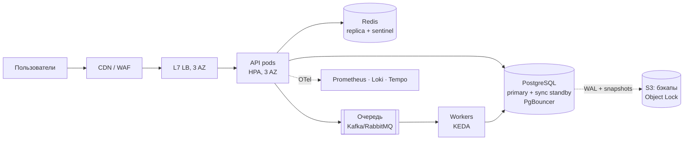

# 🚀 DevOps Interview 2026 — шпаргалка-курс для подготовки к собеседованию

> Всё, что спрашивают на собеседованиях DevOps / SRE / Platform Engineer в 2026 году — в одном репозитории.
> Короткая теория, команды, типовые вопросы с ответами, задачи live-coding и «ловушки» интервьюеров.  🖥 [Самая большая коллекция информации для собесов и практик  DevOps специалиста лежит здесь](https://t.me/+7HWlD5t-Zqw2YjMy) | Сложные концепции DevOps на


---

> 🏋️ **Новое:** [Практикум — 55 задач с решениями](#practice): Linux, сети, Git, Docker, Kubernetes, CI/CD, Terraform, Ansible, облака и FinOps, PromQL, DevSecOps, SRE, Bash/Python, System Design и разбор инцидентов.
>
> 🧪 В конце каждого модуля 01–13 — блок **«🏋️ Практика модуля»**: 2–3 лабы на 20–40 минут с решениями под спойлером.

## 📚 Оглавление

- [00. Как устроено собеседование DevOps в 2026](#m00)
- [01. Linux](#m01)
- [02. Сети](#m02)
- [03. Git](#m03)
- [04. Docker и контейнеры](#m04)
- [05. Kubernetes](#m05)
- [06. CI/CD и GitOps](#m06)
- [07. Infrastructure as Code: Terraform / OpenTofu и Ansible](#m07)
- [08. Облака: AWS / Yandex Cloud / общие принципы](#m08)
- [09. Observability: метрики, логи, трейсы](#m09)
- [10. Bash и Python для DevOps](#m10)
- [11. DevSecOps](#m11)
- [12. SRE и управление инцидентами](#m12)
- [13. System Design для DevOps](#m13)
- [14. Практика: troubleshooting-кейсы и live-coding](#m14)
- [15. Soft skills, HR и переговоры](#m15)
- [🏋️ Практикум: 55 задач с решениями](#practice)
- [⚡ DevOps-шпаргалка на одной странице](#cheatsheet)
- [❓ 150 вопросов с собеседований DevOps 2026](#questions)
- [🗺️ Дорожная карта DevOps 2026](#roadmap)

## 🔥 Что изменилось в DevOps-собеседованиях к 2026


- **Platform Engineering** и Internal Developer Platform (Backstage, Port) — частая тема для Middle+.
- **GitOps по умолчанию**: Argo CD / Flux спрашивают почти везде, где есть Kubernetes.
- **OpenTofu** рядом с Terraform (после смены лицензии HashiCorp → BSL).
- **OpenTelemetry** — стандарт де-факто для трейсов/метрик/логов.
- **Supply chain security**: SBOM, подписи образов (cosign/Sigstore), SLSA.
- **eBPF** (Cilium, Tetragon, Pixie) — в вопросах про сеть и observability в K8s.
- **Gateway API** постепенно вытесняет Ingress; ingress-nginx объявлен к выводу из поддержки.
- **AI в работе DevOps**: как используешь LLM-ассистентов, где им нельзя доверять, MLOps/GPU-ноды в K8s.
- **FinOps**: «как сократить счёт за облако на 30%» — популярный кейс.
- Для РФ-рынка: **Yandex Cloud, VK Cloud, Deckhouse, GitLab self-hosted**, импортозамещение.


---

<a id="m00"></a>

# 00. Как устроено собеседование DevOps в 2026

## Типичные этапы

| Этап | Длительность | Что проверяют |
|------|-------------|---------------|
| HR-скрининг | 20–30 мин | Мотивация, зарплатные ожидания, формат работы, английский |
| Техническое интервью | 60–90 мин | Linux, сети, контейнеры, K8s, CI/CD, IaC, облако |
| Практика / live-coding | 45–90 мин | Скрипт на Bash/Python, Dockerfile, починить пайплайн/под, troubleshooting |
| System design | 45–60 мин | Спроектировать инфраструктуру (Middle+/Senior) |
| Тестовое задание | 2–8 ч | Terraform + K8s + CI для простого сервиса |
| Финал с тимлидом/CTO | 30–60 мин | Культура, ownership, как вёл инциденты |

## Ожидания по грейдам

**Junior (0–1.5 года)**
- Уверенный Linux, основы сетей, Git.
- Docker: собрать образ, docker compose.
- Базовый CI (GitLab CI / GitHub Actions).
- Понимает, что такое K8s Pod/Deployment/Service.

**Middle (1.5–4 года)**
- K8s в продакшне: отладка, Helm, Ingress/Gateway, RBAC, HPA.
- Terraform: модули, remote state, workspaces.
- Мониторинг: Prometheus + Grafana + алерты, логирование.
- Стратегии деплоя, GitOps, секреты (Vault/ESO).
- Опыт инцидентов.

**Senior / Lead (4+ лет)**
- Проектирование платформы, multi-region, DR, RPO/RTO.
- SLO и error budget, культура postmortem.
- Безопасность цепочки поставки, compliance.
- FinOps, оценка trade-off, менторство, влияние на процессы.

## Как отвечать на технические вопросы

1. **Определение** — одно предложение.
2. **Как работает** — механизм.
3. **Пример из практики** — «у нас было так…».
4. **Trade-off / подводные камни** — это отличает Middle от Senior.

> ❌ «Rebase — это когда коммиты переносятся».
> ✅ «Rebase переписывает коммиты ветки поверх нового base, давая линейную историю. Использую для локальных фич-веток перед MR. Никогда не ребейзю публичные ветки — это переписывает хеши и ломает историю коллегам».

Если не знаешь — говори: «Не сталкивался, но рассуждал бы так…» — и рассуждай. Это ценится выше, чем выдумка.

## План подготовки

### 🏃 2 недели (интенсив)
| Дни | Темы |
|-----|------|
| 1–2 | Linux + сети (модули 01–02) |
| 3 | Git + Docker (03–04) |
| 4–6 | Kubernetes (05) + лабы |
| 7 | CI/CD + GitOps (06) |
| 8 | Terraform/Ansible (07) |
| 9 | Облако (08) |
| 10 | Observability (09) |
| 11 | Скрипты + Security (10–11) |
| 12 | SRE + System Design (12–13) |
| 13 | Практика (14), мок-интервью |
| 14 | Soft skills (15), CHEATSHEET, отдых |

### 🚶 4 недели
Тот же порядок, но по ~2 дня на модуль + каждая неделя заканчивается мок-интервью по [150 вопросов](#questions).

## Чек-лист перед интервью

- [ ] Подготовил 3 истории по STAR: инцидент, автоматизация, конфликт/неудача.
- [ ] Могу нарисовать архитектуру текущего/прошлого проекта за 5 минут.
- [ ] Знаю цифры своего проекта: RPS, кол-во сервисов, нод, время деплоя, MTTR.
- [ ] Подготовил 3–5 вопросов работодателю.
- [ ] Проверил камеру, микрофон, демонстрацию экрана, терминал с крупным шрифтом.


## 📌 Лучшие ресурсы для подготовки

Telegram-каналы, которые удобно читать между модулями — коротко, по делу и с практикой:

| Канал | О чём |
|-------|-------|
| 🖥 [DevOps Academy](https://t.me/+7HWlD5t-Zqw2YjMy) | Сложные концепции DevOps на понятных схемах и в коротких видео, плюс профессиональный подход к работе |
| 🐳 [Docker](https://t.me/+WGQi6w2QiiE4MGMy) | Фишки и приёмы работы с контейнерами, которые пригодятся и на собеседовании, и в проде |
| 🧠 [Machine Learning](https://t.me/+IikNImh3FuNmM2Ji) | Практическое применение AI: генерация кода и баз данных, всё, что DevOps-инженеру стоит знать об ИИ |
| ⚡️ [Kali Linux](https://t.me/+jnI7_NwRnd0zY2Yy) | Авторский канал об информационной безопасности и этичном хакинге с нуля — полезно для DevSecOps |
| 🐹 [Golang](https://t.me/+mACTfs56f6g5YjBi) · [ещё о Go](https://t.me/+VBSfUDFUflE2M2E6) | Разработка на Go, DevOps и построение высоконагруженных сервисов |

> 🔥 Всё сразу — в [папке лучших ресурсов](https://t.me/addlist/VWTKxdkpYBcxYzNi): подпишись одним кликом и прокачай уровень до следующего грейда.


---

<a id="m01"></a>

# 01. Linux

## Процессы

- **Процесс** — экземпляр программы со своим адресным пространством; **поток** — разделяет память процесса.
- Создание: `fork()` (копия, copy-on-write) → `exec()` (заменяет образ).
- **PID 1** — init (systemd). В контейнере PID 1 — твоё приложение: оно должно обрабатывать сигналы и «пожинать» зомби (или используй `tini` / `--init`).
- **Зомби** — завершился, но родитель не вызвал `wait()`. Не занимает ресурсов, кроме записи в таблице PID. Убить нельзя — нужно убить/починить родителя.
- **Сирота** — родитель умер, процесс переподхватывает init.

### Состояния процесса (`ps` STAT)
| Код | Значение |
|----|----------|
| R | Running/runnable |
| S | Interruptible sleep |
| D | Uninterruptible sleep (обычно I/O) — не убивается даже `kill -9` |
| Z | Zombie |
| T | Stopped |

### Сигналы
| Сигнал | № | Смысл |
|--------|---|-------|
| SIGHUP | 1 | Перечитать конфиг / терминал закрыт |
| SIGINT | 2 | Ctrl+C |
| SIGKILL | 9 | Убить немедленно, нельзя перехватить |
| SIGTERM | 15 | Вежливое завершение (по умолчанию в `kill`, в K8s при остановке пода) |
| SIGSTOP/SIGCONT | 19/18 | Пауза/продолжение |

> 💡 В K8s: SIGTERM → ждём `terminationGracePeriodSeconds` (30s) → SIGKILL.

## Память

- `free -h`: колонка **available** важнее **free** — page cache освобождается по требованию.
- **OOM Killer** выбирает жертву по `oom_score`. Смотреть: `dmesg -T | grep -i oom`, `journalctl -k`.
- **Swap** в K8s традиционно выключали; с v1.28+ есть поддержка swap (NodeSwap), к 2026 — GA для LimitedSwap.
- VSZ — виртуальная память, RSS — реально в RAM.

## Файловая система

- **inode** — метаданные файла (права, владелец, блоки), но не имя. Имя — запись в каталоге.
- **Hard link** — ещё одно имя на тот же inode (в пределах ФС). **Soft link** — файл с путём.
- «Диск полон, а `du` показывает мало» → удалённый файл держит открытый процесс: `lsof +L1` / `lsof | grep deleted`. Решение: перезапустить процесс или `> /proc/PID/fd/N`.
- «Места есть, но файл не создаётся» → кончились inode: `df -i`.
- Права: `rwx` = 4+2+1. `chmod 750`. SUID (4000), SGID (2000), sticky bit (1000, как в `/tmp`).

## Загрузка системы
BIOS/UEFI → загрузчик (GRUB) → ядро + initramfs → systemd (PID 1) → target'ы → юниты.

## systemd

```bash
systemctl status|start|stop|restart|enable --now nginx
systemctl daemon-reload            # после правки юнита
journalctl -u nginx -f --since "10 min ago"
systemctl list-units --failed
systemd-analyze blame              # что тормозит загрузку
```

Минимальный юнит:
```ini
[Unit]
Description=My App
After=network-online.target

[Service]
ExecStart=/usr/local/bin/app
Restart=on-failure
User=app
LimitNOFILE=65536

[Install]
WantedBy=multi-user.target
```

## Load Average
Среднее число процессов в состоянии R **и D** за 1/5/15 минут. Сравнивай с числом ядер (`nproc`). Высокий LA при низком CPU → ждём I/O (D-состояние).

## Troubleshooting: метод USE (Utilization, Saturation, Errors)

```bash
uptime                      # load average
top / htop                  # CPU, память, процессы
vmstat 1                    # r, b, si/so (swap), wa (iowait)
iostat -xz 1                # %util, await дисков
mpstat -P ALL 1             # загрузка по ядрам
free -h
df -h ; df -i
ss -tulpn                   # слушающие порты
ss -s                       # сводка по сокетам
lsof -p PID                 # открытые файлы процесса
strace -p PID -f -e trace=network
dmesg -T | tail
journalctl -xe
```

> 🎯 «Сервер тормозит, что делаешь?» — назови «60 секунд Брендана Грегга»: `uptime, dmesg, vmstat, mpstat, pidstat, iostat, free, sar -n DEV, sar -n TCP, top`.

## Полезные однострочники

```bash
# Топ-10 процессов по памяти
ps aux --sort=-%mem | head -11
# Топ IP в access.log
awk '{print $1}' access.log | sort | uniq -c | sort -rn | head
# Найти файлы > 1G
find / -xdev -type f -size +1G 2>/dev/null
# Кто держит порт 8080
ss -lptn 'sport = :8080'
# Заменить в файлах
grep -rl old . | xargs sed -i 's/old/new/g'
```

## ❓ Вопросы

1. **Чем отличается процесс от потока?** — Потоки делят память и дескрипторы одного процесса; процессы изолированы.
2. **Что такое зомби и как от них избавиться?** — См. выше: исправить/перезапустить родителя.
3. **`kill -9` не убивает процесс — почему?** — Процесс в D-состоянии (ждёт I/O, например зависший NFS) или зомби.
4. **Что такое inode? Что будет, если они кончатся?** — Нельзя создать файл при свободном месте.
5. **Как найти, что съело диск?** — `du -xh --max-depth=1 / | sort -h`, `ncdu`, + проверить удалённые открытые файлы.
6. **Разница между `/etc/profile`, `~/.bashrc`, `~/.bash_profile`?** — login vs interactive non-login shell.
7. **Что такое cgroups и namespaces?** — Основа контейнеров (модуль 04).
8. **Что делает `chmod 4755`?** — SUID + rwxr-xr-x.
9. **Как работает `sudo`?** — SUID-бинарь, правила в `/etc/sudoers` (редактировать `visudo`).
10. **Что такое `ulimit` / «Too many open files»?** — Лимит дескрипторов; поднять `LimitNOFILE` в юните или `/etc/security/limits.conf`.


## 🏋️ Практика модуля

> ⏱ ~30 минут. Нужна любая Linux-машина, WSL2 или `docker run -it --rm --privileged ubuntu:24.04`.

**1.1. Создай зомби и избавься от него**

```bash
# Родитель (exec sleep 300) не вызывает wait() для дочернего sleep 1
bash -c 'sleep 1 & exec sleep 300' &
sleep 2
```

<details><summary>▶️ Решение</summary>

```bash
ps -eo pid,ppid,stat,cmd | awk '$3 ~ /Z/'   # видим <defunct> и его PPID
kill -9 <ZOMBIE_PID>                       # не поможет — он уже мёртв
kill <PPID>                                # убиваем родителя → зомби подхватит init и пожнёт
```
**Для интервью:** зомби не тратит CPU/RAM, но занимает PID. Тысячи зомби = исчерпание `pid_max`. В контейнере — запускай с `--init` (tini).
</details>

**1.2. Поймай «Too many open files»**

```bash
ulimit -n 64
python3 -c "fs=[open('/dev/null') for _ in range(100)]"
```

<details><summary>▶️ Решение</summary>

```bash
# OSError: [Errno 24] Too many open files
cat /proc/<PID>/limits | grep 'open files'   # лимит конкретного процесса
ls /proc/<PID>/fd | wc -l                    # сколько открыто сейчас
# Постоянно: LimitNOFILE=65536 в [Service] юнита → systemctl daemon-reload && restart
```
**Ловушка:** правка `/etc/security/limits.conf` не действует на systemd-сервисы — только `LimitNOFILE` в юните.
</details>

**1.3. Высокий Load Average при простаивающем CPU**

```bash
# Терминал 1: генерируем I/O мимо page cache
for i in 1 2 3 4; do dd if=/dev/zero of=/tmp/io$i bs=1M count=2000 oflag=direct & done
# Терминал 2: наблюдаем
vmstat 1     # смотри колонки r, b, wa
uptime
```

<details><summary>▶️ Что должен увидеть и объяснить</summary>

- `b` (процессы в D-состоянии) > 0, `wa` (iowait) высокий, `us`/`sy` низкие.
- LA растёт, потому что в Linux он считает и R, и **D**-процессы.
- Дальше: `iostat -xz 1` (`%util`, `await`) и `pidstat -d 1` — кто пишет.
- Уборка: `rm -f /tmp/io*`.
</details>

🔗 Больше задач: [Практикум №1–7](#p-linux) — диск, inode, systemd, strace, SUID, logrotate, cron.

---

<a id="m02"></a>

# 02. Сети

## Модели OSI и TCP/IP

| OSI | Пример | TCP/IP |
|-----|--------|--------|
| 7 Application | HTTP, DNS, gRPC | Application |
| 6 Presentation | TLS, кодировки | Application |
| 5 Session | — | Application |
| 4 Transport | TCP, UDP, QUIC | Transport |
| 3 Network | IP, ICMP | Internet |
| 2 Data Link | Ethernet, ARP, MAC | Link |
| 1 Physical | кабель, радио | Link |

> L4-балансировщик смотрит на IP:порт, L7 — на HTTP (путь, заголовки, cookie).

## TCP vs UDP

| TCP | UDP |
|-----|-----|
| С установлением соединения (3-way handshake) | Без соединения |
| Гарантия доставки и порядка | Без гарантий |
| Контроль перегрузки | Минимум накладных |
| HTTP/1.1, HTTP/2, SSH, БД | DNS, VoIP, игры, QUIC (HTTP/3) |

**Handshake:** SYN → SYN-ACK → ACK. **Закрытие:** FIN → ACK → FIN → ACK.

**TIME_WAIT** — сторона, закрывшая первой, ждёт 2×MSL, чтобы поздние пакеты не попали в новое соединение. Много TIME_WAIT — норма для клиентов; лечится keep-alive / пулом соединений.

## IP и подсети

- `/24` = 256 адресов (254 хоста), `/16` = 65 536, `/28` = 16.
- Приватные: `10.0.0.0/8`, `172.16.0.0/12`, `192.168.0.0/16`. CGNAT: `100.64.0.0/10`.
- **NAT**: SNAT (исходящий, маскарадинг), DNAT (проброс портов).
- **ARP** — IP → MAC в локальном сегменте.

## DNS

Резолв `example.com`: stub resolver → `/etc/hosts` → рекурсивный резолвер → root → `.com` TLD → authoritative NS → ответ кэшируется по TTL.

| Запись | Назначение |
|--------|-----------|
| A / AAAA | IPv4 / IPv6 |
| CNAME | Алиас (нельзя на apex-домене) |
| MX | Почта |
| TXT | SPF, DKIM, верификация |
| NS | Делегирование |
| SRV | Сервис + порт |
| PTR | Обратная зона |

```bash
dig +trace example.com
dig @8.8.8.8 example.com A +short
```

> 💡 В K8s: `ndots:5` в `/etc/resolv.conf` пода → много лишних запросов к внешним доменам. Решение — FQDN с точкой в конце или уменьшить `ndots`.

## HTTP

- **Методы:** GET, POST, PUT (идемпотентный), PATCH, DELETE, HEAD, OPTIONS.
- **Коды:** 2xx успех, 301/302/307/308 редирект, 304 not modified, 400/401/403/404/429, 500/502/503/504.
  - **502** — прокси получил плохой ответ от бэкенда (упал, сбросил соединение).
  - **503** — сервис недоступен (нет здоровых апстримов, перегрузка).
  - **504** — апстрим не ответил за таймаут.
- **HTTP/1.1** — keep-alive, head-of-line blocking на уровне соединения.
- **HTTP/2** — мультиплексирование, бинарный, сжатие заголовков HPACK. HOL остаётся на уровне TCP.
- **HTTP/3** — поверх **QUIC (UDP)**, нет TCP HOL, быстрый 0-RTT/1-RTT handshake.

## TLS 1.3

1. ClientHello (поддерживаемые шифры, key share, SNI).
2. ServerHello + сертификат + Finished — 1-RTT.
3. Ключи по ECDHE → forward secrecy.

- Цепочка: leaf → intermediate → root CA (в trust store клиента).
- **mTLS** — клиент тоже предъявляет сертификат (service mesh, zero trust).
- Проверка: `openssl s_client -connect host:443 -servername host` ; `openssl x509 -noout -dates -in cert.pem`.
- Let's Encrypt + cert-manager в K8s. С 2026 года отрасль идёт к сокращению срока жизни сертификатов (CA/B Forum: до 47 дней к 2029) → автоматизация обязательна.

## Балансировка

- Алгоритмы: round robin, least connections, weighted, IP hash, consistent hashing.
- Health checks: active/passive.
- L4: IPVS, AWS NLB, HAProxy (tcp). L7: Nginx, Envoy, HAProxy, AWS ALB, Traefik.
- Sticky sessions — по cookie; лучше stateless.

## 🎯 «Что происходит, когда вводишь google.com в браузере?»

1. Браузер парсит URL, проверяет HSTS, кэш.
2. DNS-резолв (кэш браузера → ОС → резолвер → рекурсия).
3. TCP handshake (или QUIC для HTTP/3).
4. TLS handshake, проверка сертификата.
5. HTTP-запрос → CDN/балансировщик → reverse proxy → приложение → БД/кэш.
6. Ответ, рендеринг, параллельные запросы ресурсов.

Расскажи на уровне, где ты силён (например, подробно про LB и K8s ingress).

## Команды

```bash
ip a ; ip r ; ip neigh
ss -tanp state established
curl -v -o /dev/null -w "dns:%{time_namelookup} conn:%{time_connect} tls:%{time_appconnect} total:%{time_total}\n" https://site
traceroute / mtr host
tcpdump -i any -nn port 443 -w dump.pcap
nc -zv host 5432
iptables -L -n -v ; nft list ruleset
```

## ❓ Вопросы

1. **Разница L4 и L7 балансировщика?**
2. **Почему CNAME нельзя на корневом домене?** — Конфликт с SOA/NS; используют ALIAS/ANAME.
3. **Что такое MTU и чем грозит неправильный?** — Фрагментация/дроп пакетов в туннелях (VXLAN, VPN): «ping идёт, а HTTPS виснет».
4. **Что такое 502 vs 504?**
5. **Как работает HTTPS?** — TLS handshake + симметричное шифрование.
6. **Зачем keep-alive?** — Меньше handshake'ов и TIME_WAIT.
7. **Что такое anycast?** — Один IP анонсируется из многих точек (CDN, DNS 1.1.1.1).
8. **Как проверить, открыт ли порт?** — `nc -zv`, `ss`, `telnet`, `curl`.


## 🏋️ Практика модуля

> ⏱ ~30 минут. Нужны `dig`, `curl`, `tcpdump`, `nft` (пакеты `dnsutils`, `tcpdump`, `nftables`).

**2.1. Пройди DNS-резолв вручную**

Найди авторитетные NS для `github.com`, спроси их напрямую и сравни TTL с ответом публичного резолвера.

<details><summary>▶️ Решение</summary>

```bash
dig +trace github.com                  # root → .com → авторитетные NS
dig +short NS github.com
dig @<один_из_NS> github.com A         # ответ с флагом aa (authoritative)
dig @1.1.1.1 github.com A              # TTL меньше — запись из кэша, «тикает» вниз
dig +short SOA github.com              # последнее поле — TTL негативного кэша (NXDOMAIN)
```
**Для интервью:** «Поменяли A-запись, а у части клиентов старый IP» → кэши до истечения TTL. Перед миграцией заранее снижай TTL до 60 с.
</details>

**2.2. Увидь TCP handshake и закрытие своими глазами**

```bash
sudo tcpdump -i any -nn 'tcp port 80 and tcp[tcpflags] & (tcp-syn|tcp-fin|tcp-rst) != 0' &
curl -s -o /dev/null http://example.com
```

<details><summary>▶️ Что должен увидеть</summary>

```
Flags [S]    клиент → сервер   SYN
Flags [S.]   сервер → клиент   SYN-ACK
Flags [F.]   ...               FIN (закрытие, 4 сегмента: FIN/ACK/FIN/ACK)
```
Если вместо `[S.]` приходит `[R.]` — порт закрыт (RST). Если ответа нет вообще — пакет режет файрвол (DROP) → клиент получит таймаут, а не «connection refused».
</details>

**2.3. Файрвол на nftables: разрешить только SSH и HTTPS**

<details><summary>▶️ Решение</summary>

```bash
cat > /etc/nftables.conf <<'EOF'
table inet filter {
  chain input {
    type filter hook input priority 0; policy drop;
    ct state established,related accept   # без этого сломаются ответы на исходящие
    iif lo accept
    ip protocol icmp accept
    tcp dport { 22, 443 } accept
  }
}
EOF
nft -c -f /etc/nftables.conf && nft -f /etc/nftables.conf   # -c = проверка синтаксиса
nft list ruleset
```
**Ловушка:** применять `policy drop` по SSH без правила для 22 — потеряешь доступ. Страховка: `at now + 5 min <<< 'nft flush ruleset'`.
</details>

🔗 Больше задач: [Практикум №8–11](#p-net) — тайминги curl, диагностика порта, подсети, TLS.

---

<a id="m03"></a>

# 03. Git

## Модель
- Объекты: **blob** (содержимое), **tree** (каталог), **commit** (tree + родители + автор), **tag**.
- Ветка — просто указатель на коммит. `HEAD` — указатель на текущую ветку.
- Три зоны: working tree → index (staging) → repository.

## merge vs rebase

| merge | rebase |
|-------|--------|
| Сохраняет историю, создаёт merge-коммит | Переписывает коммиты, линейная история |
| Безопасно для общих веток | Только для локальных/своих веток |
| Шумная история | Чистая история, проще `bisect` |

**Squash merge** — фича одним коммитом в main.

## reset vs revert vs restore

| Команда | Что делает |
|---------|-----------|
| `git reset --soft HEAD~1` | Отменить коммит, изменения в index |
| `git reset --mixed HEAD~1` | Изменения в working tree (по умолчанию) |
| `git reset --hard HEAD~1` | Удалить изменения совсем |
| `git revert <sha>` | Новый коммит, отменяющий старый — безопасно для pushed |
| `git restore file` | Откатить файл в рабочей копии |

## Спасательные команды

```bash
git reflog                         # история перемещений HEAD — вернёт «потерянное»
git reset --hard HEAD@{2}
git cherry-pick <sha>
git stash push -m "wip" ; git stash pop
git bisect start ; git bisect bad ; git bisect good v1.0
git commit --amend --no-edit
git rebase -i HEAD~5               # squash, reword, drop
git push --force-with-lease        # безопаснее --force
git log --oneline --graph --all
git blame -L 10,20 file
```

## Стратегии ветвления
- **Trunk-based** — короткие ветки, частые мержи в main, feature flags. Стандарт для CI/CD в 2026.
- **GitHub Flow** — main + feature-ветки + PR.
- **GitFlow** — develop/release/hotfix; для релизных циклов, сейчас считается тяжеловесным.

## Секреты в репозитории
Закоммитили пароль → **сначала ротировать секрет**, потом чистить историю (`git filter-repo`, BFG). Профилактика: pre-commit + gitleaks/trufflehog, push protection.

## Монорепо vs полирепо
Монорепо: атомарные изменения, общий тулинг; нужны умные CI (affected-сборки: Nx, Bazel, Turborepo). Полирепо: независимость, но сложнее согласованность версий.

## ❓ Вопросы
1. Merge vs rebase — когда что?
2. Как отменить запушенный коммит? — `git revert`.
3. Как восстановить удалённую ветку? — `git reflog` → `git branch name <sha>`.
4. Что такое fast-forward?
5. Чем `fetch` отличается от `pull`? — pull = fetch + merge/rebase.
6. Что такое `--force-with-lease`?
7. Как разрешаешь конфликты?
8. Что такое git hooks? — pre-commit, commit-msg, pre-push; серверные pre-receive.


## 🏋️ Практика модуля

> ⏱ ~20 минут. Создай песочницу: `mkdir g && cd g && git init -b main`.

**3.1. Разреши конфликт слияния**

```bash
echo "port: 80" > app.yaml && git add . && git commit -m init
git switch -c feature && echo "port: 8080" > app.yaml && git commit -am "port 8080"
git switch main && echo "port: 443" > app.yaml && git commit -am "port 443"
git merge feature
```

<details><summary>▶️ Решение</summary>

```bash
git status                      # both modified: app.yaml
git diff                        # маркеры <<<<<<< ======= >>>>>>>
# Вариант 1: правим руками и коммитим
vim app.yaml && git add app.yaml && git commit
# Вариант 2: взять одну сторону целиком
git checkout --theirs app.yaml  # или --ours
# Передумал — отменить слияние
git merge --abort
```
</details>

**3.2. Причеши историю перед MR**

Сделай 4 коммита `wip 1..4` и преврати их в один осмысленный.

<details><summary>▶️ Решение</summary>

```bash
for i in 1 2 3 4; do echo $i >> f; git add f; git commit -m "wip $i"; done
git rebase -i HEAD~4    # первый — pick, остальные — squash (s) или fixup (f)
# Альтернатива без редактора:
git reset --soft HEAD~4 && git commit -m "feat: add f"
git push --force-with-lease   # если ветка уже была запушена (только своя ветка!)
```
</details>

🔗 Больше задач: [Практикум №41–43](#p-git) — reflog, `git bisect run`, удаление секрета из истории.

---

<a id="m04"></a>

# 04. Docker и контейнеры

## Контейнер ≠ виртуальная машина
Контейнер — изолированный **процесс** на общем ядре хоста. ВМ — отдельное ядро на гипервизоре.

Изоляция строится на:
- **namespaces** — что процесс *видит*: `pid, net, mnt, uts, ipc, user, cgroup, time`.
- **cgroups (v2)** — сколько процесс *может потребить*: CPU, память, I/O, pids.
- **capabilities, seccomp, AppArmor/SELinux** — что процесс *может делать*.
- **union FS (overlayfs)** — слои образа.

## Экосистема
- **OCI** — стандарты образа и рантайма.
- **containerd** — высокоуровневый рантайм (используется K8s). **runc** — низкоуровневый.
- **dockershim** удалён из K8s в 1.24 — K8s работает с containerd/CRI-O напрямую; образы Docker при этом совместимы.
- Альтернативы: Podman (daemonless, rootless), Buildah, BuildKit, kaniko (сборка в K8s без Docker daemon).

## Образ и слои
- Каждая инструкция `RUN/COPY/ADD` → слой. Слои кэшируются **сверху вниз**: изменение слоя инвалидирует все ниже.
- Порядок: сначала зависимости (редко меняются), потом код.

## Хороший Dockerfile (multi-stage)

```dockerfile
# syntax=docker/dockerfile:1
FROM golang:1.23 AS build
WORKDIR /src
COPY go.mod go.sum ./
RUN --mount=type=cache,target=/go/pkg/mod go mod download
COPY . .
RUN CGO_ENABLED=0 go build -ldflags="-s -w" -o /app ./cmd/app

FROM gcr.io/distroless/static:nonroot
COPY --from=build /app /app
USER nonroot:nonroot
EXPOSE 8080
ENTRYPOINT ["/app"]
```

Чек-лист:
- ✅ Multi-stage, минимальная база (distroless, alpine, chainguard/wolfi).
- ✅ Фиксированные теги или digest (`image@sha256:...`), не `latest`.
- ✅ `USER` не root.
- ✅ `.dockerignore` (`.git`, `node_modules`, секреты).
- ✅ Объединять `RUN apt-get update && apt-get install -y ... && rm -rf /var/lib/apt/lists/*`.
- ✅ Секреты при сборке — `RUN --mount=type=secret`, не `ARG`/`ENV`.
- ✅ HEALTHCHECK (для Docker/compose; в K8s — probes).

## CMD vs ENTRYPOINT
- `ENTRYPOINT` — исполняемый файл, `CMD` — аргументы по умолчанию (переопределяются при `docker run`).
- **exec-форма** `["app"]` — процесс PID 1 получает сигналы. **shell-форма** `app` — PID 1 = `/bin/sh`, SIGTERM не дойдёт до приложения.

## COPY vs ADD
`ADD` умеет распаковывать tar и качать URL — неявно; используй `COPY`.

## Сети Docker
`bridge` (по умолчанию), `host`, `none`, `overlay` (Swarm), `macvlan`. В пользовательской bridge-сети работает DNS по именам контейнеров.

## Хранилище
- **volume** — управляется Docker (`/var/lib/docker/volumes`), лучший выбор для данных.
- **bind mount** — каталог хоста.
- **tmpfs** — в памяти.

## Команды
```bash
docker build -t app:1.0 .
docker run -d --name app -p 8080:8080 --memory 512m --cpus 1 app:1.0
docker logs -f app ; docker exec -it app sh
docker inspect app ; docker stats
docker image history app:1.0       # размер слоёв
docker system df ; docker system prune -a
docker compose up -d --build
docker buildx build --platform linux/amd64,linux/arm64 -t repo/app:1.0 --push .
```

## Безопасность
- Сканирование: **Trivy**, Grype, Docker Scout.
- Подпись: **cosign** (Sigstore), SBOM: `syft`, `docker buildx --sbom=true`.
- Rootless-режим, `--read-only`, `--cap-drop=ALL`, `--security-opt no-new-privileges`.
- Никогда не монтировать `/var/run/docker.sock` в контейнер без крайней нужды — это root на хосте.

## ❓ Вопросы
1. Чем контейнер отличается от ВМ?
2. Что такое namespaces и cgroups?
3. Как уменьшить размер образа?
4. CMD vs ENTRYPOINT, exec vs shell form?
5. Почему контейнер не завершается по `docker stop` 10 секунд? — PID 1 не обрабатывает SIGTERM (shell-форма или нет обработчика) → через 10с SIGKILL.
6. Как передать секрет при сборке?
7. Как работает кэш слоёв?
8. Что будет с данными при удалении контейнера? — Пропадут, если не в volume.
9. Почему контейнер с exit code 137? — SIGKILL, чаще всего **OOMKilled**.


## 🏋️ Практика модуля

> ⏱ ~30 минут. Нужны Linux с root и Docker.

**4.1. Собери «контейнер» без Docker**

Запусти shell в отдельных PID/UTS/mount/net namespaces и убедись, что он изолирован.

<details><summary>▶️ Решение</summary>

```bash
sudo unshare --pid --fork --mount-proc --uts --net bash
hostname container-1 && hostname   # хост не изменился
ps aux                              # bash — это PID 1, процессов хоста не видно
ip a                                # только lo, и тот DOWN
exit
# Посмотреть namespaces реального контейнера:
docker run -d --name ns nginx && sudo lsns -p $(docker inspect -f '{{.State.Pid}}' ns)
```
**Для интервью:** «Контейнер — это обычный процесс с namespaces + cgroups + урезанными capabilities и своей корневой ФС».
</details>

**4.2. Найди лимиты cgroup изнутри контейнера**

```bash
docker run --rm --memory 256m --cpus 0.5 alpine sh -c 'cat /sys/fs/cgroup/memory.max /sys/fs/cgroup/cpu.max'
```

<details><summary>▶️ Что должен увидеть</summary>

```
268435456          # 256 MiB
50000 100000       # 50 мс CPU на каждые 100 мс периода = 0.5 ядра
```
**Ловушка:** `free` и `nproc` внутри контейнера показывают ресурсы **хоста**. Старые JVM/Node видели всю память хоста и падали по OOM — нужны cgroup-aware рантаймы (`-XX:MaxRAMPercentage`).
</details>

**4.3. Сократи образ в 10 раз**

Собери Python-приложение на `python:3.12`, затем на `python:3.12-slim` и через multi-stage; сравни размеры.

<details><summary>▶️ Решение</summary>

```dockerfile
FROM python:3.12-slim AS build
WORKDIR /app
COPY requirements.txt .
RUN pip wheel --no-cache-dir -w /wheels -r requirements.txt

FROM python:3.12-slim
RUN useradd -r app
WORKDIR /app
COPY --from=build /wheels /wheels
RUN pip install --no-cache-dir /wheels/* && rm -rf /wheels
COPY . .
USER app
CMD ["python", "main.py"]
```
```bash
docker image ls | grep myapp       # ~1 ГБ → ~150 МБ
docker history myapp:slim          # какой слой сколько весит
dive myapp:slim                    # интерактивный анализ слоёв
```
</details>

🔗 Больше задач: [Практикум №12–16](#p-docker) — плохой Dockerfile, SIGTERM, OOM, compose, Trivy + cosign.

---

<a id="m05"></a>

# 05. Kubernetes

## Архитектура

**Control plane:**
- **kube-apiserver** — единственная точка входа, всё общение через него (REST, watch).
- **etcd** — распределённое KV-хранилище (Raft), источник истины. Нечётное число узлов (3/5). Бэкап: `etcdctl snapshot save`.
- **kube-scheduler** — выбирает ноду для пода (filtering → scoring).
- **kube-controller-manager** — контроллеры (Deployment, ReplicaSet, Node, Job…): цикл reconcile «желаемое → фактическое».
- **cloud-controller-manager** — интеграция с облаком (LB, диски).

**Worker node:**
- **kubelet** — запускает поды через CRI (containerd), шлёт статус.
- **kube-proxy** — правила Service (iptables/IPVS/nftables); может заменяться Cilium (eBPF).
- **CNI-плагин** — Calico, Cilium, Flannel.

## 🎯 Что происходит при `kubectl apply -f deployment.yaml`
1. kubectl → API server: аутентификация → авторизация (RBAC) → admission (mutating → validating) → запись в etcd.
2. Deployment controller создаёт ReplicaSet → ReplicaSet controller создаёт Pod'ы (без `nodeName`).
3. Scheduler назначает ноду.
4. kubelet на ноде видит под → CRI тянет образ, CNI настраивает сеть, CSI монтирует тома → запуск контейнеров.
5. Endpoints/EndpointSlice обновляются после readiness → трафик через Service.

## Основные объекты

| Объект | Зачем |
|--------|-------|
| Pod | Минимальная единица, 1+ контейнеров с общей сетью и томами |
| Deployment | Stateless, rolling update, откат |
| StatefulSet | Стабильные имена (`db-0`), свой PVC на под, порядок запуска |
| DaemonSet | По поду на каждую ноду (агенты логов, мониторинга) |
| Job / CronJob | Разовые / по расписанию задачи |
| Service | Стабильный IP/DNS к набору подов |
| Ingress / Gateway API | L7 вход в кластер |
| ConfigMap / Secret | Конфигурация (Secret — только base64, не шифрование!) |
| PV / PVC / StorageClass | Хранилище, динамический provisioning |
| HPA / VPA | Автоскейлинг подов |
| PDB | Минимум доступных подов при добровольных прерываниях (drain) |
| NetworkPolicy | Файрвол между подами |

## Типы Service
- **ClusterIP** — внутренний (по умолчанию).
- **NodePort** — порт 30000–32767 на каждой ноде.
- **LoadBalancer** — облачный LB.
- **ExternalName** — CNAME.
- **Headless** (`clusterIP: None`) — DNS отдаёт IP подов напрямую (для StatefulSet).

DNS: `svc.namespace.svc.cluster.local`.

## Probes
- **startupProbe** — пока не прошла, остальные не работают (медленный старт).
- **readinessProbe** — готов принимать трафик? Нет → убирается из Endpoints.
- **livenessProbe** — живой? Нет → рестарт контейнера.

> ⚠️ Ловушка: liveness проверяет БД → БД легла → все поды перезапускаются по кругу. Liveness должна проверять только сам процесс.

## Ресурсы и QoS

```yaml
resources:
  requests: { cpu: "250m", memory: "256Mi" }   # для планировщика
  limits:   { memory: "256Mi" }                # потолок
```
- **Guaranteed** — requests = limits для всех; **Burstable** — requests < limits; **BestEffort** — ничего. При нехватке памяти выселяются первыми BestEffort.
- Превышение лимита памяти → **OOMKilled**. Превышение CPU → **throttling** (не убивает).
- Тренд: ставить memory limit = request, CPU limit часто не ставить (избегать throttling).
- С 1.33+ — **in-place resize** ресурсов пода без рестарта (beta→GA).

## Планирование
- `nodeSelector`, **node affinity**, **pod (anti-)affinity**, `topologySpreadConstraints` (раскидать по зонам).
- **taints/tolerations** — нода «отталкивает» поды без toleration (`NoSchedule`, `NoExecute`).
- PriorityClass и preemption.

## Стратегии деплоя
- `RollingUpdate` (`maxSurge`, `maxUnavailable`), `Recreate`.
- Canary / Blue-Green — через Argo Rollouts / Flagger / service mesh.

## Автоскейлинг
- **HPA** — число подов по CPU/памяти/custom metrics.
- **VPA** — requests/limits.
- **KEDA** — по событиям (очередь Kafka, RabbitMQ, cron), умеет scale-to-zero.
- **Cluster Autoscaler** / **Karpenter** — добавление/удаление нод.

## RBAC
`Role`/`ClusterRole` (что можно) + `RoleBinding`/`ClusterRoleBinding` (кому) → `User`, `Group`, `ServiceAccount`.
```bash
kubectl auth can-i delete pods --as=system:serviceaccount:dev:ci -n dev
```

## Безопасность
- **Pod Security Admission** (`privileged/baseline/restricted`) — заменил PodSecurityPolicy.
- `securityContext`: `runAsNonRoot`, `readOnlyRootFilesystem`, `allowPrivilegeEscalation: false`, `capabilities.drop: [ALL]`.
- Policy engines: **Kyverno**, OPA Gatekeeper, встроенный **ValidatingAdmissionPolicy (CEL)**.
- Секреты: шифрование etcd at rest, External Secrets Operator + Vault/облачный SM, Sealed Secrets, SOPS.

## Сеть
- Каждый под — свой IP, все поды видят друг друга без NAT (модель K8s).
- Ingress-контроллеры: ingress-nginx (в 2025 объявлен retirement — переход на Gateway API: Envoy Gateway, Cilium, Istio, NGINX Gateway Fabric, Traefik).
- **Gateway API**: `GatewayClass` → `Gateway` → `HTTPRoute/GRPCRoute`, разделение ролей инфраструктура/приложение.
- Service mesh: Istio (в т.ч. ambient mode без sidecar), Linkerd, Cilium.

## 🔧 Отладка пода

| Статус | Причина | Что смотреть |
|--------|---------|--------------|
| `Pending` | Нет ресурсов, taints, affinity, PVC не связан | `kubectl describe pod` → Events |
| `ImagePullBackOff` | Неверный образ/тег, нет imagePullSecret, rate limit | describe, `kubectl get secret` |
| `CrashLoopBackOff` | Приложение падает | `kubectl logs --previous` |
| `OOMKilled` | Превышен memory limit | describe → Last State, поднять лимит/фикс утечки |
| `CreateContainerConfigError` | Нет ConfigMap/Secret | describe |
| `Running`, но 0/1 Ready | readiness не проходит | probe, логи, порт |
| `Terminating` вечно | finalizers, зависший volume | `kubectl get -o yaml`, finalizers |

```bash
kubectl get pods -A -o wide
kubectl describe pod NAME
kubectl logs NAME -c container --previous -f
kubectl get events --sort-by=.lastTimestamp
kubectl exec -it NAME -- sh
kubectl debug -it NAME --image=nicolaka/netshoot --target=app
kubectl top pod / node
kubectl rollout status|history|undo deploy/app
kubectl port-forward svc/app 8080:80
kubectl get endpointslices -l kubernetes.io/service-name=app
kubectl drain node --ignore-daemonsets --delete-emptydir-data
```

**Service не отвечает:** селектор совпадает с лейблами? Есть endpoints? targetPort верный? Под Ready? NetworkPolicy? DNS (`nslookup svc` из пода)?

## Helm / Kustomize
- **Helm** — шаблонизатор + менеджер релизов (`install/upgrade/rollback`, values, charts в OCI-реестре).
- **Kustomize** — патчи над базовыми манифестами (overlays dev/stage/prod), встроен в kubectl.

## Операторы и CRD
CRD расширяет API, оператор — контроллер, автоматизирующий знания администратора (CloudNativePG, Strimzi, Prometheus Operator).

## Апгрейд кластера
Сначала control plane, потом ноды; по одной минорной версии; читать deprecated API (`pluto`, `kubent`); PDB + drain; бэкап etcd.

## ❓ Вопросы
1. Компоненты control plane и их роли?
2. Что происходит при `kubectl apply`?
3. Deployment vs StatefulSet vs DaemonSet?
4. Readiness vs liveness vs startup?
5. Requests vs limits, QoS-классы?
6. Под в CrashLoopBackOff — твои действия?
7. Как под на одной ноде достучится до пода на другой? — CNI: overlay (VXLAN/Geneve) или маршрутизация (BGP), eBPF.
8. Как работает Service под капотом? — kube-proxy пишет iptables/IPVS-правила DNAT на IP подов.
9. Почему Secret небезопасен по умолчанию и как защитить?
10. Как сделать zero-downtime деплой? — readiness, `maxUnavailable: 0`, preStop sleep, graceful shutdown, PDB.
11. Ingress vs Gateway API?
12. Что такое оператор?
13. Как бэкапить кластер? — etcd snapshot + Velero для ресурсов и PV.


## 🏋️ Практика модуля

> ⏱ ~40 минут. Нужен `kind`: `kind create cluster --name interview`.

**5.1. Спидран: почини три сломанных пода за 10 минут**

```bash
kubectl run p1 --image=nginx:1.999                                     # 1
kubectl run p2 --image=nginx --overrides='{"spec":{"containers":[{"name":"p2","image":"nginx","envFrom":[{"configMapRef":{"name":"nope"}}]}]}}'  # 2
kubectl run p3 --image=polinux/stress --overrides='{"spec":{"containers":[{"name":"p3","image":"polinux/stress","command":["stress","--vm","1","--vm-bytes","200M"],"resources":{"limits":{"memory":"64Mi"}}}]}}'  # 3
kubectl get pods -w
```

<details><summary>▶️ Решение</summary>

| Под | Статус | Диагноз | Починка |
|-----|--------|---------|---------|
| p1 | `ImagePullBackOff` | `describe` → `manifest unknown` | правильный тег |
| p2 | `CreateContainerConfigError` | `describe` → `configmap "nope" not found` | `kubectl create cm nope` |
| p3 | `OOMKilled` → `CrashLoopBackOff` | `describe` → Last State: OOMKilled, exit 137 | поднять limit или чинить потребление |

```bash
kubectl describe pod p1 | tail -20
kubectl set image pod/p1 p1=nginx:1.27
```
Цель — за 2–3 минуты на под проговаривать вслух: статус → `describe`/Events → `logs --previous` → гипотеза → фикс.
</details>

**5.2. Drain ноды упирается в PDB**

```bash
kind create cluster --name pdb --config - <<'EOF'
kind: Cluster
apiVersion: kind.x-k8s.io/v1alpha4
nodes: [{role: control-plane}, {role: worker}, {role: worker}]
EOF
kubectl create deploy web --image=nginx --replicas=2
kubectl create pdb web --selector=app=web --min-available=2
kubectl drain pdb-worker --ignore-daemonsets
```

<details><summary>▶️ Решение</summary>

Drain зависает: `Cannot evict pod as it would violate the pod's disruption budget`. При `minAvailable` = числу реплик выселить нельзя ни один под.

```bash
kubectl scale deploy web --replicas=3        # появляется запас
# или правильный PDB:
kubectl delete pdb web && kubectl create pdb web --selector=app=web --max-unavailable=1
kubectl uncordon pdb-worker
```
**Для интервью:** именно так ломаются автоматические апгрейды нод в EKS/GKE.
</details>

**5.3. YAML без ручного набора (трюк с CKA)**

<details><summary>▶️ Решение</summary>

```bash
export do="--dry-run=client -o yaml"
kubectl create deploy api --image=nginx --replicas=3 --port=80 $do > deploy.yaml
kubectl expose deploy api --port=80 --target-port=80 $do > svc.yaml   # нужен существующий deploy, иначе пиши руками
kubectl create cm api --from-literal=LOG_LEVEL=info $do > cm.yaml
kubectl create job once --image=busybox $do -- echo hi > job.yaml
kubectl create cronjob nightly --image=busybox --schedule="0 3 * * *" $do -- date > cj.yaml
kubectl explain deploy.spec.strategy.rollingUpdate      # документация полей без браузера
```
</details>

🔗 Больше задач: [Практикум №17–25](#p-k8s) — 10 ошибок в манифесте, Pending, Service, rollout, HPA, NetworkPolicy, RBAC.

---

<a id="m06"></a>

# 06. CI/CD и GitOps

## Термины
- **CI** — каждое изменение автоматически собирается и тестируется.
- **Continuous Delivery** — артефакт всегда готов к релизу, выкатка в прод по кнопке.
- **Continuous Deployment** — в прод автоматически.

## Типовой пайплайн

```
lint → unit tests → build → SAST/SCA → image build → scan → push (+sign, SBOM)
   → deploy dev → integration/e2e → deploy stage → approve → deploy prod → smoke → monitor
```

Принципы:
- **Build once, deploy many** — один артефакт (образ по digest) проходит все окружения.
- Быстрая обратная связь: быстрые проверки первыми, параллелизм, кэш.
- Пайплайн как код, в репо.
- Неизменяемые артефакты, версии из git SHA/semver.

## Инструменты (2026)
| Инструмент | Комментарий |
|------------|-------------|
| GitLab CI | Самый частый в РФ, `.gitlab-ci.yml`, runners |
| GitHub Actions | Самый частый в мире, marketplace, OIDC |
| Jenkins | Легаси, Groovy pipelines, много плагинов |
| Argo CD / Flux | GitOps CD для K8s |
| Tekton, Argo Workflows | K8s-native пайплайны |
| Dagger | Пайплайны как код на Go/Python/TS |

## Пример: GitLab CI

```yaml
stages: [test, build, deploy]

variables:
  IMAGE: $CI_REGISTRY_IMAGE:$CI_COMMIT_SHORT_SHA

test:
  stage: test
  image: golang:1.23
  cache: { key: go, paths: [.cache/go] }
  script: [go test ./...]

build:
  stage: build
  image: docker:27
  services: [docker:27-dind]
  script:
    - docker login -u $CI_REGISTRY_USER -p $CI_REGISTRY_PASSWORD $CI_REGISTRY
    - docker build -t $IMAGE .
    - docker push $IMAGE
  rules:
    - if: $CI_COMMIT_BRANCH == $CI_DEFAULT_BRANCH

deploy_prod:
  stage: deploy
  environment: production
  when: manual
  script:
    - helm upgrade --install app ./chart --set image.tag=$CI_COMMIT_SHORT_SHA --atomic --wait
```

## Пример: GitHub Actions с OIDC

```yaml
name: ci
on: { push: { branches: [main] }, pull_request: {} }
permissions: { contents: read, id-token: write, packages: write }
jobs:
  build:
    runs-on: ubuntu-latest
    steps:
      - uses: actions/checkout@v4
      - uses: docker/setup-buildx-action@v3
      - uses: docker/login-action@v3
        with: { registry: ghcr.io, username: ${{ github.actor }}, password: ${{ secrets.GITHUB_TOKEN }} }
      - uses: docker/build-push-action@v6
        with:
          push: ${{ github.ref == 'refs/heads/main' }}
          tags: ghcr.io/${{ github.repository }}:${{ github.sha }}
          cache-from: type=gha
          cache-to: type=gha,mode=max
```

> 💡 **OIDC** вместо долгоживущих ключей: CI получает короткоживущий токен в облаке (AWS/GCP/Yandex) по доверию к issuer'у.
> 💡 Пиньте actions по SHA (`uses: actions/checkout@<sha>`) — защита от supply chain атак (кейс tj-actions/changed-files, 2025).

## Стратегии деплоя

| Стратегия | Как | Плюсы | Минусы |
|-----------|-----|-------|--------|
| Recreate | Остановить старое → запустить новое | Просто | Даунтайм |
| Rolling | Постепенная замена | Без даунтайма, дефолт K8s | Две версии одновременно |
| Blue-Green | Две среды, переключение трафика | Мгновенный откат | x2 ресурсы |
| Canary | Новая версия на % трафика + метрики | Минимальный риск | Нужен мониторинг/маршрутизация |
| Feature flags | Код задеплоен, фича включается флагом | Развязка deploy и release | Техдолг флагов |
| Shadow | Зеркалирование трафика | Тест на реальной нагрузке | Сложно, побочные эффекты |

**Миграции БД** — паттерн expand/contract: сначала обратно-совместимые изменения схемы, потом код, потом удаление старого.

## GitOps
Принципы (OpenGitOps): декларативно, версионируется в Git, **pull**-модель (агент в кластере тянет), непрерывная сверка (reconcile).

- **Argo CD**: `Application`, `ApplicationSet`, sync waves, self-heal, prune, UI.
- **Flux**: набор контроллеров, `Kustomization`, `HelmRelease`, image automation.
- Плюсы: аудит через Git, откат = `git revert`, нет кред от кластера в CI, обнаружение drift.
- Типичная схема: репо приложения (CI собирает образ) → бот обновляет тег в **репо конфигурации** → Argo CD синхронизирует.

## Секреты в CI
- Masked/protected переменные, OIDC, Vault, никаких секретов в логах и в образе.
- Отдельные runner'ы для прода, минимальные права.

## Метрики DORA
1. **Deployment frequency**
2. **Lead time for changes**
3. **Change failure rate**
4. **Time to restore service** (MTTR)
(+ Reliability как 5-я в новых отчётах.)

## ❓ Вопросы
1. CI vs Continuous Delivery vs Deployment?
2. Какие стадии у твоего пайплайна и почему в таком порядке?
3. Как ускорить пайплайн с 30 до 5 минут? — кэш зависимостей/слоёв, параллелизм, тесты только затронутого, свои runner'ы, меньшие образы.
4. Blue-green vs canary?
5. Что такое GitOps, push vs pull?
6. Как откатить релиз?
7. Как хранить секреты для CI?
8. Как деплоить миграции БД без даунтайма?
9. Что такое DORA-метрики?


## 🏋️ Практика модуля

> ⏱ ~30 минут. Нужен аккаунт GitHub или GitLab.

**6.1. Ускорь медленную джобу**

```yaml
test:
  image: node:22
  script:
    - npm install
    - npm run lint
    - npm test
    - npm run build
```

<details><summary>▶️ Решение</summary>

```yaml
.node:
  image: node:22-alpine
  cache:
    key: { files: [package-lock.json] }      # кэш инвалидируется только при смене lock-файла
    paths: [.npm/]
  before_script: [npm ci --cache .npm --prefer-offline]

lint:  { extends: .node, stage: test,  script: [npm run lint] }
test:  { extends: .node, stage: test,  script: [npm test -- --shard=$CI_NODE_INDEX/$CI_NODE_TOTAL], parallel: 4 }
build: { extends: .node, stage: build, script: [npm run build], needs: [lint, test] }
```
Что изменилось: `npm ci` вместо `install`, кэш по lock-файлу, lint и тесты параллельно, шардирование тестов, лёгкий образ, `needs` (DAG) вместо ожидания всей стадии.
</details>

**6.2. Build once, deploy many: продвинь образ по digest**

<details><summary>▶️ Решение</summary>

```bash
# CI собирает один раз и запоминает digest
docker buildx build -t registry/app:$SHA --push . \
  --metadata-file meta.json
DIGEST=$(jq -r '."containerimage.digest"' meta.json)

# Промоушен в stage/prod — без пересборки, просто новый тег на тот же digest
crane tag registry/app@$DIGEST prod-$SHA
# В манифесте/values деплоим по digest, а не по тегу
helm upgrade app ./chart --set image.digest=$DIGEST
```
**Почему:** пересборка для прода = другой артефакт (другие версии пакетов в `apt`), и тесты на stage ничего не гарантируют.
</details>

**6.3. Canary с Argo Rollouts**

<details><summary>▶️ Решение</summary>

```yaml
apiVersion: argoproj.io/v1alpha1
kind: Rollout
metadata: { name: api }
spec:
  replicas: 10
  selector: { matchLabels: { app: api } }
  template:          # такой же, как в Deployment
    metadata: { labels: { app: api } }
    spec: { containers: [{ name: api, image: registry/api:2.0 }] }
  strategy:
    canary:
      steps:
        - setWeight: 10
        - pause: { duration: 5m }
        - analysis: { templates: [{ templateName: error-rate }] }   # PromQL: 5xx < 1%
        - setWeight: 50
        - pause: { duration: 10m }
```
```bash
kubectl argo rollouts get rollout api --watch
kubectl argo rollouts abort api      # ручной откат
```
Если анализ провален — Rollout откатывается сам.
</details>

🔗 Больше задач: [Практикум №26–28](#p-ci) — GitHub Actions, GitLab CI с окружениями, Argo CD.

---

<a id="m07"></a>

# 07. Infrastructure as Code: Terraform / OpenTofu и Ansible

## Подходы
- **Декларативный** (Terraform, K8s) — описываешь *что*, инструмент вычисляет *как*.
- **Императивный** (скрипты) — описываешь шаги.
- **Mutable** (Ansible настраивает живые сервера) vs **Immutable** (новый образ Packer → пересоздаём ВМ).

## Terraform / OpenTofu

> С 2023 Terraform под BSL; **OpenTofu** — open-source форк под Linux Foundation, совместим, добавил шифрование state. В 2025 HashiCorp вошла в IBM. На собеседовании — знать оба.

### Workflow
```bash
terraform init      # провайдеры, бэкенд, модули
terraform fmt && terraform validate
terraform plan -out=tfplan
terraform apply tfplan
terraform destroy
```

### State
- Хранит соответствие ресурсов в коде ↔ реальных объектов, метаданные, зависимости.
- **Remote backend** (S3 + блокировка, GCS, Terraform Cloud, Yandex Object Storage). С TF 1.10+ S3 умеет нативную блокировку (`use_lockfile`), DynamoDB больше не обязателен.
- **Locking** — защита от одновременных apply.
- State содержит секреты → шифровать, ограничивать доступ.
- Команды: `terraform state list|show|mv|rm`, `terraform import` / блок `import {}`, `moved {}` для рефакторинга без пересоздания.

### Ключевые понятия
```hcl
terraform {
  required_version = ">= 1.9"
  required_providers { aws = { source = "hashicorp/aws", version = "~> 5.0" } }
  backend "s3" { bucket = "tf-state" key = "prod/net.tfstate" region = "eu-central-1" use_lockfile = true }
}

variable "env" { type = string }

locals { tags = { env = var.env, owner = "platform" } }

data "aws_ami" "ubuntu" { most_recent = true owners = ["099720109477"] filter { name = "name" values = ["ubuntu/images/*24.04*amd64*"] } }

resource "aws_instance" "web" {
  for_each      = toset(["a", "b"])
  ami           = data.aws_ami.ubuntu.id
  instance_type = "t3.micro"
  tags          = merge(local.tags, { Name = "web-${each.key}" })
  lifecycle { create_before_destroy = true }
}

output "ips" { value = { for k, v in aws_instance.web : k => v.private_ip } }
```

- **`count` vs `for_each`**: `count` по индексу — удаление элемента из середины сдвигает индексы и пересоздаёт ресурсы; `for_each` по ключу — стабильно.
- **lifecycle**: `create_before_destroy`, `prevent_destroy`, `ignore_changes`, `replace_triggered_by`.
- **Модули**: переиспользование, версии из реестра/Git-тегов.
- **Workspaces** vs **отдельные каталоги/стейты на окружение** — второе обычно предпочтительнее для прода (изоляция, разные креды).
- **Terragrunt** — DRY для множества стейтов.

### Drift
Ручные изменения в облаке → `terraform plan` покажет расхождение. Решение: запрет ручных правок, регулярный plan в CI (drift detection), `-refresh-only`.

### Тестирование и качество
`tflint`, `checkov`/`trivy config`, `terraform test`, Terratest, pre-commit-terraform, Atlantis / Spacelift / env0 для plan в PR.

## Ansible

- **Agentless**, по SSH, push-модель. YAML-плейбуки, инвентарь, роли, модули.
- **Идемпотентность** — повторный запуск не меняет систему, если она уже в нужном состоянии. Модули (`apt`, `copy`, `template`) идемпотентны; `shell/command` — нет (используй `creates:`, `changed_when:`).

```yaml
- hosts: web
  become: true
  vars: { nginx_port: 80 }
  tasks:
    - name: Install nginx
      ansible.builtin.apt: { name: nginx, state: present, update_cache: true }
    - name: Config
      ansible.builtin.template: { src: nginx.conf.j2, dest: /etc/nginx/nginx.conf }
      notify: reload nginx
  handlers:
    - name: reload nginx
      ansible.builtin.service: { name: nginx, state: reloaded }
```

- Приоритет переменных: extra vars (`-e`) — самый высокий.
- Секреты: `ansible-vault`.
- Проверка: `--check --diff`, `ansible-lint`, Molecule.

## Terraform vs Ansible
Terraform — **провижининг** инфраструктуры (сети, ВМ, кластеры), хранит state. Ansible — **конфигурация** ОС и софта, без state. Часто вместе: Terraform создаёт ВМ → Ansible настраивает (или Packer + cloud-init).

## Другие инструменты
Pulumi (IaC на TS/Python/Go), Crossplane (IaC через K8s CRD), CloudFormation/CDK, Packer, cloud-init.

## ❓ Вопросы
1. Что такое state и зачем remote backend + locking?
2. Что делать, если state повреждён/потерян? — Бэкап/версионирование бакета, `import`.
3. `count` vs `for_each`?
4. Как импортировать существующий ресурс?
5. Как переименовать ресурс без пересоздания? — `moved {}` / `state mv`.
6. Как организовать окружения dev/stage/prod?
7. Что такое drift и как с ним бороться?
8. Terraform vs OpenTofu?
9. Идемпотентность в Ansible?
10. Как хранить секреты в Terraform? — не в коде; Vault provider, SM, `sensitive = true`, шифрование state.


## 🏋️ Практика модуля

> ⏱ ~30 минут. Облако не нужно: используй провайдеры `local`/`random`/`null` или `kreuzwerker/docker`.

**7.1. Переведи `count` на `for_each` без пересоздания**

```hcl
variable "users" { default = ["alice", "bob", "carol"] }
resource "local_file" "u" {
  count    = length(var.users)
  filename = "${path.module}/out/${var.users[count.index]}.txt"
  content  = var.users[count.index]
}
```
Удали `bob` из списка и посмотри `plan` — почему пересоздаётся `carol`?

<details><summary>▶️ Решение</summary>

Индексы сдвинулись: `u[2]` (carol) → `u[1]`. Переходим на ключи:

```hcl
resource "local_file" "u" {
  for_each = toset(var.users)
  filename = "${path.module}/out/${each.key}.txt"
  content  = each.key
}
moved { from = local_file.u[0] to = local_file.u["alice"] }
moved { from = local_file.u[1] to = local_file.u["bob"] }
moved { from = local_file.u[2] to = local_file.u["carol"] }
```
`terraform plan` → `0 to add, 0 to destroy`. Теперь удаление `bob` трогает только `bob`.
</details>

**7.2. Сделай Ansible-задачу идемпотентной**

```yaml
- name: Download and install tool
  ansible.builtin.shell: curl -sL https://example.com/tool.tgz | tar xz -C /usr/local/bin
- name: Add line
  ansible.builtin.shell: echo "vm.swappiness=10" >> /etc/sysctl.conf
```

<details><summary>▶️ Решение</summary>

```yaml
- name: Download and install tool
  ansible.builtin.unarchive:
    src: https://example.com/tool.tgz
    dest: /usr/local/bin
    remote_src: true
    creates: /usr/local/bin/tool      # не скачивать повторно
- name: Set swappiness
  ansible.posix.sysctl:
    name: vm.swappiness
    value: "10"
    state: present                    # не дописывает строку при каждом запуске
```
Проверка: второй прогон `ansible-playbook site.yml` → `changed=0`.
</details>

**7.3. Drift detection в CI**

<details><summary>▶️ Решение</summary>

```bash
terraform plan -detailed-exitcode -lock=false -input=false
case $? in
  0) echo "Нет изменений" ;;
  1) echo "Ошибка plan"; exit 1 ;;
  2) echo "DRIFT обнаружен"; ./notify-slack.sh; exit 2 ;;
esac
```
Запускать по расписанию (nightly) для каждого стейта. Только чтение облака — отдельная роль с read-only правами.
</details>

🔗 Больше задач: [Практикум №29–32](#p-iac) — модуль VPC, `moved`/`import`, remote state, Ansible-роль.

---

<a id="m08"></a>

# 08. Облака: AWS / Yandex Cloud / общие принципы

## Модели
- **IaaS** (ВМ, сети) → **PaaS** (managed БД, K8s) → **SaaS**. **Serverless/FaaS** — Lambda, Cloud Functions.
- **Shared responsibility**: облако отвечает за безопасность *облака*, ты — за безопасность *в облаке* (IAM, данные, конфиги, патчи ВМ).

## Регионы и зоны
- **Region** — географическая локация; **AZ** — изолированный ДЦ внутри региона.
- Прод — минимум 2–3 AZ. Multi-region — для DR и глобальной задержки, дорого и сложно.

## Соответствие сервисов

| Категория | AWS | Yandex Cloud | GCP |
|-----------|-----|--------------|-----|
| ВМ | EC2 | Compute Cloud | Compute Engine |
| K8s | EKS | Managed Kubernetes | GKE |
| Объектное хранилище | S3 | Object Storage | GCS |
| Блочные диски | EBS | Disks | Persistent Disk |
| Managed SQL | RDS/Aurora | Managed PostgreSQL/MySQL | Cloud SQL |
| Сеть | VPC | VPC | VPC |
| IAM | IAM | IAM + сервисные аккаунты | IAM |
| Секреты | Secrets Manager / KMS | Lockbox / KMS | Secret Manager |
| Реестр | ECR | Container Registry | Artifact Registry |
| Функции | Lambda | Cloud Functions | Cloud Run Functions |
| Мониторинг | CloudWatch | Monitoring | Cloud Monitoring |
| DNS | Route 53 | Cloud DNS | Cloud DNS |
| LB | ALB/NLB | Application/Network LB | Cloud LB |

## Сеть (VPC)
- Публичная подсеть: маршрут в **Internet Gateway**. Приватная: исходящий через **NAT Gateway**.
- **Security Group** — stateful, на уровне ENI/инстанса, только allow. **NACL** — stateless, на подсеть, allow+deny.
- Связность: VPC peering, Transit Gateway, PrivateLink/VPC endpoints (доступ к S3 без интернета и без платы за NAT), VPN, Direct Connect.

## IAM
- Принцип **least privilege**.
- Роли вместо долгоживущих ключей; для EC2 — instance profile, для EKS — **IRSA / EKS Pod Identity**, для CI — **OIDC**.
- Политика: Effect / Action / Resource / Condition. Явный Deny побеждает Allow.
- Organizations + SCP, отдельные аккаунты на окружения.

## Хранилище
- **Object** (S3): классы хранения, lifecycle-политики, версионирование, Object Lock (защита бэкапов от ransomware). С 2020 S3 strongly consistent.
- **Block** (EBS): IOPS/throughput, снапшоты, привязаны к AZ.
- **File** (EFS/NFS): общий доступ многим инстансам.

## Отказоустойчивость и DR
- **RPO** — сколько данных можно потерять. **RTO** — за сколько восстановиться.
- Стратегии по росту стоимости: Backup & Restore → Pilot Light → Warm Standby → Multi-site Active/Active.
- Правило бэкапов **3-2-1**: 3 копии, 2 типа носителей, 1 вне площадки (+ immutable). Бэкап без проверенного восстановления — не бэкап.

## FinOps — «как сократить счёт»
1. Видимость: теги, cost allocation, дашборды (Kubecost/OpenCost для K8s).
2. Rightsizing: по фактической утилизации, VPA-рекомендации.
3. Модели оплаты: Reserved/Savings Plans для базы, **Spot** для stateless/батчей (Karpenter).
4. Выключать dev по ночам, scale-to-zero.
5. Хранилище: lifecycle в холодные классы, удалить orphaned диски/снапшоты/IP.
6. Трафик: NAT Gateway и межзональный/межрегиональный трафик — частые «скрытые» расходы; VPC endpoints.
7. ARM-инстансы (Graviton) — дешевле на 20–40%.

## Well-Architected Framework (6 столпов)
Operational Excellence, Security, Reliability, Performance Efficiency, Cost Optimization, Sustainability.

## ❓ Вопросы
1. Security Group vs NACL?
2. Как приватная подсеть ходит в интернет?
3. Как дать поду в EKS доступ к S3 без ключей?
4. RPO vs RTO, стратегии DR?
5. Как сократить расходы на облако?
6. Как построить отказоустойчивое веб-приложение в облаке? — LB в нескольких AZ, ASG/K8s, managed БД Multi-AZ, кэш, CDN, бэкапы.
7. Что такое shared responsibility?
8. Что делать, если ключ доступа утёк на GitHub? — немедленно деактивировать, ротировать, проверить CloudTrail, найти созданные ресурсы.


## 🏋️ Практика модуля

> ⏱ ~30 минут. Можно на бумаге; для проверки — AWS Free Tier / Yandex Cloud trial или LocalStack.

**8.1. IAM-политика по принципу least privilege**

Сервису нужно читать и писать объекты только в префикс `uploads/` бакета `acme-media`, удалять нельзя.

<details><summary>▶️ Решение</summary>

```json
{
  "Version": "2012-10-17",
  "Statement": [
    {
      "Effect": "Allow",
      "Action": ["s3:GetObject", "s3:PutObject"],
      "Resource": "arn:aws:s3:::acme-media/uploads/*"
    },
    {
      "Effect": "Allow",
      "Action": "s3:ListBucket",
      "Resource": "arn:aws:s3:::acme-media",
      "Condition": { "StringLike": { "s3:prefix": ["uploads/*"] } }
    }
  ]
}
```
**Ловушка:** `ListBucket` применяется к **бакету**, а `Get/PutObject` — к **объектам** (`/*`). Перепутать ARN — частая ошибка. Проверка: IAM Policy Simulator или `aws iam simulate-principal-policy`.
</details>

**8.2. Спроектируй VPC на 3 зоны**

Дан `10.0.0.0/16`. Нужны публичные подсети (только LB и NAT), приватные для приложений/K8s (много IP) и изолированные для БД, в каждой из 3 AZ.

<details><summary>▶️ Решение</summary>

| Слой | AZ-a | AZ-b | AZ-c | Маршрут |
|------|------|------|------|---------|
| public /24 | 10.0.0.0/24 | 10.0.1.0/24 | 10.0.2.0/24 | 0.0.0.0/0 → IGW |
| private /19 | 10.0.32.0/19 | 10.0.64.0/19 | 10.0.96.0/19 | 0.0.0.0/0 → NAT в своей AZ |
| db /24 | 10.0.10.0/24 | 10.0.11.0/24 | 10.0.12.0/24 | без выхода в интернет |

Почему так: поды в EKS (VPC CNI) получают IP из VPC → приватным подсетям нужен большой запас (/19 = 8190 адресов). NAT в каждой AZ — чтобы падение одной зоны не отрезало остальные (и нет межзонового трафика). Оставлен резерв 10.0.128.0/17 под рост.
</details>

**8.3. Найди «мусор», за который платишь**

<details><summary>▶️ Решение</summary>

```bash
# Неподключённые диски
aws ec2 describe-volumes --filters Name=status,Values=available \
  --query 'Volumes[].[VolumeId,Size,CreateTime]' --output table
# Неиспользуемые Elastic IP (платные, если не привязаны)
aws ec2 describe-addresses --query 'Addresses[?AssociationId==null].PublicIp'
# Снапшоты старше 90 дней
aws ec2 describe-snapshots --owner-ids self \
  --query "Snapshots[?StartTime<='$(date -d '-90 days' +%F)'].[SnapshotId,VolumeSize]"
# Балансировщики без таргетов — через describe-target-health по каждой target group
```
Yandex Cloud: `yc compute disk list`, `yc vpc address list` — ищем записи без `instance_id`/`used: false`.
</details>

🔗 Больше задач: [Практикум №44–46](#p-cloud) — безопасный S3 на Terraform, OIDC для CI, FinOps-кейс.

---

<a id="m09"></a>

# 09. Observability: метрики, логи, трейсы

## Мониторинг vs Observability
Мониторинг отвечает на *известные* вопросы («упал ли сервис?»). Observability позволяет ответить на *неизвестные* («почему у 2% пользователей из региона X медленно?») по телеметрии.

**Три столпа:** метрики, логи, трейсы (+ профилирование как четвёртый — Pyroscope, eBPF-профайлеры).

## Методологии
- **RED** (для сервисов): Rate, Errors, Duration.
- **USE** (для ресурсов): Utilization, Saturation, Errors.
- **Four Golden Signals** (Google SRE): Latency, Traffic, Errors, Saturation.

## Prometheus
- **Pull-модель**: скрейпит `/metrics` по HTTP. Для короткоживущих задач — Pushgateway.
- Service discovery (K8s, Consul, файлы), в K8s — Prometheus Operator: `ServiceMonitor`, `PodMonitor`, `PrometheusRule`.
- Хранение: локальная TSDB. Долгосрочное и HA: **Thanos, VictoriaMetrics, Mimir**.
- Prometheus 3.0 (2024): новый UI, native OTLP-приём, UTF-8 имена метрик.

### Типы метрик
| Тип | Пример | Как использовать |
|-----|--------|------------------|
| Counter | `http_requests_total` | Только растёт → `rate()` |
| Gauge | `memory_usage_bytes` | Текущее значение |
| Histogram | `http_request_duration_seconds_bucket` | Перцентили через `histogram_quantile` (агрегируется!) |
| Summary | квантили на клиенте | Нельзя агрегировать между инстансами |

### Кардинальность
Каждая уникальная комбинация лейблов = новый time series. **Никогда** не клади в лейблы user_id, request_id, email, полный URL — Prometheus умрёт.

### PromQL шпаргалка
```promql
# RPS сервиса
sum(rate(http_requests_total{job="api"}[5m]))

# Доля 5xx
sum(rate(http_requests_total{status=~"5.."}[5m]))
  / sum(rate(http_requests_total[5m]))

# p99 latency
histogram_quantile(0.99, sum by (le) (rate(http_request_duration_seconds_bucket[5m])))

# CPU пода в ядрах
sum by (pod) (rate(container_cpu_usage_seconds_total{namespace="prod"}[5m]))

# Диск заполнится через 4 часа
predict_linear(node_filesystem_avail_bytes[6h], 4*3600) < 0

# Под рестартился за час
increase(kube_pod_container_status_restarts_total[1h]) > 0

# Таргет недоступен
up == 0
```

`rate` — среднее за окно (для алертов/графиков), `irate` — по последним двум точкам (для резких графиков), `increase` — прирост за окно.

### Алертинг
```yaml
groups:
- name: api
  rules:
  - alert: HighErrorRate
    expr: |
      sum(rate(http_requests_total{status=~"5.."}[5m]))
      / sum(rate(http_requests_total[5m])) > 0.05
    for: 10m
    labels: { severity: critical }
    annotations:
      summary: "5xx > 5% на api"
      runbook_url: https://wiki/runbooks/api-5xx
```
**Alertmanager**: группировка, дедупликация, подавление (inhibition), silences, маршрутизация (Telegram, Slack, PagerDuty, email).

Хороший алерт: **actionable**, на симптомы (пользовательская боль), а не на причины; с runbook. Борьба с alert fatigue. Лучшая практика — **алерты на burn rate SLO** (модуль 12).

## Логи
- Структурированные (JSON), с `trace_id`, уровнем, сервисом.
- Стеки: **ELK/EFK** (Elasticsearch/OpenSearch), **Loki** (индексирует только лейблы — дёшево), ClickHouse-based (SigNoz, Uptrace), VictoriaLogs.
- Сборщики: Fluent Bit, Vector, Promtail → **Grafana Alloy** (Promtail в 2025 объявлен deprecated), OTel Collector.
- В K8s: приложение пишет в stdout → DaemonSet-агент читает `/var/log/containers`.

## Трейсы
- Распределённый трейс = дерево **span**'ов через сервисы; контекст передаётся в заголовках (W3C `traceparent`).
- Бэкенды: **Jaeger**, **Tempo**, Zipkin.
- **Sampling**: head-based (решение в начале) vs tail-based (в коллекторе, сохраняем ошибки и медленные).

## OpenTelemetry
Вендор-нейтральный стандарт: API/SDK для языков + **OTel Collector** (receivers → processors → exporters) + протокол OTLP. Автоинструментация, в т.ч. через eBPF (Grafana Beyla / OBI). Стандарт де-факто в 2026.

## Grafana
Дашборды, алерты, источники данных (Prometheus, Loki, Tempo, ClickHouse). Дашборды как код (Grafonnet, provisioning, Terraform). Стек **LGTM**: Loki, Grafana, Tempo, Mimir.

## ❓ Вопросы
1. Pull vs push модель мониторинга?
2. Типы метрик Prometheus, histogram vs summary?
3. Что такое кардинальность и чем опасна?
4. Как посчитать p95 latency?
5. `rate` vs `irate` vs `increase`?
6. Как сделать Prometheus HA и долгое хранение?
7. Что такое хороший алерт?
8. Loki vs Elasticsearch?
9. Что такое OpenTelemetry и Collector?
10. RED vs USE?


## 🏋️ Практика модуля

> ⏱ ~40 минут. Удобно делать поверх стенда из [задачи 33](#p-mon).

**9.1. Инструментируй своё приложение**

Добавь в Python-сервис метрики RED: счётчик запросов и гистограмму длительности.

<details><summary>▶️ Решение</summary>

```python
# pip install prometheus-client flask
import random, time
from flask import Flask
from prometheus_client import Counter, Histogram, make_wsgi_app
from werkzeug.middleware.dispatcher import DispatcherMiddleware

app = Flask(__name__)
REQS = Counter("http_requests_total", "Requests", ["method", "route", "status"])
LAT = Histogram("http_request_duration_seconds", "Latency", ["route"],
                buckets=[.01, .05, .1, .25, .5, 1, 2.5])

@app.route("/api")
def api():
    with LAT.labels("/api").time():
        time.sleep(random.random() / 5)
        status = 500 if random.random() < 0.05 else 200
    REQS.labels("GET", "/api", str(status)).inc()
    return "ok", status

app.wsgi_app = DispatcherMiddleware(app.wsgi_app, {"/metrics": make_wsgi_app()})
app.run(host="0.0.0.0", port=8000)
```
Лейбл `route` — шаблон пути (`/users/{id}`), а **не** реальный URL — иначе взрыв кардинальности.
</details>

**9.2. Найди, кто раздул Prometheus**

<details><summary>▶️ Решение</summary>

```promql
# Топ-10 метрик по числу серий
topk(10, count by (__name__) ({__name__=~".+"}))
# Какой лейбл виноват
count(count by (path) (http_requests_total))
# Какой таргет приносит больше всего серий
topk(5, scrape_series_added)
```
```bash
curl -s localhost:9090/api/v1/status/tsdb | jq '.data.seriesCountByMetricName[:10]'
```
Лечение: убрать лейбл в коде или `metric_relabel_configs` с `action: labeldrop`, лимиты `sample_limit` на таргет.
</details>

**9.3. Recording rule для тяжёлого запроса**

<details><summary>▶️ Решение</summary>

```yaml
groups:
  - name: api-recording
    interval: 30s
    rules:
      - record: job:http_requests:rate5m
        expr: sum by (job) (rate(http_requests_total[5m]))
      - record: job:http_errors:ratio_rate5m
        expr: |
          sum by (job) (rate(http_requests_total{status=~"5.."}[5m]))
          / sum by (job) (rate(http_requests_total[5m]))
```
Дашборды и алерты используют `job:http_errors:ratio_rate5m` — быстро и дёшево. Конвенция имени: `level:metric:operations`.
</details>

🔗 Больше задач: [Практикум №33–35](#p-mon) — стенд Prometheus + Grafana, 8 запросов PromQL, burn rate.

---

<a id="m10"></a>

# 10. Bash и Python для DevOps

## Bash: безопасный шаблон

```bash
#!/usr/bin/env bash
set -Eeuo pipefail          # падать на ошибке, неизвестной переменной, ошибке в пайпе
IFS=$'\n\t'
trap 'echo "Ошибка на строке $LINENO" >&2' ERR
trap 'rm -rf "$TMP"' EXIT

TMP=$(mktemp -d)
LOG_LEVEL=${LOG_LEVEL:-info}

log() { printf '%s [%s] %s\n' "$(date -Is)" "$1" "${*:2}" >&2; }

usage() { echo "Usage: $0 -e <env> [-n]"; exit 1; }

DRY_RUN=false
while getopts "e:nh" opt; do
  case $opt in
    e) ENV=$OPTARG ;;
    n) DRY_RUN=true ;;
    *) usage ;;
  esac
done
[[ -z ${ENV:-} ]] && usage

log info "Деплой в $ENV (dry-run=$DRY_RUN)"
```

### Ловушки Bash
- Всегда кавычки: `"$var"`, `"$@"`.
- `[[ ]]` вместо `[ ]` в bash.
- `$(...)` вместо обратных кавычек.
- `set -e` не срабатывает внутри `if`, `&&`, `||`.
- Проверяй скрипты **shellcheck**.
- `2>&1` — stderr в stdout; `&>/dev/null` — всё в никуда.
- Exit codes: `0` — успех, `$?` — код последней команды, `${PIPESTATUS[@]}`.

### Однострочники
```bash
# Подсчёт кодов ответа в nginx-логе
awk '{print $9}' access.log | sort | uniq -c | sort -rn
# Запросы в минуту
awk '{print substr($4,2,17)}' access.log | uniq -c
# Удалить файлы старше 7 дней
find /var/log/app -name "*.log" -mtime +7 -delete
# Параллельно пинговать хосты
xargs -P10 -I{} sh -c 'ping -c1 -W1 {} >/dev/null && echo "{} up" || echo "{} down"' < hosts.txt
# Повтор с задержкой
for i in {1..5}; do curl -fsS http://svc/health && break || sleep $((i*2)); done
# JSON
kubectl get pods -o json | jq -r '.items[] | select(.status.phase!="Running") | .metadata.name'
# YAML
yq '.spec.replicas = 3' -i deploy.yaml
```

## Задачи с собеседований (Bash)

**1. Найти топ-5 IP с наибольшим числом 5xx в логе nginx**
```bash
awk '$9 ~ /^5/ {print $1}' access.log | sort | uniq -c | sort -rn | head -5
```

**2. Проверить список URL и вывести недоступные**
```bash
while read -r url; do
  code=$(curl -s -o /dev/null -w '%{http_code}' --max-time 5 "$url")
  [[ $code =~ ^2|^3 ]] || echo "$url -> $code"
done < urls.txt
```

**3. Алерт, если диск > 80%**
```bash
df -P | awk 'NR>1 && int($5) > 80 {print $6, $5}'
```

**4. Ротация бэкапов: оставить последние 7**
```bash
ls -1t /backup/db-*.sql.gz | tail -n +8 | xargs -r rm --
```

## Python для DevOps

```python
#!/usr/bin/env python3
"""Найти поды не в Running и вывести причину."""
import json, subprocess, sys

out = subprocess.run(["kubectl", "get", "pods", "-A", "-o", "json"],
                     capture_output=True, text=True, check=True).stdout
for p in json.loads(out)["items"]:
    phase = p["status"]["phase"]
    if phase != "Running":
        reasons = [cs.get("state", {}).get("waiting", {}).get("reason")
                   for cs in p["status"].get("containerStatuses", [])]
        print(f'{p["metadata"]["namespace"]}/{p["metadata"]["name"]}: {phase} {reasons}')
```

**Парсинг логов с collections.Counter**
```python
from collections import Counter
import re
pat = re.compile(r'^(\S+) .* "(\w+) (\S+) [^"]+" (\d{3})')
c = Counter()
with open("access.log") as f:
    for line in f:
        if m := pat.match(line):
            ip, method, path, status = m.groups()
            if status.startswith("5"):
                c[ip] += 1
for ip, n in c.most_common(5):
    print(ip, n)
```

**HTTP health-check с ретраями**
```python
import time, requests
def check(url, retries=3, backoff=2):
    for i in range(retries):
        try:
            r = requests.get(url, timeout=5)
            if r.ok: return True
        except requests.RequestException as e:
            print(f"try {i+1}: {e}")
        time.sleep(backoff ** i)
    return False
```

Полезные библиотеки: `requests/httpx`, `boto3`, `kubernetes`, `pyyaml`, `click/typer`, `paramiko/fabric`, `jinja2`, `pytest`. Для CLI-утилит команды всё чаще пишут на **Go**.

## ❓ Вопросы
1. Что делает `set -euo pipefail`?
2. Разница `$@` и `$*`?
3. Как обработать сигналы в скрипте? — `trap`.
4. Как сделать скрипт идемпотентным?
5. Когда Bash, а когда Python/Go? — Bash для склейки команд до ~100 строк; дальше — Python/Go (структуры данных, тесты, ошибки).


## 🏋️ Практика модуля

> ⏱ ~30 минут. Проверяй Bash через `shellcheck script.sh`.

**10.1. Найди 6 багов в скрипте**

```bash
#!/bin/bash
DIR=$1
for f in `ls $DIR/*.log`; do
  if [ $(stat -c %s $f) -gt 1000000 ]; then
    gzip $f
  fi
done
cd /tmp/work
rm -rf *
echo "done"
```

<details><summary>▶️ Решение</summary>

1. Нет `set -euo pipefail` — ошибки молча игнорируются.
2. `$1` не проверяется — при пустом `DIR` пойдёт `/*.log`.
3. `ls` в цикле ломается на пробелах в именах → `for f in "$DIR"/*.log`.
4. Переменные без кавычек: `"$f"`, `"$DIR"`.
5. **Опасно:** если `cd /tmp/work` упадёт, `rm -rf *` удалит текущий каталог → `cd /tmp/work || exit 1` или `rm -rf /tmp/work/*`.
6. Обратные кавычки → `$(...)`; `[ ]` → `[[ ]]`.

```bash
#!/usr/bin/env bash
set -euo pipefail
DIR=${1:?usage: $0 <dir>}
shopt -s nullglob
for f in "$DIR"/*.log; do
  if [[ $(stat -c %s "$f") -gt 1000000 ]]; then gzip -- "$f"; fi
done
rm -rf -- /tmp/work/*
echo "done"
```
</details>

**10.2. Функция retry с экспоненциальной задержкой**

`retry 5 curl -fsS http://svc/health` — до 5 попыток, задержка 1, 2, 4, 8 с.

<details><summary>▶️ Решение</summary>

```bash
retry() {
  local max=$1; shift
  local n=1 delay=1
  until "$@"; do
    (( n >= max )) && { echo "fail after $n attempts: $*" >&2; return 1; }
    echo "attempt $n failed, retry in ${delay}s" >&2
    sleep "$delay"
    (( n++, delay *= 2 ))
  done
}
```
`"$@"` сохраняет аргументы с пробелами — главное, что проверяют в этой задаче.
</details>

**10.3. Параллельная проверка 200 URL на Python**

<details><summary>▶️ Решение</summary>

```python
#!/usr/bin/env python3
import sys
from concurrent.futures import ThreadPoolExecutor, as_completed
import requests

def check(url: str) -> tuple[str, str]:
    try:
        r = requests.get(url, timeout=5)
        return url, str(r.status_code)
    except requests.RequestException as e:
        return url, type(e).__name__

urls = [u.strip() for u in open(sys.argv[1]) if u.strip()]
bad = 0
with ThreadPoolExecutor(max_workers=20) as pool:
    for fut in as_completed(pool.submit(check, u) for u in urls):
        url, res = fut.result()
        if not res.startswith(("2", "3")):
            bad += 1
            print(f"{url} -> {res}")
sys.exit(1 if bad else 0)        # ненулевой код — удобно для CI и cron
```
Потоки подходят, потому что задача I/O-bound (GIL отпускается на сетевых вызовах). Альтернатива — `asyncio` + `httpx`.
</details>

🔗 Больше задач: [Практикум №36–38](#p-code) — анализ лога nginx, бэкап PostgreSQL, отчёт о подах.

---

<a id="m11"></a>

# 11. DevSecOps

## Shift Left
Безопасность встраивается в пайплайн как можно раньше, а не проверяется перед релизом.

| Проверка | Что ищет | Инструменты |
|----------|----------|-------------|
| Secrets scanning | Ключи/пароли в коде | gitleaks, trufflehog, GitHub push protection |
| SAST | Уязвимости в коде | Semgrep, SonarQube, CodeQL |
| SCA | Уязвимые зависимости | Trivy, Grype, Dependabot, Renovate, Snyk |
| IaC scanning | Ошибки конфигурации | Checkov, Trivy config, tfsec (в Trivy), KICS |
| Container scanning | CVE в образах | Trivy, Grype, Docker Scout |
| DAST | Уязвимости работающего приложения | OWASP ZAP, Burp |
| Runtime | Аномалии в рантайме | Falco, Tetragon (eBPF) |

## Supply chain security
- **SBOM** (Software Bill of Materials) — список компонентов: SPDX, CycloneDX (`syft`, `trivy sbom`).
- **Подпись образов**: cosign / Sigstore (keyless через OIDC), проверка admission-политикой (Kyverno, sigstore policy-controller).
- **SLSA** — уровни зрелости сборки (provenance, изолированный builder).
- Пиннинг зависимостей и actions по digest/SHA, приватные зеркала, проверка контрольных сумм.
- Примеры атак: SolarWinds, Codecov, xz-utils backdoor (2024), tj-actions/changed-files (2025), атаки на npm-пакеты (Shai-Hulud, 2025).

## Секреты
- **Vault** (HashiCorp) / OpenBao (open-source форк): динамические секреты (временные креды БД), lease, ротация, аудит.
- Облачные: AWS Secrets Manager, Yandex Lockbox.
- В K8s: External Secrets Operator, Vault Agent/CSI, Sealed Secrets, SOPS (+ age/KMS).
- Принципы: короткоживущие креды > долгоживущие; OIDC/workload identity; никаких секретов в git, образах, env в логах.

## Принципы
- **Least privilege**, **defense in depth**, **zero trust** («никогда не доверяй, всегда проверяй»: mTLS, идентичность сервиса, проверка каждого запроса).
- Иммутабельная инфраструктура, минимальные образы, регулярные патчи.
- Сегментация сети (NetworkPolicy, SG).

## Hardening Linux
SSH: только ключи, `PermitRootLogin no`, `PasswordAuthentication no`; fail2ban; автообновления безопасности; файрвол; аудит (auditd); CIS Benchmarks.

## Kubernetes security
- RBAC с минимальными правами, отключить `automountServiceAccountToken` где не нужно.
- Pod Security Standards `restricted`.
- NetworkPolicy default deny.
- Шифрование Secrets в etcd, аудит-логи API.
- Проверка: `kube-bench` (CIS), `kubescape`, Trivy Operator.

## OWASP Top 10 (2025) — кратко
Broken Access Control, Security Misconfiguration, Software Supply Chain Failures, Cryptographic Failures, Injection, Insecure Design, Authentication Failures, Software/Data Integrity Failures, Logging & Alerting Failures, Mishandling of Exceptional Conditions.

## ❓ Вопросы
1. Что такое DevSecOps и shift left?
2. SAST vs DAST vs SCA?
3. Как хранить секреты в K8s?
4. Что такое SBOM и зачем подписывать образы?
5. Нашли критическую CVE в базовом образе — действия? — оценить применимость/эксплуатируемость, обновить базу, пересобрать всё зависимое, задеплоить, добавить gate в CI.
6. Что такое zero trust?
7. Как защитить CI/CD от компрометации?


## 🏋️ Практика модуля

> ⏱ ~30 минут. Нужны Docker, `kind`, `trivy`, `pre-commit`.

**11.1. Не дай секрету попасть в репозиторий**

<details><summary>▶️ Решение</summary>

```yaml
# .pre-commit-config.yaml
repos:
  - repo: https://github.com/gitleaks/gitleaks
    rev: v8.21.2            # пинить версию
    hooks: [{ id: gitleaks }]
```
```bash
pre-commit install
echo 'aws_secret_access_key = "wJalrXUtnFEMI/K7MDENG/bPxRfiCYEXAMPLEKEY"' > leak.txt
git add leak.txt && git commit -m test      # коммит заблокирован
gitleaks detect --source . --log-opts="--all"   # скан всей истории
```
Локальный хук можно обойти (`--no-verify`), поэтому дублируй проверку в CI и включи push protection на стороне Git-сервера.
</details>

**11.2. Доведи под до Pod Security Standard `restricted`**

```bash
kubectl create ns secure
kubectl label ns secure pod-security.kubernetes.io/enforce=restricted
kubectl -n secure run web --image=nginx      # отклонено — почему?
```

<details><summary>▶️ Решение</summary>

Обычный nginx работает от root и пишет в `/var/cache/nginx`. Используем unprivileged-образ и `securityContext`:

```yaml
apiVersion: v1
kind: Pod
metadata: { name: web, namespace: secure }
spec:
  automountServiceAccountToken: false
  securityContext:
    runAsNonRoot: true
    runAsUser: 101
    seccompProfile: { type: RuntimeDefault }
  containers:
    - name: web
      image: nginxinc/nginx-unprivileged:1.27
      ports: [{ containerPort: 8080 }]
      securityContext:
        allowPrivilegeEscalation: false
        readOnlyRootFilesystem: true
        capabilities: { drop: [ALL] }
      volumeMounts:
        - { name: tmp, mountPath: /tmp }
  volumes:
    - { name: tmp, emptyDir: {} }
```
Проверка всего кластера: `kubescape scan framework nsa` или `trivy k8s --report summary`.
</details>

**11.3. Запрети `:latest` политикой Kyverno**

<details><summary>▶️ Решение</summary>

```yaml
apiVersion: kyverno.io/v1
kind: ClusterPolicy
metadata: { name: disallow-latest-tag }
spec:
  validationFailureAction: Enforce
  rules:
    - name: require-pinned-image
      match: { any: [{ resources: { kinds: [Pod] } }] }
      validate:
        message: "Используй фиксированный тег или digest, не :latest"
        pattern:
          spec:
            containers:
              - image: "!*:latest & *:*"   # тег обязателен и не latest
```
Правило на `Pod` Kyverno автоматически распространяет на Deployment/StatefulSet/Job (autogen).
</details>

🔗 Больше задач: [Практикум №47–49](#p-sec) — Trivy-гейт в CI, External Secrets + Vault, подпись и проверка образов.

---

<a id="m12"></a>

# 12. SRE и управление инцидентами

## DevOps vs SRE vs Platform Engineering
- **DevOps** — культура и практики сотрудничества Dev и Ops, автоматизация, CI/CD.
- **SRE** — «что получится, если поручить эксплуатацию инженерам-программистам» (Google). Конкретная реализация DevOps через SLO, error budget, борьбу с toil.
- **Platform Engineering** — команда строит внутреннюю платформу (IDP) с «golden paths», чтобы разработчики сами деплоили без тикетов.

## SLI / SLO / SLA
- **SLI** — измеряемый показатель: доля успешных запросов, доля запросов быстрее 300 мс.
- **SLO** — цель по SLI: 99.9% успешных запросов за 28 дней.
- **SLA** — договор с клиентом с последствиями (штрафы); SLA мягче SLO.

### Таблица «девяток»
| Доступность | Даунтайм в год | В месяц (30д) |
|-------------|---------------|---------------|
| 99% | 3.65 дня | 7.2 ч |
| 99.9% | 8.76 ч | 43.2 мин |
| 99.95% | 4.38 ч | 21.6 мин |
| 99.99% | 52.6 мин | 4.32 мин |
| 99.999% | 5.26 мин | 26 сек |

> Доступность последовательных компонентов перемножается: 99.9% × 99.9% = 99.8%.

## Error budget
`Бюджет = 1 − SLO`. При 99.9% — 0.1% запросов могут быть ошибочными.
- Бюджет есть → релизим, экспериментируем.
- Бюджет исчерпан → фриз фич, фокус на надёжности.
- **Burn rate alerts** (multi-window, multi-burn-rate): например, сжигание 2% бюджета за 1 час (burn rate 14.4) → пейджинг; 5% за 6 ч → пейджинг; 10% за 3 дня → тикет.

## Toil
Ручная, повторяющаяся, автоматизируемая работа без долгосрочной ценности. Цель SRE — < 50% времени на toil.

## Управление инцидентами
**Роли:** Incident Commander (координирует), Ops/Tech lead (чинит), Communications (статус стейкхолдерам), Scribe.

**Порядок:**
1. Обнаружить (алерт/пользователи) → объявить инцидент, severity (SEV1–SEV4).
2. **Mitigate first** — сначала восстановить сервис (откат, переключение, скейл, feature flag), причину искать потом.
3. Коммуникация: статус-страница, регулярные апдейты.
4. Разрешение и наблюдение.
5. **Blameless postmortem**.

**Метрики:** MTTD (обнаружение), MTTA (подтверждение), MTTR (восстановление), MTBF.

## Postmortem — шаблон
- Резюме, влияние (сколько пользователей, сколько времени, деньги).
- Таймлайн.
- Root cause и способствующие факторы (5 Whys).
- Что сработало хорошо / плохо / где повезло.
- Action items с владельцами и сроками.
- **Без поиска виноватых** — ищем системные причины.

## Надёжность: паттерны
- Timeouts, retries с **exponential backoff + jitter**, **circuit breaker**, bulkhead, rate limiting, graceful degradation, load shedding.
- Идемпотентность операций (для безопасных ретраев).
- Избегать retry storm: бюджет ретраев, ретраить только на одном уровне.
- **Chaos engineering**: Chaos Mesh, LitmusChaos, Gremlin; game days.
- Capacity planning, нагрузочное тестирование (k6, Gatling, Locust).

## On-call
Разумная ротация, runbooks на каждый алерт, компенсация, разбор шумных алертов, эскалация (PagerDuty, Opsgenie → в 2025 Atlassian объявил его закрытие, Grafana OnCall/IRM, incident.io).

## ❓ Вопросы
1. SLI vs SLO vs SLA?
2. Сколько даунтайма в месяц допускает 99.95%?
3. Что такое error budget и как он влияет на релизы?
4. Как ты проводишь инцидент? Расскажи о реальном.
5. Что такое blameless postmortem?
6. Что такое toil?
7. Retry + backoff + jitter — зачем jitter? — Чтобы клиенты не ретраили синхронно (thundering herd).
8. DevOps vs SRE?


## 🏋️ Практика модуля

> ⏱ ~30 минут. Калькулятор и текстовый редактор.

**12.1. Посчитай error budget**

SLO доступности — 99.9% за 28 дней. Сервис обрабатывает 10 млн запросов в сутки. Был инцидент: 40 минут 30% запросов возвращали 5xx. Сколько бюджета сожжено и можно ли релизить?

<details><summary>▶️ Решение</summary>

```
Запросов за 28 дней:  10 000 000 × 28            = 280 000 000
Бюджет ошибок:        280 000 000 × 0.001        = 280 000
Запросов за 40 минут: 10 000 000 / 1440 × 40     ≈ 277 800
Ошибок в инциденте:   277 800 × 0.3              ≈ 83 300
Сожжено:              83 300 / 280 000           ≈ 30% бюджета
Burn rate инцидента:  0.30 / 0.001               = 300 (бюджет кончился бы за ~2.2 ч)
```
Бюджета осталось ~70% → релизы можно продолжать, но с action items из постмортема. Если бы осталось < 0 — по error budget policy фриз фич до восстановления.
</details>

**12.2. Напиши постмортем за 20 минут**

Возьми задачу [39](#p-inc) или свой реальный инцидент и заполни шаблон.

<details><summary>▶️ Пример заполнения</summary>

```markdown
# Postmortem: 5xx на checkout-api, 2026-03-13
**Статус:** закрыт · **Severity:** SEV2 · **IC:** @ivan · **Длительность:** 18:02–18:41 (39 мин)

## Влияние
30% запросов к оформлению заказа завершались ошибкой; ~4 100 неуспешных заказов.

## Таймлайн (MSK)
- 17:55 деплой checkout-api v2.14 (rolling, 100% сразу)
- 18:02 алерт ErrorBudgetBurn (burn rate 14.4)
- 18:09 IC объявил инцидент, канал #inc-0313
- 18:21 корреляция с релизом, решение откатить
- 18:27 `argocd app rollback checkout-api`
- 18:41 5xx на базовом уровне, инцидент закрыт

## Root cause
В v2.14 изменился таймаут пула соединений к БД (30s → 3s) через новый дефолт библиотеки; под нагрузкой пул исчерпывался.

## Что помогло / помешало / повезло
+ алерт по burn rate сработал через 7 минут
− 19 минут на поиск связи с релизом: в дашборде нет аннотаций деплоев
~ релиз был в начале пикового часа, а не в его середине

## Action items
| Действие | Владелец | Срок |
|---|---|---|
| Canary 10% с автоанализом (Argo Rollouts) | @olga | 2026-03-27 |
| Аннотации деплоев в Grafana | @ivan | 2026-03-20 |
| Нагрузочный тест в CI для checkout | @petr | 2026-04-10 |
```
Без имён виноватых — «деплой выкатили», а не «Петя выкатил».
</details>

**12.3. Мини-chaos: проверь, что сервис переживает потерю пода**

<details><summary>▶️ Решение</summary>

```bash
kubectl create deploy web --image=nginx --replicas=3
kubectl expose deploy web --port=80
kubectl run load --image=williamyeh/hey --restart=Never -- -z 60s -c 20 http://web
# Параллельно убиваем по поду каждые 10 секунд
for i in 1 2 3 4 5; do
  kubectl delete $(kubectl get pod -l app=web -o name | shuf -n1) --wait=false; sleep 10
done
kubectl logs load | grep -A5 'Status code distribution'
```
Если видишь ошибки — добавь readinessProbe, `preStop: sleep 5`, PDB и graceful shutdown, повтори и сравни.
</details>

🔗 Больше задач: [Практикум №50–52](#p-sre) — SLO и error budget policy, runbook, game day.

---

<a id="m13"></a>

# 13. System Design для DevOps

## Шаблон ответа (45 минут)

1. **Уточнить требования (5–7 мин)**
   - Функциональные: что делает система.
   - Нефункциональные: RPS, пользователи, гео, latency, доступность (SLO), RPO/RTO, бюджет, compliance (152-ФЗ, GDPR), команда.
2. **Оценки (3 мин)** — нагрузка, объём данных, трафик.
3. **Высокоуровневая схема (10 мин)** — нарисовать блоки.
4. **Углубление (15 мин)** — сеть, деплой, данные, масштабирование, отказоустойчивость, безопасность, observability.
5. **Узкие места и trade-off (5 мин)**.
6. **Эволюция** — что делать при x10.

> Говори вслух, задавай вопросы, называй trade-off. Нет «правильного» ответа — оценивают ход мысли.

## Чек-лист тем для любой задачи
- [ ] Вход: DNS, CDN, WAF, LB (L4/L7), TLS.
- [ ] Вычисления: K8s/ВМ/serverless, автоскейлинг, multi-AZ.
- [ ] Данные: БД (репликация, шардирование), кэш (Redis), очередь (Kafka/RabbitMQ), объектное хранилище.
- [ ] Деплой: CI/CD, GitOps, стратегии, откат.
- [ ] Конфигурация и секреты.
- [ ] Observability: метрики, логи, трейсы, SLO-алерты.
- [ ] Безопасность: IAM, сеть, шифрование at rest/in transit.
- [ ] DR: бэкапы, RPO/RTO, multi-region?
- [ ] Стоимость.

## Типовые задачи

### 1. Инфраструктура для веб-приложения на 1M пользователей
CDN → WAF → ALB (multi-AZ) → K8s (HPA + Karpenter, 3 AZ) → Redis (кэш/сессии) → PostgreSQL (primary + реплики, Multi-AZ, PITR) → S3 для статики/файлов. Kafka для асинхронных задач. GitOps (Argo CD), Prometheus/Grafana/Loki/Tempo, Vault. Бэкапы в другой регион.

### 2. CI/CD-платформа для 200 микросервисов
Шаблоны пайплайнов (include/reusable workflows), автоскейлинг runner'ов в K8s, кэш и общий реестр, build once deploy many, GitOps-монорепо конфигурации, ApplicationSet, preview-окружения на MR, политики (Kyverno), подписи образов, DORA-метрики, IDP (Backstage) с golden paths.

### 3. Централизованное логирование для 500 нод, 2 ТБ/день
Агент (Fluent Bit/Vector/Alloy) на ноде → буфер Kafka (развязка и защита от пиков) → обработка → хранилище: Loki (дёшево, S3) или ClickHouse/OpenSearch (полнотекстовый поиск). Ретенция: горячее 7 дней, холодное в S3 90 дней. Семплирование debug-логов, лимиты на tenant'а.

### 4. Мониторинг для 50 K8s-кластеров
Prometheus/vmagent в каждом кластере → remote_write в центральный Mimir/VictoriaMetrics/Thanos (multi-tenant) → Grafana. Alertmanager HA, единые правила через GitOps, контроль кардинальности.

### 5. Миграция монолита из ДЦ в облако / K8s
Оценка (6R: rehost, replatform, refactor…), сеть (VPN/interconnect), перенос данных (репликация, CDC), strangler fig pattern, поэтапное переключение трафика (DNS weighted), план отката.

### 6. Zero-downtime деплой с миграцией БД
Expand/contract, обратная совместимость версий, rolling/canary, feature flags, миграции отдельной Job до деплоя, проверка через метрики.

### 7. Multi-region active-active
Global LB / GeoDNS / anycast, данные: выбрать между консистентностью и доступностью (CAP) — глобальные БД (CockroachDB, YDB, Spanner) или регион-владелец данных + асинхронная репликация, конфликты, стоимость межрегионального трафика.

## Полезные числа
- Чтение из RAM ~100 нс, SSD ~100 мкс, сеть внутри ДЦ ~0.5 мс, межконтинентальный RTT ~150 мс.
- 1M запросов/день ≈ 12 RPS (пик ×3–10).
- 1 день = 86 400 с.

## Теоремы
- **CAP**: при сетевом разделении выбираешь консистентность или доступность.
- **PACELC**: и без разделения — компромисс latency vs consistency.


## 🏋️ Практика модуля

> ⏱ 45 минут на задачу, засекай время. Рисуй в Excalidraw / draw.io или прямо в Mermaid.

**13.1. Оценка «на салфетке»: логирование**

500 нод, 2 ТБ логов в сутки, хранение: 7 дней «горячих» с поиском, 90 дней «холодных». Посчитай поток, объём и порядок стоимости.

<details><summary>▶️ Решение</summary>

```
Поток:        2 ТБ / 86 400 с ≈ 23 МБ/с в среднем, пик ×3 ≈ 70 МБ/с
На ноду:      2 ТБ / 500 ≈ 4 ГБ/сутки ≈ 46 КБ/с — агенту (Fluent Bit/Vector) хватит
Горячее:      2 ТБ × 7 = 14 ТБ сырых; Loki/ClickHouse сжимают ×5–10 → 1.5–3 ТБ (+реплика ×2)
Холодное:     2 ТБ × 90 = 180 ТБ сырых → ~20–35 ТБ в S3 после сжатия
Буфер:        Kafka на 2–4 часа пика: 70 МБ/с × 4 ч ≈ 1 ТБ (×3 реплики)
```
Озвучивай допущения (коэффициент сжатия, пик) — интервьюер оценивает ход мысли, а не точные цифры.
</details>

**13.2. Нарисуй схему за 10 минут**

Задача: «API + воркеры + PostgreSQL + Redis, 99.95%, один регион».

<details><summary>▶️ Пример</summary>


Проговори: точки отказа и как каждая закрыта, как деплоим (GitOps + canary), RPO/RTO для БД, что первым упрётся при росте ×10.
</details>

🔗 Больше задач: [Практикум №53–55](#p-sd) — три полных mock-задачи с критериями оценки.

---

<a id="m14"></a>

# 14. Практика: troubleshooting-кейсы и live-coding

Формат: интервьюер описывает проблему, ты говоришь, **что проверяешь и в каком порядке**. Оценивают системность.

> Общий алгоритм: **что изменилось?** (деплой, конфиг, нагрузка) → масштаб (все/часть) → от симптома вниз по стеку → mitigate → root cause.

---

### Кейс 1. «Сайт открывается медленно»
1. Все ли пользователи/регионы? Когда началось? Был ли релиз?
2. Метрики: latency по сервисам (трейсы — где тратится время), RPS, ошибки, saturation.
3. `curl -w` — разложить по DNS/connect/TLS/TTFB.
4. Бэкенд: CPU/память/GC, пулы соединений, медленные запросы к БД (`pg_stat_statements`), блокировки, кэш hit rate.
5. Mitigation: откат, скейл, отключить тяжёлую фичу.

### Кейс 2. «Под в CrashLoopBackOff после деплоя»
`kubectl describe` (exit code, events) → `logs --previous` → нет конфига/секрета? неправильная команда? liveness слишком строгая? OOMKilled (137)? Нет доступа к БД? → `rollout undo`.

### Кейс 3. «Диск на сервере заполнился на 100%»
`df -h` → `du -xh --max-depth=1 / | sort -h` → логи? (`journalctl --vacuum-size=500M`, logrotate) → docker (`docker system df`) → удалённые открытые файлы (`lsof +L1`) → `df -i` (inode). Долгосрочно: алерт на `predict_linear`, ротация.

### Кейс 4. «Сервис не может подключиться к БД»
DNS резолвится? `nc -zv db 5432`? Security group/NetworkPolicy/firewall? Креды/секрет ротировали? `max_connections` исчерпан? TLS-сертификат истёк? БД жива?

### Кейс 5. «Внезапно вырос счёт за облако x2»
Cost Explorer по сервисам/тегам → чаще всего: NAT/межзональный трафик, забытые ресурсы, логи (CloudWatch ingestion), автоскейлинг вышел из-под контроля, утечка ключа → майнинг.

### Кейс 6. «После обновления ноды K8s поды не стартуют: Pending»
`describe pod` → Insufficient cpu/memory? taint на новой ноде? PVC в другой AZ (volume node affinity conflict)? Лимит IP в подсети (EKS VPC CNI)?

### Кейс 7. «Терраформ хочет пересоздать базу данных в проде»
СТОП. Смотреть plan: какой атрибут вызывает `forces replacement`? Изменили имя/ключ for_each (→ `moved {}`)? Обновили провайдер? Кто-то менял руками (drift)? Добавить `prevent_destroy`.

### Кейс 8. «Сертификат истёк, сайт лежит»
Mitigation: выпустить вручную, задеплоить. Root cause: почему не продлился (cert-manager логи, ACME challenge, DNS, rate limit). Действия: алерт за 21/7 дней (`probe_ssl_earliest_cert_expiry`), автоматизация.

### Кейс 9. «Периодические 502 на ingress»
Поды убиваются во время запросов при деплое → `preStop: sleep 10`, graceful shutdown, readiness. Keep-alive таймаут апстрима меньше, чем у прокси → выровнять. OOM подов.

---

## Live-coding задачи

1. **Напиши Dockerfile** для Node.js/Python/Go приложения (multi-stage, non-root, кэш).
2. **Напиши Deployment + Service + Ingress** с probes, ресурсами, 3 репликами, anti-affinity.
3. **Напиши пайплайн** CI: тест → сборка → пуш → деплой.
4. **Terraform**: VPC + 2 подсети + SG + ВМ, вынести в модуль.
5. **Bash**: распарсить лог, посчитать топ, проверить список хостов.
6. **Python**: вызвать API (GitHub/K8s), отфильтровать, вывести таблицу/JSON.
7. **PromQL**: доля ошибок, p99, алерт.
8. **«Найди баги в манифесте»** — типичные:
   - селектор Service не совпадает с лейблами подов;
   - `targetPort` ≠ `containerPort`;
   - liveness без `initialDelaySeconds`/startupProbe;
   - `image: app:latest` + `imagePullPolicy: IfNotPresent`;
   - отсутствуют requests/limits;
   - secret в `env.value` открытым текстом.

➡️ Готовые задания с решениями — в разделе [🏋️ Практикум: 55 задач](#practice).


---

<a id="m15"></a>

# 15. Soft skills, HR и переговоры

## Метод STAR
- **S**ituation — контекст.
- **T**ask — твоя задача.
- **A**ction — что сделал *ты* (не «мы»).
- **R**esult — результат в цифрах.

> Пример: «Деплой занимал 40 минут и падал в 20% случаев (S). Мне поручили ускорить (T). Я перевёл сборку на BuildKit с кэшем, распараллелил тесты, ввёл Argo CD (A). Время деплоя — 7 минут, change failure rate — 4% (R).»

## Подготовь истории
1. Самый сложный инцидент.
2. Автоматизация, которой гордишься.
3. Ошибка, которую ты совершил, и чему научился.
4. Конфликт / несогласие с коллегой или руководителем.
5. Как внедрил изменение, которому сопротивлялись.
6. Как учил/менторил коллег.
7. Как расставлял приоритеты при завале задач.

## Частые вопросы
- Расскажи о себе (2 минуты: опыт → стек → достижения → почему здесь).
- Почему уходишь с текущего места? (позитивно, без критики)
- Опиши архитектуру текущего проекта.
- Как следишь за новыми технологиями?
- Как используешь AI-инструменты в работе? (конкретно: генерация манифестов/скриптов, разбор логов; всегда ревью, не отдаёшь секреты, не применяешь в прод без проверки)
- Где видишь себя через 2–3 года?

## Вопросы работодателю
1. Как устроен on-call? Сколько алертов в неделю?
2. Как часто деплоите и сколько занимает путь от коммита до прода?
3. Какой стек и что планируете менять?
4. Сколько людей в DevOps/платформенной команде и сколько разработчиков на них?
5. Какие главные проблемы инфраструктуры сейчас?
6. Как выглядит успех на этой позиции через 3 и 6 месяцев?
7. Есть ли бюджет на обучение/конференции/сертификации?
8. Как проходит постмортем — есть ли культура blameless?

## Переговоры о зарплате
- Изучи рынок (hh.ru, Хабр Карьера — отчёты о зарплатах, levels.fyi, сообщества).
- Первую цифру называй вилкой с нижней границей чуть выше желаемого минимума.
- Уточняй: gross/net, бонусы, ДМС, удалёнка, оборудование, обучение.
- Несколько офферов — сильная позиция; будь честным.
- Встречный оффер от текущей работы редко решает причину ухода.

## Сертификации (по желанию, плюс к резюме)
CKA, CKAD, CKS (Kubernetes); AWS SAA / DevOps Pro; HashiCorp Terraform Associate; Yandex Cloud сертификации.

## Красные флаги у компании
- «DevOps — это человек, который делает всё».
- Нет мониторинга, деплой руками по SSH в прод, и менять это не планируют.
- On-call без компенсации.
- Тестовое задание на неделю.


---

<a id="practice"></a>

# 🏋️ Практикум: 55 задач с решениями

> Делай руками, а не читай. Сначала попробуй решить сам, потом раскрой ▶️ решение.
> Что нужно: Linux (или WSL2), Docker, `kind`/`minikube`, `kubectl`, `terraform`/`tofu`, `ansible`, Python 3.
>
> ```bash
> kind create cluster --name interview   # локальный K8s за 1 минуту
> ```

| Блок | Задачи |
|------|--------|
| [🐧 Linux](#p-linux) | 1–7 |
| [🌐 Сети](#p-net) | 8–11 |
| [🐳 Docker](#p-docker) | 12–16 |
| [☸️ Kubernetes](#p-k8s) | 17–25 |
| [🔁 CI/CD](#p-ci) | 26–28 |
| [🏗 Terraform и Ansible](#p-iac) | 29–32 |
| [📊 Мониторинг и PromQL](#p-mon) | 33–35 |
| [🐍 Bash и Python](#p-code) | 36–38 |
| [🚨 Разбор инцидентов](#p-inc) | 39–40 |
| [🌿 Git](#p-git) | 41–43 |
| [☁️ Облака и FinOps](#p-cloud) | 44–46 |
| [🔐 DevSecOps](#p-sec) | 47–49 |
| [🛡 SRE](#p-sre) | 50–52 |
| [🧩 System Design (mock)](#p-sd) | 53–55 |

---

<a id="p-linux"></a>

## 🐧 Linux

### Задача 1. Найди, кто съел диск
Сымитируй проблему и найди её причину.

```bash
# Подготовка: процесс держит открытым удалённый файл на 500 МБ
dd if=/dev/zero of=/tmp/big.log bs=1M count=500
tail -f /tmp/big.log > /dev/null &
rm /tmp/big.log
df -h /tmp       # место не освободилось
```

<details><summary>▶️ Решение</summary>

```bash
lsof +L1 | grep big.log           # находим PID и номер FD
# Вариант 1: перезапустить/убить процесс
kill <PID>
# Вариант 2: обнулить файл, не убивая процесс
: > /proc/<PID>/fd/<FD>
df -h /tmp                        # место вернулось
```
**Вывод для интервью:** `rm` удаляет только имя файла; пока процесс держит дескриптор, inode и блоки живы. Поэтому logrotate использует `copytruncate` или отправляет сигнал HUP.
</details>

### Задача 2. Кончились inode
```bash
mkdir /tmp/inodes && cd /tmp/inodes
for i in $(seq 1 200000); do : > f$i; done
```
Как обнаружить проблему и найти каталог-виновник?

<details><summary>▶️ Решение</summary>

```bash
df -i                                                    # IUse% близок к 100%
# Каталоги с наибольшим числом файлов
find / -xdev -printf '%h\n' 2>/dev/null | sort | uniq -c | sort -rn | head
# Удалить быстро (rm * упадёт с "Argument list too long")
find /tmp/inodes -type f -delete
```
Типичные виновники в проде: сессии PHP, кэш, очереди почты, мелкие файлы от cron.
</details>

### Задача 3. Systemd-сервис с автоперезапуском
Напиши юнит для скрипта `/opt/app/app.sh`. Требования: запуск от пользователя `app`, перезапуск при падении не чаще 5 раз за минуту, лимит памяти 200 МБ, логи в journald.

<details><summary>▶️ Решение</summary>

```ini
# /etc/systemd/system/app.service
[Unit]
Description=Demo app
After=network-online.target
Wants=network-online.target
StartLimitIntervalSec=60
StartLimitBurst=5

[Service]
Type=simple
User=app
ExecStart=/opt/app/app.sh
Restart=on-failure
RestartSec=3
MemoryMax=200M
NoNewPrivileges=true
ProtectSystem=strict
PrivateTmp=true
StandardOutput=journal
StandardError=journal

[Install]
WantedBy=multi-user.target
```
```bash
useradd -r -s /usr/sbin/nologin app
systemctl daemon-reload && systemctl enable --now app
journalctl -u app -f
systemctl show app -p NRestarts
```
</details>

### Задача 4. Процесс грузит CPU — найди, что он делает
```bash
# Подготовка
python3 -c "while True: pass" &
```

<details><summary>▶️ Решение</summary>

```bash
top -o %CPU                 # находим PID
pidstat -p <PID> 1          # подтверждаем
cat /proc/<PID>/cmdline | tr '\0' ' '
ls -l /proc/<PID>/cwd       # рабочий каталог
strace -p <PID> -c          # какие системные вызовы (тут почти нет — чистый счёт)
perf top -p <PID>           # горячие функции
# Для Java: jstack, для Python: py-spy dump --pid <PID>
```
Отличай: много `user` — код считает; много `sys` — системные вызовы; `wa` — ждём диск; `st` — гипервизор забирает CPU (шумный сосед).
</details>

### Задача 5. Права и SUID
Пользователь `dev` должен иметь возможность перезапускать только `nginx` через sudo, без пароля и без root-шелла.

<details><summary>▶️ Решение</summary>

```bash
visudo -f /etc/sudoers.d/dev-nginx
# содержимое:
dev ALL=(root) NOPASSWD: /usr/bin/systemctl restart nginx, /usr/bin/systemctl status nginx
```
Ловушка: нельзя разрешать `systemctl *`, `vim`, `less`, `find` — из них можно получить шелл (см. GTFOBins).
</details>

### Задача 6. Ротация логов приложения
Логи `/var/log/myapp/*.log` растут бесконечно. Настрой хранение 14 дней, сжатие, ежедневную ротацию без перезапуска приложения.

<details><summary>▶️ Решение</summary>

```conf
# /etc/logrotate.d/myapp
/var/log/myapp/*.log {
    daily
    rotate 14
    compress
    delaycompress
    missingok
    notifempty
    copytruncate
    maxsize 500M
}
```
```bash
logrotate -d /etc/logrotate.d/myapp     # dry-run
logrotate -f /etc/logrotate.d/myapp     # принудительно
```
Лучше вместо `copytruncate` — `postrotate kill -HUP $(cat /run/myapp.pid)`, если приложение умеет переоткрывать файл (copytruncate может потерять пару строк).
</details>

### Задача 7. Разовая и периодическая задачи
Запускать бэкап каждый день в 03:15, но не допустить параллельного запуска, если предыдущий ещё идёт.

<details><summary>▶️ Решение</summary>

```bash
# crontab -e
15 3 * * * /usr/bin/flock -n /run/backup.lock /opt/backup.sh >> /var/log/backup.log 2>&1
```
Альтернатива — systemd timer (`OnCalendar=*-*-* 03:15:00`, `Persistent=true` — запустит пропущенный запуск после перезагрузки). В K8s — `CronJob` с `concurrencyPolicy: Forbid`.
</details>

---

<a id="p-net"></a>

## 🌐 Сети

### Задача 8. Разложи медленный HTTP-запрос по этапам

<details><summary>▶️ Решение</summary>

```bash
cat > curl-format.txt <<'EOF'
    dns:  %{time_namelookup}s
connect:  %{time_connect}s
    tls:  %{time_appconnect}s
   ttfb:  %{time_starttransfer}s
  total:  %{time_total}s
   code:  %{http_code}
EOF
curl -o /dev/null -s -w @curl-format.txt https://github.com
```
Интерпретация: большой `dns` → проблемы резолвера; большой `connect` → сеть/далёкий сервер/SYN-очередь; большой `tls` → handshake, OCSP; большой разрыв `ttfb − tls` → медленный бэкенд.
</details>

### Задача 9. Порт не отвечает — пошаговая диагностика
Сервис на `10.0.0.5:8080` недоступен с соседнего сервера.

<details><summary>▶️ Решение</summary>

```bash
# На клиенте
ping -c3 10.0.0.5              # L3 (ICMP может быть закрыт — это не приговор)
nc -zv -w3 10.0.0.5 8080       # TCP: refused = хост жив, порт закрыт; timeout = фильтрует файрвол
traceroute -T -p 8080 10.0.0.5
# На сервере
ss -ltnp | grep 8080           # слушает? на 127.0.0.1 или 0.0.0.0?
iptables -S ; nft list ruleset
tcpdump -i any -nn port 8080   # доходят ли SYN
```
Частая причина: приложение слушает `127.0.0.1` вместо `0.0.0.0`; в облаке — Security Group.
</details>

### Задача 10. Расчёт подсетей
VPC `10.10.0.0/16`. Нужны 3 публичные и 3 приватные подсети по зонам, в приватных — до 4000 адресов.

<details><summary>▶️ Решение</summary>

| Подсеть | CIDR | Адресов |
|---------|------|---------|
| private-a | 10.10.0.0/20 | 4096 |
| private-b | 10.10.16.0/20 | 4096 |
| private-c | 10.10.32.0/20 | 4096 |
| public-a | 10.10.48.0/24 | 256 |
| public-b | 10.10.49.0/24 | 256 |
| public-c | 10.10.50.0/24 | 256 |

В Terraform: `cidrsubnet("10.10.0.0/16", 4, 0)` → `10.10.0.0/20`. Помни: облако резервирует 3–5 адресов в каждой подсети; EKS с VPC CNI съедает по IP на под — планируй с запасом.
</details>

### Задача 11. Проверка TLS-сертификата
Узнай, когда истекает сертификат сайта, и напиши проверку для cron, которая предупредит за 14 дней.

<details><summary>▶️ Решение</summary>

```bash
host=github.com
openssl s_client -connect $host:443 -servername $host </dev/null 2>/dev/null \
  | openssl x509 -noout -dates -subject -issuer

# Проверка: вернёт ненулевой код, если истекает в ближайшие 14 дней
openssl s_client -connect $host:443 -servername $host </dev/null 2>/dev/null \
  | openssl x509 -noout -checkend $((14*86400)) || echo "ALERT: $host сертификат скоро истекает"
```
В проде — blackbox_exporter и алерт `probe_ssl_earliest_cert_expiry - time() < 14*86400`.
</details>

---

<a id="p-docker"></a>

## 🐳 Docker

### Задача 12. Исправь плохой Dockerfile
```dockerfile
FROM python:latest
ADD . /app
WORKDIR /app
RUN apt-get update
RUN apt-get install -y gcc
RUN pip install -r requirements.txt
ENV API_KEY=sk-123456
EXPOSE 8000
CMD python app.py
```

<details><summary>▶️ Решение</summary>

Проблемы: `latest`; `ADD .` до зависимостей ломает кэш; `update` и `install` в разных слоях; gcc в финальном образе; секрет в ENV навсегда в слое; root; shell-форма CMD (сигналы не доходят); нет `.dockerignore`.

```dockerfile
# syntax=docker/dockerfile:1
FROM python:3.12-slim AS build
WORKDIR /app
RUN apt-get update && apt-get install -y --no-install-recommends gcc \
    && rm -rf /var/lib/apt/lists/*
COPY requirements.txt .
RUN --mount=type=cache,target=/root/.cache/pip \
    pip install --prefix=/install -r requirements.txt

FROM python:3.12-slim
ENV PYTHONDONTWRITEBYTECODE=1 PYTHONUNBUFFERED=1
RUN useradd --create-home --uid 10001 app
WORKDIR /app
COPY --from=build /install /usr/local
COPY --chown=app:app . .
USER app
EXPOSE 8000
CMD ["python", "app.py"]
```
</details>

### Задача 13. Почему контейнер останавливается 10 секунд?
```bash
docker run -d --name slow alpine sh -c "sleep 3600"
time docker stop slow   # ~10 секунд
```

<details><summary>▶️ Решение</summary>

PID 1 внутри — `sh`, у PID 1 нет обработчиков сигналов по умолчанию, SIGTERM игнорируется → через 10 с Docker шлёт SIGKILL.

```bash
docker run -d --init --name fast alpine sleep 3600   # tini как PID 1
time docker stop fast                               # мгновенно
```
В своём образе: exec-форма `CMD ["app"]`, `exec "$@"` в entrypoint-скриптах, обработка SIGTERM в коде, либо `tini`/`dumb-init`.
</details>

### Задача 14. Ограничь ресурсы и поймай OOM
<details><summary>▶️ Решение</summary>

```bash
docker run --name oom -m 64m python:3.12-slim \
  python -c "a = bytearray(200*1024*1024)"
docker inspect oom --format '{{.State.OOMKilled}} {{.State.ExitCode}}'   # true 137
docker stats --no-stream
```
Exit 137 = 128 + 9 (SIGKILL). Тот же механизм — `OOMKilled` в Kubernetes.
</details>

### Задача 15. docker compose: приложение + PostgreSQL + Redis
Подними стек, где приложение стартует только после того, как БД реально готова.

<details><summary>▶️ Решение</summary>

```yaml
services:
  db:
    image: postgres:16-alpine
    environment:
      POSTGRES_PASSWORD: example
    volumes: [pgdata:/var/lib/postgresql/data]
    healthcheck:
      test: ["CMD-SHELL", "pg_isready -U postgres"]
      interval: 5s
      retries: 10
  redis:
    image: redis:7-alpine
  app:
    image: ghcr.io/example/app:1.0
    environment:
      DATABASE_URL: postgres://postgres:example@db:5432/postgres
      REDIS_URL: redis://redis:6379
    ports: ["8080:8080"]
    depends_on:
      db: { condition: service_healthy }
      redis: { condition: service_started }
    restart: unless-stopped
volumes:
  pgdata:
```
Ключевое — `depends_on.condition: service_healthy`; без healthcheck `depends_on` ждёт только старта контейнера, а не готовности БД.
</details>

### Задача 16. Просканируй образ и подпиши его
<details><summary>▶️ Решение</summary>

```bash
trivy image --severity HIGH,CRITICAL --exit-code 1 nginx:1.25    # в CI упадёт при находках
syft nginx:1.27 -o cyclonedx-json > sbom.json                    # SBOM
cosign generate-key-pair
cosign sign --key cosign.key registry.example.com/app@sha256:<digest>
cosign verify --key cosign.pub registry.example.com/app@sha256:<digest>
```
Подписывай **digest**, а не тег — тег можно перезаписать.
</details>

---

<a id="p-k8s"></a>

## ☸️ Kubernetes

### Задача 17. Найди 10 ошибок в манифесте
```yaml
apiVersion: apps/v1
kind: Deployment
metadata:
  name: web
spec:
  replicas: 1
  selector:
    matchLabels:
      app: web
  template:
    metadata:
      labels:
        app: website
    spec:
      containers:
        - name: web
          image: nginx:latest
          ports:
            - containerPort: 80
          env:
            - name: DB_PASSWORD
              value: "SuperSecret123"
          livenessProbe:
            httpGet:
              path: /healthz
              port: 8080
            periodSeconds: 1
            failureThreshold: 1
---
apiVersion: v1
kind: Service
metadata:
  name: web
spec:
  selector:
    app: web
  ports:
    - port: 80
      targetPort: 8080
```

<details><summary>▶️ Решение</summary>

1. Лейблы шаблона `website` ≠ selector `web` — API отклонит Deployment.
2. `replicas: 1` — нет отказоустойчивости.
3. `nginx:latest` — невоспроизводимо.
4. Пароль открытым текстом → Secret / ESO.
5. Liveness на порт 8080, а контейнер слушает 80; `/healthz` у nginx нет.
6. Агрессивная liveness (1 с / 1 попытка) → рестарты по кругу.
7. Нет readinessProbe.
8. Нет resources → QoS BestEffort.
9. Service `targetPort: 8080` ≠ `containerPort: 80`.
10. Нет securityContext (root, writable FS).

```yaml
apiVersion: apps/v1
kind: Deployment
metadata:
  name: web
spec:
  replicas: 3
  selector:
    matchLabels: { app: web }
  strategy:
    rollingUpdate: { maxSurge: 1, maxUnavailable: 0 }
  template:
    metadata:
      labels: { app: web }
    spec:
      topologySpreadConstraints:
        - maxSkew: 1
          topologyKey: kubernetes.io/hostname
          whenUnsatisfiable: ScheduleAnyway
          labelSelector: { matchLabels: { app: web } }
      securityContext: { runAsNonRoot: true, seccompProfile: { type: RuntimeDefault } }
      containers:
        - name: web
          image: nginxinc/nginx-unprivileged:1.27-alpine
          ports: [{ containerPort: 8080 }]
          env:
            - name: DB_PASSWORD
              valueFrom: { secretKeyRef: { name: web-db, key: password } }
          readinessProbe:
            httpGet: { path: /, port: 8080 }
            periodSeconds: 5
          livenessProbe:
            httpGet: { path: /, port: 8080 }
            initialDelaySeconds: 10
            periodSeconds: 10
            failureThreshold: 3
          resources:
            requests: { cpu: 50m, memory: 64Mi }
            limits: { memory: 64Mi }
          securityContext:
            allowPrivilegeEscalation: false
            capabilities: { drop: [ALL] }
          lifecycle:
            preStop: { exec: { command: ["sleep", "5"] } }
---
apiVersion: v1
kind: Service
metadata:
  name: web
spec:
  selector: { app: web }
  ports: [{ port: 80, targetPort: 8080 }]
---
apiVersion: policy/v1
kind: PodDisruptionBudget
metadata:
  name: web
spec:
  minAvailable: 2
  selector: { matchLabels: { app: web } }
```
</details>

### Задача 18. Почини CrashLoopBackOff
```bash
kubectl create deployment crash --image=busybox -- sh -c "echo starting; exit 1"
kubectl get pods -w
```

<details><summary>▶️ Решение</summary>

```bash
kubectl describe pod -l app=crash      # Last State: Terminated, Exit Code: 1, Back-off restarting
kubectl logs -l app=crash --previous   # "starting"
kubectl get events --sort-by=.lastTimestamp | tail
# Исправляем команду
kubectl patch deploy crash --type=json \
  -p='[{"op":"replace","path":"/spec/template/spec/containers/0/command","value":["sh","-c","echo ok; sleep 3600"]}]'
kubectl rollout status deploy/crash
```
Расшифровка exit code: 1 — ошибка приложения; 126/127 — нет прав / команда не найдена; 137 — SIGKILL/OOM; 143 — SIGTERM.
</details>

### Задача 19. Под висит в Pending
```bash
kubectl run big --image=nginx --overrides='{"spec":{"containers":[{"name":"big","image":"nginx","resources":{"requests":{"cpu":"100","memory":"1Ti"}}}]}}'
```

<details><summary>▶️ Решение</summary>

```bash
kubectl describe pod big | sed -n '/Events/,$p'
# 0/1 nodes are available: 1 Insufficient cpu, 1 Insufficient memory
kubectl describe nodes | grep -A5 "Allocated resources"
kubectl delete pod big
```
Чек-лист Pending: ресурсы → taints/tolerations → nodeSelector/affinity → PVC не связан (StorageClass, зона) → ResourceQuota → лимит подов на ноде (110) → нет IP в подсети.
</details>

### Задача 20. Service не отвечает
```bash
kubectl create deployment api --image=nginx --replicas=2
kubectl expose deployment api --port=80 --target-port=8080
kubectl run tmp --rm -it --image=curlimages/curl -- curl -m3 http://api
```

<details><summary>▶️ Решение</summary>

```bash
kubectl get endpointslices -l kubernetes.io/service-name=api   # endpoints есть, но порт 8080
kubectl get svc api -o yaml | grep -A3 ports
kubectl get pods -l app=api -o jsonpath='{..containerPort}'      # 80
kubectl patch svc api -p '{"spec":{"ports":[{"port":80,"targetPort":80}]}}'
```
Порядок проверки: селектор совпадает с лейблами → endpoints не пустые → `targetPort` верный → поды Ready → NetworkPolicy → DNS (`nslookup api` из пода).
</details>

### Задача 21. Zero-downtime rolling update и откат
<details><summary>▶️ Решение</summary>

```bash
kubectl create deployment web --image=nginx:1.26 --replicas=4
kubectl set image deploy/web nginx=nginx:1.27
kubectl rollout status deploy/web
kubectl rollout history deploy/web
kubectl set image deploy/web nginx=nginx:does-not-exist   # сломали
kubectl rollout status deploy/web --timeout=60s           # зависнет
kubectl rollout undo deploy/web
kubectl annotate deploy/web kubernetes.io/change-cause="rollback after bad image"
```
Благодаря `maxUnavailable` старые поды не удаляются, пока новые не стали Ready, поэтому сломанный образ не уронил сервис.
</details>

### Задача 22. ConfigMap, Secret и обновление конфигурации
Прокинь конфиг файлом и секрет переменной. Как сделать так, чтобы поды перезапустились при изменении ConfigMap?

<details><summary>▶️ Решение</summary>

```bash
kubectl create configmap app-cfg --from-literal=LOG_LEVEL=info --from-file=app.yaml
kubectl create secret generic app-sec --from-literal=DB_PASSWORD='s3cr3t'
```
```yaml
spec:
  template:
    metadata:
      annotations:
        checksum/config: "{{ include (print $.Template.BasePath \"/configmap.yaml\") . | sha256sum }}"  # Helm
    spec:
      containers:
        - name: app
          envFrom: [{ secretRef: { name: app-sec } }]
          volumeMounts: [{ name: cfg, mountPath: /etc/app }]
      volumes:
        - name: cfg
          configMap: { name: app-cfg }
```
Факты: файлы из смонтированного ConfigMap обновляются сами (до ~1 мин), env — нет (нужен рестарт). Способы рестарта: хеш-аннотация в Helm, `kubectl rollout restart`, Reloader (stakater). При `subPath` файл не обновляется.
</details>

### Задача 23. HPA под нагрузкой
<details><summary>▶️ Решение</summary>

```bash
# metrics-server для kind
kubectl apply -f https://github.com/kubernetes-sigs/metrics-server/releases/latest/download/components.yaml
kubectl patch deploy metrics-server -n kube-system --type=json \
  -p='[{"op":"add","path":"/spec/template/spec/containers/0/args/-","value":"--kubelet-insecure-tls"}]'

kubectl create deployment php --image=registry.k8s.io/hpa-example
kubectl set resources deploy php --requests=cpu=200m
kubectl expose deploy php --port=80
kubectl autoscale deploy php --cpu-percent=50 --min=1 --max=10
kubectl run load --rm -it --image=busybox -- sh -c "while true; do wget -q -O- http://php; done"
kubectl get hpa -w
```
Без `requests.cpu` HPA по CPU не работает (процент считается от requests).
</details>

### Задача 24. NetworkPolicy: default deny
Разреши трафик к `db` только из подов `app=api` на порт 5432.

<details><summary>▶️ Решение</summary>

```yaml
apiVersion: networking.k8s.io/v1
kind: NetworkPolicy
metadata: { name: default-deny, namespace: prod }
spec:
  podSelector: {}
  policyTypes: [Ingress]
---
apiVersion: networking.k8s.io/v1
kind: NetworkPolicy
metadata: { name: db-from-api, namespace: prod }
spec:
  podSelector: { matchLabels: { app: db } }
  policyTypes: [Ingress]
  ingress:
    - from:
        - podSelector: { matchLabels: { app: api } }
      ports:
        - { protocol: TCP, port: 5432 }
```
Ловушки: в kind по умолчанию CNI (kindnet) не применяет NetworkPolicy — нужен Calico/Cilium. Если делаешь default deny для **Egress**, не забудь разрешить DNS (UDP/TCP 53 к kube-dns).
</details>

### Задача 25. RBAC для CI-бота
ServiceAccount `deployer` в namespace `staging` должен уметь обновлять Deployment'ы и смотреть поды, но не читать Secret'ы.

<details><summary>▶️ Решение</summary>

```yaml
apiVersion: v1
kind: ServiceAccount
metadata: { name: deployer, namespace: staging }
---
apiVersion: rbac.authorization.k8s.io/v1
kind: Role
metadata: { name: deployer, namespace: staging }
rules:
  - apiGroups: ["apps"]
    resources: ["deployments"]
    verbs: ["get", "list", "watch", "patch", "update"]
  - apiGroups: [""]
    resources: ["pods", "pods/log"]
    verbs: ["get", "list", "watch"]
---
apiVersion: rbac.authorization.k8s.io/v1
kind: RoleBinding
metadata: { name: deployer, namespace: staging }
subjects: [{ kind: ServiceAccount, name: deployer, namespace: staging }]
roleRef: { kind: Role, name: deployer, apiGroup: rbac.authorization.k8s.io }
```
```bash
kubectl auth can-i patch deploy -n staging --as=system:serviceaccount:staging:deployer   # yes
kubectl auth can-i get secrets -n staging --as=system:serviceaccount:staging:deployer   # no
kubectl create token deployer -n staging --duration=1h                                   # короткоживущий токен
```
</details>

---

<a id="p-ci"></a>

## 🔁 CI/CD

### Задача 26. Полный пайплайн GitHub Actions
Тесты → сборка образа → скан Trivy → push в GHCR только из `main` → деплой через обновление тега в репозитории конфигурации (GitOps).

<details><summary>▶️ Решение</summary>

```yaml
name: ci
on:
  push: { branches: [main] }
  pull_request:
concurrency: { group: ci-${{ github.ref }}, cancel-in-progress: true }
permissions: { contents: read, packages: write }

jobs:
  test:
    runs-on: ubuntu-latest
    steps:
      - uses: actions/checkout@v4
      - uses: actions/setup-python@v5
        with: { python-version: "3.12", cache: pip }
      - run: pip install -r requirements.txt && pytest -q

  build:
    needs: test
    runs-on: ubuntu-latest
    outputs: { image: ${{ steps.meta.outputs.image }} }
    steps:
      - uses: actions/checkout@v4
      - id: meta
        run: echo "image=ghcr.io/${GITHUB_REPOSITORY,,}:${GITHUB_SHA::7}" >> "$GITHUB_OUTPUT"
      - uses: docker/setup-buildx-action@v3
      - uses: docker/login-action@v3
        with: { registry: ghcr.io, username: ${{ github.actor }}, password: ${{ secrets.GITHUB_TOKEN }} }
      - uses: docker/build-push-action@v6
        with:
          load: true
          tags: ${{ steps.meta.outputs.image }}
          cache-from: type=gha
          cache-to: type=gha,mode=max
      - uses: aquasecurity/trivy-action@master
        with: { image-ref: "${{ steps.meta.outputs.image }}", severity: "CRITICAL,HIGH", exit-code: "1", ignore-unfixed: true }
      - if: github.ref == 'refs/heads/main'
        run: docker push ${{ steps.meta.outputs.image }}

  deploy:
    if: github.ref == 'refs/heads/main'
    needs: build
    runs-on: ubuntu-latest
    environment: production
    steps:
      - uses: actions/checkout@v4
        with: { repository: my-org/gitops, token: ${{ secrets.GITOPS_TOKEN }} }
      - run: |
          yq -i '.image.tag = "${{ github.sha }}"' apps/api/values-prod.yaml
          git config user.name ci-bot && git config user.email ci@example.com
          git commit -am "api: deploy ${GITHUB_SHA::7}" && git push
```
На собеседовании объясни: `concurrency` отменяет устаревшие запуски, `environment` даёт ручной approve, Argo CD сам подтянет изменение из gitops-репо. В проде пинни actions по SHA.
</details>

### Задача 27. GitLab CI: шаблоны и окружения
Вынеси общий шаблон деплоя и используй его для stage (автоматически) и prod (вручную, только по тегу).

<details><summary>▶️ Решение</summary>

```yaml
stages: [build, deploy]

.deploy_tpl:
  stage: deploy
  image: alpine/helm:3.16.2
  script:
    - helm upgrade --install api ./chart -n $KUBE_NS
        --set image.tag=$CI_COMMIT_SHORT_SHA --atomic --wait --timeout 5m

build:
  stage: build
  image: docker:27
  services: [docker:27-dind]
  script:
    - docker login -u $CI_REGISTRY_USER -p $CI_REGISTRY_PASSWORD $CI_REGISTRY
    - docker build -t $CI_REGISTRY_IMAGE:$CI_COMMIT_SHORT_SHA .
    - docker push $CI_REGISTRY_IMAGE:$CI_COMMIT_SHORT_SHA

deploy_stage:
  extends: .deploy_tpl
  variables: { KUBE_NS: staging }
  environment: { name: staging, url: https://stage.example.com }
  rules: [{ if: $CI_COMMIT_BRANCH == $CI_DEFAULT_BRANCH }]

deploy_prod:
  extends: .deploy_tpl
  variables: { KUBE_NS: production }
  environment: { name: production, url: https://example.com }
  rules: [{ if: $CI_COMMIT_TAG, when: manual }]
```
`--atomic` откатит релиз Helm, если поды не стали Ready.
</details>

### Задача 28. Argo CD Application
<details><summary>▶️ Решение</summary>

```yaml
apiVersion: argoproj.io/v1alpha1
kind: Application
metadata:
  name: api-prod
  namespace: argocd
spec:
  project: default
  source:
    repoURL: https://github.com/my-org/gitops.git
    targetRevision: main
    path: apps/api
    helm: { valueFiles: [values-prod.yaml] }
  destination:
    server: https://kubernetes.default.svc
    namespace: production
  syncPolicy:
    automated: { prune: true, selfHeal: true }
    syncOptions: [CreateNamespace=true]
```
`selfHeal` вернёт ручные правки в кластере к состоянию из Git; `prune` удалит ресурсы, которых больше нет в Git. Для множества кластеров/сервисов — `ApplicationSet`.
</details>

---

<a id="p-iac"></a>

## 🏗 Terraform и Ansible

### Задача 29. Модуль VPC с подсетями по зонам
<details><summary>▶️ Решение</summary>

```hcl
# modules/vpc/variables.tf
variable "name" { type = string }
variable "cidr" { type = string }
variable "azs"  { type = list(string) }

# modules/vpc/main.tf
resource "aws_vpc" "this" {
  cidr_block           = var.cidr
  enable_dns_hostnames = true
  tags                 = { Name = var.name }
}

resource "aws_subnet" "private" {
  for_each          = { for i, az in var.azs : az => i }
  vpc_id            = aws_vpc.this.id
  availability_zone = each.key
  cidr_block        = cidrsubnet(var.cidr, 4, each.value)
  tags              = { Name = "${var.name}-private-${each.key}" }
}

resource "aws_subnet" "public" {
  for_each                = { for i, az in var.azs : az => i }
  vpc_id                  = aws_vpc.this.id
  availability_zone       = each.key
  cidr_block              = cidrsubnet(var.cidr, 8, 48 + each.value)
  map_public_ip_on_launch = true
  tags                    = { Name = "${var.name}-public-${each.key}" }
}

# modules/vpc/outputs.tf
output "private_subnet_ids" { value = [for s in aws_subnet.private : s.id] }

# envs/prod/main.tf
module "vpc" {
  source = "../../modules/vpc"
  name   = "prod"
  cidr   = "10.10.0.0/16"
  azs    = ["eu-central-1a", "eu-central-1b", "eu-central-1c"]
}
```
Почему `for_each` по зоне: удаление зоны из списка не пересоздаст остальные подсети (с `count` индексы бы сдвинулись).
</details>

### Задача 30. Рефакторинг без пересоздания и импорт
1) Ресурс `aws_s3_bucket.logs` переименовали в `aws_s3_bucket.audit_logs`. 2) Бакет `legacy-data` создан руками — заведи его под Terraform.

<details><summary>▶️ Решение</summary>

```hcl
moved {
  from = aws_s3_bucket.logs
  to   = aws_s3_bucket.audit_logs
}

import {
  to = aws_s3_bucket.legacy
  id = "legacy-data"
}

resource "aws_s3_bucket" "legacy" {
  bucket = "legacy-data"
  lifecycle { prevent_destroy = true }
}
```
```bash
terraform plan -generate-config-out=generated.tf   # TF 1.5+ сгенерирует код для import
terraform plan                                     # 0 to add, 0 to destroy — цель
```
</details>

### Задача 31. Remote state с блокировкой
<details><summary>▶️ Решение</summary>

```hcl
terraform {
  backend "s3" {
    bucket       = "acme-tf-state"
    key          = "prod/network/terraform.tfstate"
    region       = "eu-central-1"
    encrypt      = true
    use_lockfile = true      # TF 1.10+: блокировка через S3, DynamoDB не нужен
  }
}
```
Бакет state: версионирование ON, шифрование KMS, блок публичного доступа, доступ только CI-роли. Чтобы читать outputs другого стейта — `data "terraform_remote_state"` (а лучше — передавать значения через SSM/параметры, чтобы не связывать стейты жёстко).
</details>

### Задача 32. Ansible-роль: nginx + пользователь + firewall
<details><summary>▶️ Решение</summary>

```yaml
# inventory.ini
[web]
10.0.0.11
10.0.0.12

# site.yml
- hosts: web
  become: true
  vars:
    deploy_user: deploy
    deploy_key: "{{ lookup('file', '~/.ssh/id_ed25519.pub') }}"
  tasks:
    - name: Пользователь для деплоя
      ansible.builtin.user: { name: "{{ deploy_user }}", shell: /bin/bash, groups: sudo, append: true }

    - name: SSH-ключ
      ansible.posix.authorized_key: { user: "{{ deploy_user }}", key: "{{ deploy_key }}" }

    - name: Запрет входа по паролю
      ansible.builtin.lineinfile:
        path: /etc/ssh/sshd_config
        regexp: '^#?PasswordAuthentication'
        line: 'PasswordAuthentication no'
        validate: 'sshd -t -f %s'
      notify: restart ssh

    - name: Пакеты
      ansible.builtin.apt: { name: [nginx, ufw], state: present, update_cache: true, cache_valid_time: 3600 }

    - name: Firewall
      community.general.ufw: { rule: allow, port: "{{ item }}", proto: tcp }
      loop: ["22", "80", "443"]

    - name: Включить ufw
      community.general.ufw: { state: enabled, policy: deny }

  handlers:
    - name: restart ssh
      ansible.builtin.service: { name: ssh, state: restarted }
```
```bash
ansible-playbook -i inventory.ini site.yml --check --diff   # dry-run
ansible-playbook -i inventory.ini site.yml                  # второй запуск должен дать changed=0
```
`validate: sshd -t` не даст записать сломанный конфиг и потерять доступ к серверу.
</details>

---

<a id="p-mon"></a>

## 📊 Мониторинг и PromQL

### Задача 33. Мини-стенд Prometheus + Grafana
<details><summary>▶️ Решение</summary>

```yaml
# docker-compose.yml
services:
  node-exporter:
    image: prom/node-exporter:v1.8.2
  prometheus:
    image: prom/prometheus:v3.0.1
    volumes:
      - ./prometheus.yml:/etc/prometheus/prometheus.yml:ro
      - ./alerts.yml:/etc/prometheus/alerts.yml:ro
    ports: ["9090:9090"]
  grafana:
    image: grafana/grafana:11.3.0
    environment: { GF_SECURITY_ADMIN_PASSWORD: admin }
    ports: ["3000:3000"]
```
```yaml
# prometheus.yml
global: { scrape_interval: 15s }
rule_files: [/etc/prometheus/alerts.yml]
scrape_configs:
  - job_name: node
    static_configs: [{ targets: ["node-exporter:9100"] }]
```
```yaml
# alerts.yml
groups:
  - name: node
    rules:
      - alert: TargetDown
        expr: up == 0
        for: 1m
        labels: { severity: critical }
      - alert: HighCPU
        expr: 100 - avg by (instance) (rate(node_cpu_seconds_total{mode="idle"}[5m])) * 100 > 85
        for: 10m
        labels: { severity: warning }
      - alert: DiskWillFillIn4h
        expr: predict_linear(node_filesystem_avail_bytes{fstype!~"tmpfs|overlay"}[6h], 4*3600) < 0
        for: 30m
        labels: { severity: warning }
```
Дальше: в Grafana добавь datasource `http://prometheus:9090`, импортируй дашборд **Node Exporter Full (ID 1860)**, нагрузи CPU (`docker run --rm alpine sh -c "yes > /dev/null"`) и посмотри алерт на `/alerts`.
</details>

### Задача 34. Напиши 8 запросов PromQL
1. Использование памяти ноды в %. 2. Использование диска `/` в %. 3. RPS по сервисам. 4. Доля 5xx. 5. p95 latency по эндпоинтам. 6. Поды, рестартовавшие за час. 7. Поды с CPU throttling > 25%. 8. Использование памяти пода относительно лимита.

<details><summary>▶️ Решение</summary>

```promql
# 1
(1 - node_memory_MemAvailable_bytes / node_memory_MemTotal_bytes) * 100
# 2
(1 - node_filesystem_avail_bytes{mountpoint="/"} / node_filesystem_size_bytes{mountpoint="/"}) * 100
# 3
sum by (service) (rate(http_requests_total[5m]))
# 4
sum(rate(http_requests_total{code=~"5.."}[5m])) / sum(rate(http_requests_total[5m]))
# 5
histogram_quantile(0.95, sum by (le, handler) (rate(http_request_duration_seconds_bucket[5m])))
# 6
increase(kube_pod_container_status_restarts_total[1h]) > 0
# 7
sum by (pod) (rate(container_cpu_cfs_throttled_periods_total[5m]))
  / sum by (pod) (rate(container_cpu_cfs_periods_total[5m])) > 0.25
# 8
sum by (pod) (container_memory_working_set_bytes{container!=""})
  / sum by (pod) (kube_pod_container_resource_limits{resource="memory"})
```
`working_set_bytes` — то, на что смотрит OOM killer, а не `usage_bytes` (включает кэш).
</details>

### Задача 35. SLO-алерт по burn rate
SLO: 99.9% успешных запросов за 30 дней. Напиши быстрый и медленный алерты.

<details><summary>▶️ Решение</summary>

```yaml
groups:
  - name: slo-api
    rules:
      - record: slo:error_ratio:rate5m
        expr: sum(rate(http_requests_total{job="api",code=~"5.."}[5m])) / sum(rate(http_requests_total{job="api"}[5m]))
      - record: slo:error_ratio:rate1h
        expr: sum(rate(http_requests_total{job="api",code=~"5.."}[1h])) / sum(rate(http_requests_total{job="api"}[1h]))
      - record: slo:error_ratio:rate30m
        expr: sum(rate(http_requests_total{job="api",code=~"5.."}[30m])) / sum(rate(http_requests_total{job="api"}[30m]))
      - record: slo:error_ratio:rate6h
        expr: sum(rate(http_requests_total{job="api",code=~"5.."}[6h])) / sum(rate(http_requests_total{job="api"}[6h]))

      - alert: ApiErrorBudgetFastBurn     # 2% бюджета за 1 час
        expr: slo:error_ratio:rate1h > (14.4 * 0.001) and slo:error_ratio:rate5m > (14.4 * 0.001)
        labels: { severity: page }
      - alert: ApiErrorBudgetSlowBurn     # 5% бюджета за 6 часов
        expr: slo:error_ratio:rate6h > (6 * 0.001) and slo:error_ratio:rate30m > (6 * 0.001)
        labels: { severity: page }
```
Короткое окно (5m/30m) нужно, чтобы алерт быстро **погас** после исправления. Генераторы правил: Sloth, Pyrra.
</details>

---

<a id="p-code"></a>

## 🐍 Bash и Python

### Задача 36. Анализ лога nginx
Сгенерируй лог и ответь: топ-5 IP, распределение кодов, топ-5 URL с 5xx, запросы в минуту, доля 5xx.

```bash
python3 - > access.log <<'EOF'
import random
from datetime import datetime, timedelta
ips = [f"10.0.{random.randint(0,3)}.{random.randint(1,50)}" for _ in range(40)]
paths = ["/", "/api/users", "/api/orders", "/login", "/static/app.js", "/health"]
codes = [200]*80 + [301]*5 + [404]*7 + [500]*4 + [502]*2 + [503]*2
t0 = datetime(2026, 10, 1, 12)
for i in range(5000):
    ts = (t0 + timedelta(seconds=i//20)).strftime("%d/%b/%Y:%H:%M:%S +0300")
    print(f'{random.choice(ips)} - - [{ts}] "GET {random.choice(paths)} HTTP/1.1" {random.choice(codes)} {random.randint(200,5000)} "-" "curl/8.5.0"')
EOF
```

<details><summary>▶️ Решение</summary>

```bash
awk '{print $1}' access.log | sort | uniq -c | sort -rn | head -5
awk '{print $9}' access.log | sort | uniq -c | sort -rn
awk '$9 ~ /^5/ {print $7}' access.log | sort | uniq -c | sort -rn | head -5
awk '{print substr($4, 2, 17)}' access.log | uniq -c
awk '{t++} $9 ~ /^5/ {e++} END {printf "5xx: %.2f%%\n", e/t*100}' access.log
```
</details>

### Задача 37. Скрипт бэкапа PostgreSQL с ротацией и проверкой
<details><summary>▶️ Решение</summary>

```bash
#!/usr/bin/env bash
set -Eeuo pipefail

DB=${DB:-app}
DIR=${BACKUP_DIR:-/backup}
KEEP=${KEEP:-7}
TS=$(date +%F_%H%M)
FILE="$DIR/${DB}_${TS}.sql.gz"

log() { echo "$(date -Is) $*"; }
trap 'log "ОШИБКА на строке $LINENO"; rm -f "$FILE"; exit 1' ERR

exec 9>/run/pg-backup.lock
flock -n 9 || { log "Бэкап уже идёт"; exit 0; }

mkdir -p "$DIR"
log "Старт бэкапа $DB"
pg_dump --no-owner "$DB" | gzip -9 > "$FILE"

gzip -t "$FILE"                                      # архив не битый
[[ $(stat -c %s "$FILE") -gt 1024 ]] || { log "Слишком маленький файл"; exit 1; }

aws s3 cp "$FILE" "s3://acme-backups/postgres/" --storage-class STANDARD_IA

ls -1t "$DIR"/${DB}_*.sql.gz | tail -n +$((KEEP+1)) | xargs -r rm --
log "Готово: $FILE ($(du -h "$FILE" | cut -f1))"
```
Что сказать на интервью: `pg_dump` подходит для небольших БД; для больших — физические бэкапы и PITR (pgBackRest, WAL-G). Бэкап без регулярного тестового восстановления — не бэкап.
</details>

### Задача 38. Python: отчёт о проблемных подах
Выведи все поды, которые не Running/Succeeded или рестартовали больше 3 раз, с причиной, в виде таблицы.

<details><summary>▶️ Решение</summary>

```python
#!/usr/bin/env python3
# pip install kubernetes
from kubernetes import client, config

config.load_kube_config()          # внутри кластера: config.load_incluster_config()
v1 = client.CoreV1Api()

rows = []
for p in v1.list_pod_for_all_namespaces().items:
    for cs in p.status.container_statuses or []:
        reason = ""
        if cs.state.waiting:
            reason = cs.state.waiting.reason
        elif cs.last_state.terminated:
            reason = f"last: {cs.last_state.terminated.reason}"
        if p.status.phase not in ("Running", "Succeeded") or cs.restart_count > 3 or (cs.state.waiting and reason):
            rows.append((p.metadata.namespace, p.metadata.name, p.status.phase, cs.restart_count, reason))

print(f"{'NAMESPACE':<15}{'POD':<45}{'PHASE':<10}{'RESTARTS':<10}REASON")
for r in sorted(rows, key=lambda r: -r[3]):
    print(f"{r[0]:<15}{r[1]:<45}{r[2]:<10}{r[3]:<10}{r[4]}")
```
Улучшения: аргументы через `argparse`, вывод в JSON, отправка в Telegram/Slack, запуск как CronJob с ServiceAccount только на `list pods`.
</details>

---

<a id="p-inc"></a>

## 🚨 Разбор инцидентов (ролевая игра)

> Попроси друга сыграть интервьюера: он описывает ситуацию и отвечает на твои вопросы, ты называешь действия.

### Задача 39. «В пятницу в 18:00 после релиза выросли 5xx до 30%»

<details><summary>▶️ Эталонный ход мысли</summary>

1. **Объявить инцидент**, назначить себя/кого-то Incident Commander, открыть канал, сообщить статус.
2. **Связать с изменением:** релиз 10 минут назад → самая вероятная причина.
3. **Mitigate first:** немедленный откат (`kubectl rollout undo` / `git revert` в GitOps / выключить feature flag). Не дебажить в проде полчаса при 30% ошибок.
4. **Проверить восстановление:** 5xx вернулись к базовому уровню, latency в норме.
5. **Root cause после:** логи и трейсы упавших запросов, diff релиза, миграции БД, новые зависимости/конфиги.
6. **Postmortem:** почему canary/тесты не поймали? Action items: canary с автоматическим анализом (Argo Rollouts + Prometheus), контрактные тесты, запрет релизов в пятницу вечером без дежурного.
</details>

### Задача 40. «Ночью база данных стала отвечать в 10 раз медленнее, релизов не было»

<details><summary>▶️ Эталонный ход мысли</summary>

1. **Масштаб:** все запросы или часть? Все сервисы или один? С какого времени (наложить на графики)?
2. **Что изменилось без релиза:** cron/батч-задачи, бэкап, `VACUUM`/`ANALYZE`, рост данных, всплеск трафика (бот, маркетинговая рассылка), облачное обслуживание, исчерпание burst-кредитов диска (gp2/t-инстансы).
3. **Ресурсы БД:** CPU, IOPS/latency диска, память (cache hit ratio), число соединений, репликационный лаг, блокировки.
4. **Запросы:** `pg_stat_activity` (долгие и ждущие), `pg_stat_statements` (топ по total time), `pg_locks`; план запроса изменился (`EXPLAIN ANALYZE`) — статистика устарела.
5. **Mitigate:** убить зависший тяжёлый запрос/транзакцию, остановить батч, увеличить пул/инстанс, переключить чтение на реплику.
6. **Предотвращение:** алерты на slow queries и соединения, `statement_timeout`, батчи в окно с низкой нагрузкой, connection pooler (PgBouncer), capacity planning.
</details>

---

<a id="p-git"></a>

## 🌿 Git

### Задача 41. Верни коммиты после `reset --hard`
```bash
git init -b main lab && cd lab
for i in 1 2 3; do echo $i > f; git add f; git commit -qm "commit $i"; done
git reset --hard HEAD~2      # «потеряли» два коммита
git log --oneline            # остался только commit 1
```

<details><summary>▶️ Решение</summary>

```bash
git reflog                   # HEAD@{1}: commit: commit 3
git reset --hard HEAD@{1}    # или git branch rescue <sha>
git log --oneline            # все три на месте
```
**Для интервью:** reflog локален и хранится ~90 дней (`gc.reflogExpire`). Удалённую ветку восстанавливают так же: `git branch name <sha>`. Если коммит был только у коллеги и он сделал `push --force` — ищи в его reflog или в CI-кэше.
</details>

### Задача 42. Найди коммит, сломавший тест, автоматически
```bash
git init -b main bis && cd bis
echo 'echo 4' > calc.sh && git add . && git commit -qm v0
for i in $(seq 1 30); do echo "# $i" >> calc.sh; git commit -qam "c$i"; done
sed -i 's/echo 4/echo 5/' calc.sh && git commit -qam "refactor"
for i in $(seq 31 50); do echo "# $i" >> calc.sh; git commit -qam "c$i"; done
# Тест: bash calc.sh должен печатать 4
```

<details><summary>▶️ Решение</summary>

```bash
git bisect start HEAD $(git rev-list --max-parents=0 HEAD)   # bad, good
git bisect run sh -c '[ "$(bash calc.sh)" = 4 ]'              # exit 0 = good
# ... <sha> is the first bad commit  →  refactor
git bisect reset
```
52 коммита → ~6 шагов (log₂). Код возврата 125 в скрипте = «пропустить коммит» (не собирается).
</details>

### Задача 43. Удали секрет из истории
В репозиторий три коммита назад попал файл `.env` с паролем БД, ветка уже запушена.

<details><summary>▶️ Решение</summary>

1. **Сначала ротировать секрет** — он уже скомпрометирован (форки, клоны, CI-кэши).
2. Переписать историю:
   ```bash
   pip install git-filter-repo
   git filter-repo --path .env --invert-paths      # или --replace-text secrets.txt
   echo ".env" >> .gitignore && git commit -am "ignore .env"
   git push --force --all && git push --force --tags
   ```
3. Попросить коллег переклонировать; на GitHub — обратиться в поддержку для очистки кэшированных view/PR.
4. Профилактика: gitleaks в pre-commit и CI, push protection.

**Ловушка:** ответ «удалю файл новым коммитом» — неверный, секрет остаётся в истории.
</details>

---

<a id="p-cloud"></a>

## ☁️ Облака и FinOps

### Задача 44. Безопасный S3-бакет на Terraform
Бакет для бэкапов: без публичного доступа, шифрование, версионирование, переход в холодный класс через 30 дней, удаление через 365.

<details><summary>▶️ Решение</summary>

```hcl
resource "aws_s3_bucket" "backup" {
  bucket = "acme-prod-backups"
  lifecycle { prevent_destroy = true }
}

resource "aws_s3_bucket_public_access_block" "backup" {
  bucket                  = aws_s3_bucket.backup.id
  block_public_acls       = true
  block_public_policy     = true
  ignore_public_acls      = true
  restrict_public_buckets = true
}

resource "aws_s3_bucket_versioning" "backup" {
  bucket = aws_s3_bucket.backup.id
  versioning_configuration { status = "Enabled" }
}

resource "aws_s3_bucket_server_side_encryption_configuration" "backup" {
  bucket = aws_s3_bucket.backup.id
  rule {
    apply_server_side_encryption_by_default {
      sse_algorithm     = "aws:kms"
      kms_master_key_id = aws_kms_key.backup.arn
    }
    bucket_key_enabled = true    # дешевле: меньше вызовов KMS
  }
}

resource "aws_s3_bucket_lifecycle_configuration" "backup" {
  bucket = aws_s3_bucket.backup.id
  rule {
    id     = "tiering"
    status = "Enabled"
    filter {}
    transition {
      days          = 30
      storage_class = "GLACIER_IR"
    }
    expiration { days = 365 }
    noncurrent_version_expiration { noncurrent_days = 30 }
  }
}
```
Плюс для защиты от ransomware: **Object Lock** (compliance mode) и отдельный аккаунт для бэкапов. Проверка: `checkov -d .` / `trivy config .`.
</details>

### Задача 45. CI без долгоживущих ключей: OIDC GitHub → AWS

<details><summary>▶️ Решение</summary>

Trust policy роли — разрешаем только main-ветку конкретного репозитория:
```json
{
  "Version": "2012-10-17",
  "Statement": [{
    "Effect": "Allow",
    "Principal": { "Federated": "arn:aws:iam::123456789012:oidc-provider/token.actions.githubusercontent.com" },
    "Action": "sts:AssumeRoleWithWebIdentity",
    "Condition": {
      "StringEquals": {
        "token.actions.githubusercontent.com:aud": "sts.amazonaws.com",
        "token.actions.githubusercontent.com:sub": "repo:acme/api:ref:refs/heads/main"
      }
    }
  }]
}
```
Workflow:
```yaml
permissions: { id-token: write, contents: read }
steps:
  - uses: aws-actions/configure-aws-credentials@v4
    with:
      role-to-assume: arn:aws:iam::123456789012:role/gha-deploy
      aws-region: eu-central-1
  - run: aws sts get-caller-identity
```
**Ловушка:** условие `sub` через `StringLike: repo:acme/*` открывает роль любому репозиторию организации и любой ветке, включая PR из форков.
</details>

### Задача 46. FinOps-кейс: «счёт вырос с $18k до $31k»
В Cost Explorer: EC2 +$2k, **EC2-Other +$9k**, S3 +$1k, CloudWatch +$1k. Где искать?

<details><summary>▶️ Эталонный ход мысли</summary>

1. **EC2-Other** — это NAT Gateway, межзональный трафик, EBS, снапшоты, Elastic IP. Детализируй по *Usage type*: `NatGateway-Bytes`, `DataTransfer-Regional-Bytes`.
2. Типичная причина: новый сервис качает образы/данные из S3 или ECR через NAT → **Gateway VPC Endpoint** для S3 (бесплатный) и Interface Endpoints для ECR.
3. Межзональный трафик: поды ходят в БД/кэш в другой AZ → topology-aware routing (`trafficDistribution: PreferClose`), реплики в каждой AZ.
4. CloudWatch +$1k — обычно логи: кто-то включил debug → ретеншн и уровень логирования.
5. Закрепить: теги `team`/`service` обязательны (SCP/Kyverno), бюджеты и **anomaly detection** с алертами, Kubecost для K8s.

Оценка экономии вслух: «NAT стоит ~$0.045/ГБ; 100 ТБ/мес через NAT = ~$4.5k, endpoint для S3 убирает это полностью».
</details>

---

<a id="p-sec"></a>

## 🔐 DevSecOps

### Задача 47. Security-гейт в CI
Пайплайн должен падать на секретах в коде, на CRITICAL/HIGH CVE с доступным фиксом и на ошибках в Terraform.

<details><summary>▶️ Решение</summary>

```yaml
name: security
on: [pull_request]
jobs:
  scan:
    runs-on: ubuntu-latest
    steps:
      - uses: actions/checkout@v4
        with: { fetch-depth: 0 }
      - name: Secrets
        uses: gitleaks/gitleaks-action@v2
        env: { GITHUB_TOKEN: "${{ secrets.GITHUB_TOKEN }}" }
      - name: IaC
        uses: aquasecurity/trivy-action@0.28.0
        with: { scan-type: config, scan-ref: ./infra, exit-code: "1", severity: "HIGH,CRITICAL" }
      - name: Build
        run: docker build -t app:${{ github.sha }} .
      - name: Image CVE
        uses: aquasecurity/trivy-action@0.28.0
        with:
          image-ref: app:${{ github.sha }}
          exit-code: "1"
          severity: CRITICAL,HIGH
          ignore-unfixed: true          # не блокировать то, что нечем чинить
          format: sarif
          output: trivy.sarif
      - uses: github/codeql-action/upload-sarif@v3
        if: always()
        with: { sarif_file: trivy.sarif }
```
Исключения — в `.trivyignore` с комментарием и сроком пересмотра. Версии actions в проде пинить по SHA.
</details>

### Задача 48. Секреты из Vault в K8s через External Secrets Operator

<details><summary>▶️ Решение</summary>

```yaml
apiVersion: external-secrets.io/v1beta1
kind: SecretStore
metadata: { name: vault, namespace: prod }
spec:
  provider:
    vault:
      server: https://vault.internal:8200
      path: kv
      version: v2
      auth:
        kubernetes:                       # под аутентифицируется своим ServiceAccount
          mountPath: kubernetes
          role: prod-api
          serviceAccountRef: { name: api }
---
apiVersion: external-secrets.io/v1beta1
kind: ExternalSecret
metadata: { name: api-db, namespace: prod }
spec:
  refreshInterval: 1h
  secretStoreRef: { name: vault, kind: SecretStore }
  target: { name: api-db }                # обычный K8s Secret, создаётся оператором
  data:
    - secretKey: DATABASE_PASSWORD
      remoteRef: { key: prod/api/db, property: password }
```
В Git лежат только эти манифесты — без значений. Для ротации без рестарта пода: монтировать Secret как файл (обновится сам) или Reloader.
</details>

### Задача 49. Подпиши образ и запрети неподписанные

<details><summary>▶️ Решение</summary>

```bash
cosign generate-key-pair                           # или keyless через OIDC в CI
cosign sign --key cosign.key ghcr.io/acme/api@sha256:<digest>
cosign verify --key cosign.pub ghcr.io/acme/api@sha256:<digest>
syft ghcr.io/acme/api@sha256:<digest> -o cyclonedx-json > sbom.json
cosign attest --key cosign.key --type cyclonedx --predicate sbom.json ghcr.io/acme/api@sha256:<digest>
```
```yaml
apiVersion: kyverno.io/v1
kind: ClusterPolicy
metadata: { name: verify-signature }
spec:
  validationFailureAction: Enforce
  webhookTimeoutSeconds: 30
  rules:
    - name: check-cosign
      match: { any: [{ resources: { kinds: [Pod] } }] }
      verifyImages:
        - imageReferences: ["ghcr.io/acme/*"]
          mutateDigest: true                     # тег → digest
          attestors:
            - entries:
                - keys:
                    publicKeys: |-
                      -----BEGIN PUBLIC KEY-----
                      ...
                      -----END PUBLIC KEY-----
```
Подписывать **digest**, а не тег — тег можно перезаписать.
</details>

---

<a id="p-sre"></a>

## 🛡 SRE

### Задача 50. Определи SLI/SLO и error budget policy
Сервис: публичный API платежей. Сформулируй 2 SLI, SLO и что происходит при исчерпании бюджета.

<details><summary>▶️ Пример ответа</summary>

| SLI | Как считаем | SLO (28 дней) |
|-----|-------------|---------------|
| Доступность | доля ответов не-5xx на LB (исключая 429) | 99.95% |
| Latency | доля запросов `POST /payments` быстрее 400 мс | 99% |

```promql
# SLI доступности
1 - (sum(rate(http_requests_total{route="/payments",status=~"5.."}[28d]))
     / sum(rate(http_requests_total{route="/payments"}[28d])))
```
**Error budget policy** (согласована с продуктом заранее):
- бюджет < 50% → обязательный canary для всех релизов;
- бюджет < 25% → только багфиксы и задачи надёжности;
- бюджет исчерпан → фриз фич, топ action items постмортемов в приоритете, ревью с CTO;
- один инцидент сжёг > 20% бюджета → обязательный постмортем.

Измеряем на стороне клиента/LB, а не внутри приложения: падающий под не посчитает свои ошибки.
</details>

### Задача 51. Напиши runbook к алерту
Алерт `PostgresReplicationLagHigh` (лаг > 60 с за 5 минут).

<details><summary>▶️ Решение</summary>

```markdown
# Runbook: PostgresReplicationLagHigh
**Влияние:** чтения с реплики отдают устаревшие данные; при failover возможна потеря данных (RPO).
**Срочность:** P2 днём; P1, если лаг > 10 мин или растёт линейно.

## Диагностика
1. Дашборд «Postgres / Replication». Лаг растёт или стабилен?
2. На primary: `SELECT client_addr, state, write_lag, replay_lag FROM pg_stat_replication;`
3. На реплике: `SELECT now() - pg_last_xact_replay_timestamp();`
4. Типичные причины:
   - тяжёлая запись на primary (миграция, батч) → проверить `pg_stat_activity`;
   - диск/CPU реплики упёрлись → `iostat`, метрики ноды;
   - долгий запрос на реплике блокирует replay (`max_standby_streaming_delay`);
   - сеть между AZ.

## Действия
- Батч/миграция → согласовать паузу с владельцем.
- Долгий запрос на реплике → `SELECT pg_cancel_backend(pid)`.
- Лаг > 10 мин → переключить чтение на primary (флаг `READ_FROM_REPLICA=false`).
- Не помогло за 30 мин → эскалация: @db-oncall.

## После
Задача на постмортем, если влияние на пользователей было.
```
Хороший runbook отвечает на «что делать в 3 часа ночи», а не пересказывает документацию.
</details>

### Задача 52. Проведи game day
Спланируй учения: что ломаем, гипотеза, критерии остановки.

<details><summary>▶️ План</summary>

| Эксперимент | Гипотеза | Как | Стоп-условие |
|-------------|----------|-----|--------------|
| Убить 1 из 3 подов API | 0 ошибок для клиентов | `kubectl delete pod` / Chaos Mesh `PodChaos` | 5xx > 1% |
| Задержка 300 мс к Redis | p99 < 1 с, срабатывают таймауты | Chaos Mesh `NetworkChaos` delay | p99 > 3 с |
| Отказ AZ | трафик уходит в 2 другие за < 2 мин | cordon + drain всех нод AZ, отключение подсети | SLO burn rate > 14 |
| Failover БД | RTO < 60 с, без потери записей | `patronictl switchover` | ошибки > 2 мин |

Порядок: staging → прод в низкую нагрузку → с дежурным и предупреждением поддержки. Результат — список находок с владельцами, как в постмортеме.
</details>

---

<a id="p-sd"></a>

## 🧩 System Design (mock-интервью)

> Формат: 45 минут, напарник играет интервьюера и задаёт уточняющие вопросы. Оцени себя по критериям в конце каждой задачи.

### Задача 53. Платформа для 30 команд разработчиков
Компания переходит с ВМ на K8s. 150 сервисов, 30 команд, нужна self-service платформа.

<details><summary>▶️ Каркас ответа</summary>

1. **Уточнить:** облако или on-prem, требования compliance, текущий CI, сколько окружений, мульти-тенантность.
2. **Кластеры:** prod / non-prod раздельно, namespace на команду+окружение, ResourceQuota/LimitRange, NetworkPolicy default deny.
3. **Golden path:** шаблон сервиса (Backstage scaffolder) → репо с CI, Helm-чартом, дашбордами и алертами «из коробки».
4. **Доставка:** GitHub Actions/GitLab CI собирают образ → Argo CD (ApplicationSet на команду) → canary через Argo Rollouts.
5. **Политики:** Kyverno (без root, лимиты, подписанные образы), RBAC по группам из SSO.
6. **Секреты:** Vault + ESO. **Observability:** OTel Collector → Prometheus/Mimir, Loki, Tempo; SLO-шаблоны.
7. **Стоимость:** Kubecost, showback по namespace, Karpenter + spot для non-prod.
8. **Миграция:** пилот на 2–3 командах, метрики DORA до/после.

**Критерии:** ✅ спросил требования ✅ разделил платформу и приложения ✅ назвал self-service, а не «тикеты в DevOps» ✅ безопасность и стоимость ✅ план миграции.
</details>

### Задача 54. Деплой без даунтайма с переименованием колонки
Нужно переименовать `users.name` → `users.full_name` в таблице на 200 млн строк, сервис работает 24/7.

<details><summary>▶️ Каркас ответа</summary>

Паттерн **expand → migrate → contract**, каждый шаг — отдельный релиз:
1. `ALTER TABLE users ADD COLUMN full_name text;` (без DEFAULT — мгновенно).
2. Релиз A: код пишет в **обе** колонки, читает из старой.
3. Бэкфилл батчами по 10k строк с паузами (не одним `UPDATE` — блокировки, раздувание WAL, лаг реплик).
4. Релиз B: читает из новой, пишет в обе.
5. Релиз C: пишет только в новую. Наблюдаем неделю.
6. `ALTER TABLE users DROP COLUMN name;`

Каждый шаг откатывается независимо. Миграции — отдельной джобой (Helm hook / Argo sync wave), с `lock_timeout`, чтобы не повесить прод в очереди на блокировку.

**Критерии:** ✅ две версии кода работают одновременно (rolling) ✅ батчи ✅ откат на каждом шаге ✅ блокировки и реплики.
</details>

### Задача 55. Мониторинг 50 кластеров в 3 регионах

<details><summary>▶️ Каркас ответа</summary>

1. **В каждом кластере:** Prometheus Agent / OTel Collector (сбор, без долгого хранения) + Fluent Bit/Alloy для логов.
2. **Центр:** remote_write в Mimir/VictoriaMetrics cluster (multi-tenant, tenant = кластер), Loki, Tempo; объектное хранилище для долгого хранения.
3. **Надёжность:** WAL у агентов на случай недоступности центра; алерты «нет данных от кластера» (`absent`/deadman switch во внешней системе).
4. **Кардинальность:** лимиты на тенанта, relabeling, recording rules на краю.
5. **Алертинг:** локальные критичные правила оцениваются в кластере (работают при разрыве связи), глобальные — в центре; Alertmanager в HA, маршрутизация по `team`.
6. **Оценка:** 50 кластеров × 500k серий = 25M активных серий → ~ порядок размера кластера Mimir; стоимость хранения.

**Критерии:** ✅ разделение сбора и хранения ✅ поведение при разрыве сети ✅ multi-tenancy и лимиты ✅ мониторинг самого мониторинга.
</details>

---

### ✅ Чек-лист готовности к практике

- [ ] Решил все 55 задач руками хотя бы один раз
- [ ] Прошёл блоки «🏋️ Практика модуля» во всех модулях 01–13
- [ ] Могу за 10 минут написать Deployment + Service + Ingress с probes и ресурсами по памяти
- [ ] Могу за 10 минут написать multi-stage Dockerfile
- [ ] Могу за 15 минут написать пайплайн CI с тестами, сборкой и деплоем
- [ ] Знаю наизусть 5 запросов PromQL
- [ ] Могу рассказать порядок действий при любом инциденте из этого раздела
- [ ] Могу за 5 минут посчитать error budget и burn rate
- [ ] Могу объяснить, как удалить секрет из истории Git и что сделать **до** этого
- [ ] Провёл хотя бы 2 mock-интервью по System Design с напарником


---

<a id="cheatsheet"></a>

# ⚡ DevOps-шпаргалка на одной странице

> Повторить за час до собеседования.

## Linux
| Задача | Команда |
|--------|---------|
| Нагрузка | `uptime`, `top`, `vmstat 1`, `iostat -xz 1` |
| Память | `free -h` (смотри **available**), `dmesg -T \| grep -i oom` |
| Диск | `df -h`, `df -i`, `du -xh --max-depth=1 / \| sort -h`, `lsof +L1` |
| Порты | `ss -tulpn`, `ss -lptn 'sport = :80'` |
| Процесс | `ps aux --sort=-%cpu`, `strace -p PID`, `lsof -p PID` |
| Сервис | `systemctl status X`, `journalctl -u X -f` |

- Сигналы: TERM(15) вежливо, KILL(9) насильно, HUP(1) перечитать конфиг.
- D-state не убивается; зомби — чинить родителя.
- LA = R + D процессы; сравнивать с `nproc`.

## Сети
- OSI: Physical → Data Link → Network → Transport → Session → Presentation → Application.
- TCP: SYN / SYN-ACK / ACK. UDP — без соединения. HTTP/3 = QUIC поверх UDP.
- 502 — плохой ответ апстрима, 503 — нет доступных, 504 — таймаут апстрима.
- DNS: A, AAAA, CNAME, MX, TXT, NS, SRV, PTR. `dig +trace`.
- `/24`=256, `/16`=65536. Приватные: 10/8, 172.16/12, 192.168/16.
- `curl -w "%{time_namelookup} %{time_connect} %{time_appconnect} %{time_total}"`.

## Git
- merge — сохраняет историю; rebase — линейная, только для своих веток.
- revert — безопасная отмена pushed; reset — переписывает.
- Потерял? → `git reflog`. Push после rebase → `--force-with-lease`.

## Docker
- Контейнер = процесс + namespaces (видимость) + cgroups (ресурсы).
- Multi-stage, distroless, non-root, digest, `.dockerignore`, `--mount=type=secret`.
- exec-форма `["app"]` → сигналы доходят. Exit 137 = SIGKILL/OOM.
- Слои кэшируются сверху вниз — зависимости раньше кода.

## Kubernetes
- CP: apiserver, etcd, scheduler, controller-manager. Node: kubelet, kube-proxy, CRI, CNI.
- apply → API (authn → authz → admission) → etcd → controller → scheduler → kubelet.
- Deployment / StatefulSet / DaemonSet / Job / CronJob.
- Service: ClusterIP / NodePort / LoadBalancer / Headless. DNS `svc.ns.svc.cluster.local`.
- Probes: startup → readiness (трафик) / liveness (рестарт). Liveness не зависит от БД!
- QoS: Guaranteed / Burstable / BestEffort. Memory > limit → OOMKilled; CPU > limit → throttling.
- Отладка: `describe` → `logs --previous` → `get events` → `exec`/`debug`.
- Pending → ресурсы/taints/affinity/PVC. ImagePullBackOff → образ/секрет. CrashLoop → логи.
- Zero downtime: readiness + `maxUnavailable: 0` + preStop sleep + graceful shutdown + PDB.
- Secret = base64, не шифрование → ESO/Vault/SOPS + шифрование etcd.
- Ingress → Gateway API. Автоскейл: HPA, VPA, KEDA, Cluster Autoscaler/Karpenter.

## CI/CD
- lint → test → build → scan → push(sign, SBOM) → deploy dev → e2e → stage → prod.
- Build once, deploy many. OIDC вместо статических ключей. Pin actions по SHA.
- Rolling / Recreate / Blue-Green / Canary / Feature flags.
- GitOps: Git = источник истины, pull, reconcile (Argo CD, Flux).
- DORA: deploy frequency, lead time, change failure rate, MTTR.
- Миграции БД: expand → migrate → contract.

## Terraform / Ansible
- init → plan → apply. State: remote + lock + encrypt.
- `for_each` > `count`. Рефакторинг: `moved {}`. Существующее: `import {}`.
- lifecycle: `prevent_destroy`, `create_before_destroy`, `ignore_changes`.
- Drift → plan в CI. OpenTofu — open-source форк.
- Ansible: agentless, SSH, идемпотентность, роли, handlers, vault.

## Облако
- Region → AZ. Прод ≥ 2–3 AZ.
- SG stateful (allow) vs NACL stateless (allow+deny).
- Private subnet → NAT GW. S3 без интернета → VPC endpoint.
- Роли/IRSA/Pod Identity/OIDC вместо ключей. Explicit Deny побеждает.
- RPO — потеря данных, RTO — время восстановления. Бэкапы 3-2-1 + тест восстановления.
- FinOps: теги, rightsizing, spot, RI/SP, lifecycle, NAT-трафик, ARM.

## Observability
- RED (Rate, Errors, Duration), USE (Utilization, Saturation, Errors), 4 Golden Signals.
- Counter → `rate()`. Histogram → `histogram_quantile(0.99, sum by (le)(rate(x_bucket[5m])))`.
- Кардинальность: никаких user_id в лейблах.
- Ошибки: `sum(rate(req{status=~"5.."}[5m])) / sum(rate(req[5m]))`.
- Алерт: на симптом, actionable, с runbook, `for:`.
- Логи: Loki/ELK; трейсы: Tempo/Jaeger; стандарт — OpenTelemetry.

## Security
- Shift left: secrets scan, SAST, SCA, IaC scan, image scan, DAST, runtime (Falco).
- Supply chain: SBOM, cosign, SLSA, pin по digest.
- Least privilege, defense in depth, zero trust, mTLS.
- Утёк ключ → отозвать и ротировать **сначала**, чистить историю потом.

## SRE
- SLI (метрика) → SLO (цель) → SLA (договор).
- 99.9% = 43 мин/мес, 99.99% = 4.3 мин/мес.
- Error budget = 1 − SLO. Алерты на burn rate.
- Инцидент: mitigate first → коммуникация → root cause → blameless postmortem.
- Retries + exponential backoff + **jitter**, circuit breaker, timeouts.

## System Design
Требования (RPS, SLO, RPO/RTO, бюджет) → оценки → схема → углубление → trade-off → x10.
Вход (DNS/CDN/WAF/LB) → compute (K8s, multi-AZ, autoscale) → данные (БД+реплики, кэш, очередь, S3) → CI/CD → observability → security → DR → cost.

## Soft
STAR. 3 истории: инцидент, автоматизация, ошибка. Знай цифры своего проекта. 3–5 вопросов работодателю.


---

<a id="questions"></a>

# ❓ 150 вопросов с собеседований DevOps 2026

> Закрой ответ, ответь вслух, потом раскрой ▶️ и проверь себя.
> 🟢 Junior · 🟡 Middle · 🔴 Senior

---

## 🐧 Linux (1–20)

<details><summary>1. 🟢 Процесс vs поток?</summary>Поток делит адресное пространство и дескрипторы процесса; процессы изолированы друг от друга.</details>
<details><summary>2. 🟢 Что такое зомби-процесс?</summary>Завершившийся процесс, чей код возврата не прочитал родитель (`wait()`). Убрать — перезапустить/исправить родителя.</details>
<details><summary>3. 🟢 SIGTERM vs SIGKILL?</summary>TERM можно перехватить и корректно завершиться; KILL — немедленно ядром, перехватить нельзя.</details>
<details><summary>4. 🟡 Почему `kill -9` не убивает процесс?</summary>Процесс в D-state (uninterruptible I/O, например NFS) или уже зомби.</details>
<details><summary>5. 🟢 Что показывает load average?</summary>Среднее число процессов в R и D за 1/5/15 мин. Сравнивать с числом ядер.</details>
<details><summary>6. 🟡 Высокий LA, но CPU простаивает — почему?</summary>Процессы ждут I/O (D-state): диск, NFS. Смотреть `iostat -x`, `vmstat` (колонки b, wa).</details>
<details><summary>7. 🟢 Что такое inode?</summary>Структура с метаданными файла (права, владелец, блоки), без имени. Могут закончиться раньше места — `df -i`.</details>
<details><summary>8. 🟢 Hard link vs symlink?</summary>Hard — ещё одно имя того же inode в пределах ФС; symlink — отдельный файл с путём, может «висеть».</details>
<details><summary>9. 🟡 `df` показывает 100%, `du` — 40%. Почему?</summary>Удалённый файл держит открытым процесс. `lsof +L1`, перезапустить процесс или обнулить через `/proc/PID/fd`.</details>
<details><summary>10. 🟢 free vs available в `free -h`?</summary>available учитывает освобождаемый page cache — это реальная доступная память.</details>
<details><summary>11. 🟡 Как работает OOM killer?</summary>При нехватке памяти ядро убивает процесс с наибольшим `oom_score` (с учётом `oom_score_adj`). Следы — `dmesg`.</details>
<details><summary>12. 🟢 Что делает `chmod 755` и `chmod 4755`?</summary>rwxr-xr-x; 4 — SUID: запуск с правами владельца файла.</details>
<details><summary>13. 🟢 Как посмотреть слушающие порты?</summary>`ss -tulpn` (или `netstat -tulpn`, `lsof -i`).</details>
<details><summary>14. 🟡 Порядок загрузки Linux?</summary>UEFI/BIOS → GRUB → ядро + initramfs → systemd (PID 1) → targets → сервисы.</details>
<details><summary>15. 🟢 Как сделать сервис автозапускаемым?</summary>Юнит в `/etc/systemd/system`, `systemctl daemon-reload && systemctl enable --now svc`.</details>
<details><summary>16. 🟡 «Too many open files» — что делать?</summary>Поднять лимит: `LimitNOFILE` в юните, `ulimit -n`, `/etc/security/limits.conf`; проверить утечку дескрипторов.</details>
<details><summary>17. 🟡 Что такое swap и нужен ли он серверу?</summary>Выгрузка страниц на диск. Небольшой swap спасает от OOM, но может вызывать деградацию; для БД/K8s традиционно минимизируют (`vm.swappiness`).</details>
<details><summary>18. 🟢 Как найти большие файлы?</summary>`find / -xdev -type f -size +1G`, `du -xh --max-depth=1 / | sort -h`, `ncdu`.</details>
<details><summary>19. 🟡 Что такое strace и когда использовать?</summary>Трассировка системных вызовов: процесс «висит», не может открыть файл, к чему подключается.</details>
<details><summary>20. 🔴 Как диагностировать медленный сервер за 60 секунд?</summary>uptime, dmesg, vmstat 1, mpstat -P ALL, pidstat, iostat -xz, free -m, sar -n DEV, sar -n TCP,ETCP, top (метод Брендана Грегга).</details>

## 🌐 Сети (21–40)

<details><summary>21. 🟢 Модель OSI?</summary>Physical, Data Link, Network, Transport, Session, Presentation, Application.</details>
<details><summary>22. 🟢 TCP vs UDP?</summary>TCP — соединение, гарантия доставки и порядка; UDP — без соединения и гарантий, быстрее.</details>
<details><summary>23. 🟢 Трёхстороннее рукопожатие TCP?</summary>SYN → SYN-ACK → ACK.</details>
<details><summary>24. 🟡 Что такое TIME_WAIT?</summary>Состояние закрывшей первой стороны на 2×MSL, чтобы поздние пакеты не попали в новое соединение.</details>
<details><summary>25. 🟢 Как работает DNS-резолв?</summary>Кэш → hosts → рекурсивный резолвер → root → TLD → authoritative → ответ кэшируется по TTL.</details>
<details><summary>26. 🟢 A vs CNAME?</summary>A — имя → IPv4; CNAME — имя → другое имя. CNAME нельзя на apex.</details>
<details><summary>27. 🟢 502 vs 503 vs 504?</summary>502 — некорректный ответ апстрима; 503 — сервис недоступен; 504 — апстрим не ответил за таймаут.</details>
<details><summary>28. 🟡 HTTP/1.1 vs HTTP/2 vs HTTP/3?</summary>H2 — мультиплексирование в одном TCP, бинарный, HPACK; H3 — QUIC поверх UDP, нет TCP head-of-line blocking.</details>
<details><summary>29. 🟡 Как работает TLS handshake?</summary>ClientHello (шифры, key share, SNI) → ServerHello + сертификат → ECDHE общий ключ → симметричное шифрование. TLS 1.3 — 1-RTT.</details>
<details><summary>30. 🟡 Что такое mTLS?</summary>Обе стороны предъявляют сертификаты. Используется в service mesh и zero trust.</details>
<details><summary>31. 🟢 L4 vs L7 балансировщик?</summary>L4 — по IP/порту (TCP/UDP); L7 — видит HTTP: путь, заголовки, cookie, TLS termination.</details>
<details><summary>32. 🟢 Что такое NAT?</summary>Трансляция адресов: SNAT — приватные хосты выходят в интернет; DNAT — проброс портов внутрь.</details>
<details><summary>33. 🟢 Сколько адресов в /26?</summary>64 (62 хоста).</details>
<details><summary>34. 🟡 Что такое MTU и проблемы с ним?</summary>Максимальный размер кадра. В туннелях (VXLAN, VPN) — фрагментация/дроп: ping проходит, большие пакеты (TLS) виснут.</details>
<details><summary>35. 🟡 Что такое anycast?</summary>Один IP анонсируется из многих точек по BGP — трафик идёт к ближайшей (CDN, публичные DNS).</details>
<details><summary>36. 🟢 Что происходит при вводе URL в браузер?</summary>URL → DNS → TCP/QUIC → TLS → HTTP → CDN/LB → приложение → ответ → рендер.</details>
<details><summary>37. 🟡 Что такое CDN и как инвалидировать кэш?</summary>Сеть edge-кэшей. Инвалидация через API/purge или версионирование имён файлов (хеш в имени).</details>
<details><summary>38. 🟢 Как проверить доступность порта?</summary>`nc -zv host port`, `curl -v telnet://host:port`, `ss` на сервере.</details>
<details><summary>39. 🟡 Как снять трафик для анализа?</summary>`tcpdump -i any -nn host X and port 443 -w f.pcap` → Wireshark.</details>
<details><summary>40. 🔴 Проблема ndots в K8s?</summary>`ndots:5` → внешний домен сначала пробуется со всеми search-доменами → лишние DNS-запросы и задержки. Решение — FQDN с точкой, dnsConfig, NodeLocal DNSCache.</details>

## 🌿 Git (41–48)

<details><summary>41. 🟢 merge vs rebase?</summary>merge — merge-коммит, сохраняет историю; rebase — переписывает коммиты поверх base, линейная история, не для общих веток.</details>
<details><summary>42. 🟢 Как отменить запушенный коммит?</summary>`git revert <sha>`.</details>
<details><summary>43. 🟢 fetch vs pull?</summary>pull = fetch + merge (или rebase).</details>
<details><summary>44. 🟡 Как восстановить удалённую ветку/коммит?</summary>`git reflog` → `git branch name <sha>`.</details>
<details><summary>45. 🟡 reset --soft/--mixed/--hard?</summary>soft — изменения в index; mixed — в рабочей копии; hard — удалить.</details>
<details><summary>46. 🟡 Что такое `--force-with-lease`?</summary>Force push, который откажет, если удалённая ветка изменилась с последнего fetch.</details>
<details><summary>47. 🟡 Trunk-based vs GitFlow?</summary>Trunk — короткие ветки, частые мержи, feature flags (под CI/CD); GitFlow — долгие ветки develop/release, тяжеловесно.</details>
<details><summary>48. 🟡 Закоммитили секрет — что делать?</summary>Сначала отозвать/ротировать секрет, затем чистить историю (git filter-repo/BFG), включить secret scanning.</details>

## 🐳 Docker (49–62)

<details><summary>49. 🟢 Контейнер vs ВМ?</summary>Контейнер — изолированный процесс на общем ядре; ВМ — полная ОС со своим ядром на гипервизоре.</details>
<details><summary>50. 🟡 Что такое namespaces и cgroups?</summary>namespaces — изоляция видимости (pid, net, mnt, uts, ipc, user); cgroups — ограничение ресурсов.</details>
<details><summary>51. 🟢 Образ vs контейнер?</summary>Образ — read-only шаблон из слоёв; контейнер — запущенный экземпляр с writable-слоем.</details>
<details><summary>52. 🟢 Как уменьшить образ?</summary>Multi-stage, slim/distroless база, меньше слоёв, чистка кэшей пакетного менеджера, `.dockerignore`.</details>
<details><summary>53. 🟢 CMD vs ENTRYPOINT?</summary>ENTRYPOINT — что запускается; CMD — аргументы по умолчанию, легко переопределить.</details>
<details><summary>54. 🟡 exec vs shell form?</summary>exec `["app"]` — app = PID 1 и получает сигналы; shell — PID 1 = sh, SIGTERM не доходит.</details>
<details><summary>55. 🟢 COPY vs ADD?</summary>ADD умеет URL и распаковку tar; предпочитать COPY.</details>
<details><summary>56. 🟡 Как работает кэш слоёв?</summary>Слой переиспользуется, если инструкция и входы не изменились; изменение инвалидирует все последующие.</details>
<details><summary>57. 🟢 volume vs bind mount?</summary>volume управляется Docker; bind — произвольный путь хоста.</details>
<details><summary>58. 🟡 Exit code 137?</summary>128+9 — SIGKILL, чаще всего OOMKilled.</details>
<details><summary>59. 🟡 Как безопасно передать секрет при сборке?</summary>`RUN --mount=type=secret,id=x` (BuildKit), не ARG/ENV.</details>
<details><summary>60. 🟡 Почему опасно монтировать docker.sock?</summary>Доступ к сокету = root на хосте.</details>
<details><summary>61. 🟡 Docker vs containerd vs runc?</summary>Docker — инструмент/демон; containerd — высокоуровневый рантайм (CRI для K8s); runc — запуск контейнера по OCI-спеке.</details>
<details><summary>62. 🟡 Как собрать образ под arm64 и amd64?</summary>`docker buildx build --platform linux/amd64,linux/arm64 --push`.</details>

## ☸️ Kubernetes (63–90)

<details><summary>63. 🟢 Компоненты control plane?</summary>kube-apiserver, etcd, kube-scheduler, kube-controller-manager (+ cloud-controller-manager).</details>
<details><summary>64. 🟢 Компоненты worker-ноды?</summary>kubelet, kube-proxy, container runtime (containerd), CNI.</details>
<details><summary>65. 🟡 Что происходит при `kubectl apply`?</summary>API: authn → authz → admission → etcd; контроллеры создают RS/Pods; scheduler выбирает ноду; kubelet запускает через CRI/CNI/CSI.</details>
<details><summary>66. 🟢 Pod vs Deployment?</summary>Pod — единица запуска; Deployment управляет ReplicaSet'ами: реплики, rolling update, откат.</details>
<details><summary>67. 🟢 Deployment vs StatefulSet?</summary>StatefulSet: стабильные имена, свой PVC на под, упорядоченный запуск — для БД/кластерного ПО.</details>
<details><summary>68. 🟢 Что такое DaemonSet?</summary>Под на каждой (подходящей) ноде — агенты логов/мониторинга/CNI.</details>
<details><summary>69. 🟢 Типы Service?</summary>ClusterIP, NodePort, LoadBalancer, ExternalName, Headless.</details>
<details><summary>70. 🟡 Как Service работает под капотом?</summary>kube-proxy (или Cilium eBPF) настраивает DNAT с виртуального IP на IP готовых подов из EndpointSlice.</details>
<details><summary>71. 🟢 readiness vs liveness?</summary>readiness — убирает под из балансировки; liveness — рестартует контейнер.</details>
<details><summary>72. 🟡 Зачем startupProbe?</summary>Для медленно стартующих приложений: пока не прошла, liveness не убивает контейнер.</details>
<details><summary>73. 🟢 requests vs limits?</summary>requests — для планирования (гарантия); limits — потолок.</details>
<details><summary>74. 🟡 QoS-классы?</summary>Guaranteed (req=lim), Burstable, BestEffort — порядок выселения при нехватке ресурсов обратный.</details>
<details><summary>75. 🟡 Что будет при превышении CPU и памяти?</summary>CPU — throttling; память — OOMKilled.</details>
<details><summary>76. 🟢 Под в Pending — причины?</summary>Нет ресурсов, taints, nodeSelector/affinity, не связан PVC, лимиты квоты.</details>
<details><summary>77. 🟢 CrashLoopBackOff — действия?</summary>`describe` (exit code, events), `logs --previous`, конфиги/секреты, probes, OOM, откат.</details>
<details><summary>78. 🟡 taints/tolerations vs affinity?</summary>Taint — нода отталкивает поды; affinity — под притягивается к нодам/подам.</details>
<details><summary>79. 🟡 Что такое PDB?</summary>PodDisruptionBudget — минимум доступных подов при добровольных прерываниях (drain, апгрейд).</details>
<details><summary>80. 🟡 HPA vs VPA vs KEDA?</summary>HPA — число реплик по метрикам; VPA — requests; KEDA — по внешним событиям, scale-to-zero.</details>
<details><summary>81. 🟡 Cluster Autoscaler vs Karpenter?</summary>CA масштабирует группы нод; Karpenter подбирает тип инстанса под pending-поды напрямую, быстрее, консолидирует.</details>
<details><summary>82. 🟡 Почему Secret небезопасен?</summary>base64, хранится в etcd открыто без encryption at rest; доступен всем с правом get secrets.</details>
<details><summary>83. 🟡 Ingress vs Gateway API?</summary>Gateway API — новый стандарт: разделение ролей, L4/L7, gRPC, богаче маршрутизация, переносимость; ingress-nginx уходит из поддержки.</details>
<details><summary>84. 🟡 Как сделать zero-downtime деплой?</summary>readiness, maxUnavailable 0, preStop sleep, обработка SIGTERM, PDB, достаточный terminationGracePeriod.</details>
<details><summary>85. 🟡 Helm vs Kustomize?</summary>Helm — шаблоны + релизы + пакеты; Kustomize — патчи и overlays без шаблонов.</details>
<details><summary>86. 🟡 Что такое оператор?</summary>CRD + контроллер, автоматизирующий эксплуатацию сложного ПО (бэкапы, failover).</details>
<details><summary>87. 🟡 RBAC в K8s?</summary>Role/ClusterRole (права) + RoleBinding/ClusterRoleBinding (к пользователю/группе/ServiceAccount).</details>
<details><summary>88. 🔴 Как поды на разных нодах общаются?</summary>CNI: overlay (VXLAN/Geneve) или прямая маршрутизация (BGP), либо eBPF (Cilium); у каждого пода свой IP без NAT.</details>
<details><summary>89. 🔴 Как обновить кластер K8s?</summary>Проверить deprecated API, бэкап etcd, control plane → ноды по одной минорной версии, drain с PDB, проверить аддоны.</details>
<details><summary>90. 🔴 Как бэкапить K8s?</summary>etcd snapshot (control plane) + Velero (ресурсы + PV снапшоты) + GitOps-репо как источник манифестов.</details>

## 🔁 CI/CD (91–102)

<details><summary>91. 🟢 CI vs CD?</summary>CI — автосборка и тесты каждого изменения; Delivery — готовность к релизу по кнопке; Deployment — автоматически в прод.</details>
<details><summary>92. 🟢 Стадии пайплайна?</summary>lint → test → build → scan → push → deploy → e2e/smoke.</details>
<details><summary>93. 🟡 Build once, deploy many?</summary>Один неизменяемый артефакт (по digest) продвигается по всем окружениям; конфиг — снаружи.</details>
<details><summary>94. 🟢 Blue-green vs canary?</summary>BG — переключение всего трафика между средами; canary — постепенный % трафика с анализом метрик.</details>
<details><summary>95. 🟡 Как ускорить пайплайн?</summary>Кэш, параллелизм, тесты только изменённого, собственные runner'ы, BuildKit кэш, меньшие образы.</details>
<details><summary>96. 🟡 Что такое GitOps?</summary>Желаемое состояние в Git, агент в кластере тянет и сверяет (Argo CD, Flux), drift исправляется автоматически.</details>
<details><summary>97. 🟡 Push vs pull деплой?</summary>Push — CI ходит в кластер (нужны креды в CI); pull — кластер тянет из Git (безопаснее, видит drift).</details>
<details><summary>98. 🟡 Как хранить секреты в CI?</summary>Masked/protected vars, OIDC к облаку, Vault, никогда в репо и логах.</details>
<details><summary>99. 🟡 Миграции БД без даунтайма?</summary>Expand/contract: обратно-совместимая схема → новый код → удаление старого.</details>
<details><summary>100. 🟡 DORA-метрики?</summary>Deployment frequency, Lead time, Change failure rate, Time to restore.</details>
<details><summary>101. 🟡 Feature flags — зачем?</summary>Разделить деплой и релиз, быстро выключить фичу, A/B, canary для пользователей.</details>
<details><summary>102. 🔴 Как защитить CI/CD от supply-chain атак?</summary>Pin по SHA, минимальные права токенов, OIDC, изолированные runner'ы, подпись артефактов, SBOM, review изменений пайплайна.</details>

## 🏗 IaC (103–114)

<details><summary>103. 🟢 Зачем IaC?</summary>Воспроизводимость, версионирование, ревью, автоматизация, меньше ручных ошибок.</details>
<details><summary>104. 🟢 Что такое Terraform state?</summary>Соответствие кода реальным ресурсам + метаданные. Хранить удалённо с блокировкой и шифрованием.</details>
<details><summary>105. 🟡 Зачем state locking?</summary>Чтобы два apply не изменили инфраструктуру одновременно и не повредили state.</details>
<details><summary>106. 🟡 count vs for_each?</summary>count — по индексу, сдвиг индексов пересоздаёт ресурсы; for_each — по ключу, стабильнее.</details>
<details><summary>107. 🟡 Как импортировать ресурс?</summary>Блок `import { to = ..., id = ... }` + plan (или `terraform import`).</details>
<details><summary>108. 🟡 Как переименовать ресурс без пересоздания?</summary>Блок `moved { from = ..., to = ... }` или `terraform state mv`.</details>
<details><summary>109. 🟡 Что такое drift?</summary>Расхождение реальности и кода из-за ручных изменений. Выявлять регулярным plan.</details>
<details><summary>110. 🟡 Terraform vs OpenTofu?</summary>OpenTofu — open-source (MPL) форк после перехода Terraform на BSL; совместим, есть шифрование state.</details>
<details><summary>111. 🟡 Как организовать окружения?</summary>Отдельные стейты/каталоги (или Terragrunt), общие модули, разные креды и аккаунты.</details>
<details><summary>112. 🟢 Terraform vs Ansible?</summary>Terraform — провижининг, декларативный, со state; Ansible — конфигурация, процедурно-декларативный, без state.</details>
<details><summary>113. 🟢 Что такое идемпотентность?</summary>Повторное применение даёт тот же результат без лишних изменений.</details>
<details><summary>114. 🔴 Plan хочет пересоздать прод-БД — действия?</summary>Не применять; найти атрибут с forces replacement; moved/ignore_changes/исправить код; prevent_destroy.</details>

## ☁️ Облака (115–124)

<details><summary>115. 🟢 Region vs AZ?</summary>Регион — география; AZ — изолированный ДЦ в регионе.</details>
<details><summary>116. 🟢 Security Group vs NACL?</summary>SG — stateful, на инстанс, только allow; NACL — stateless, на подсеть, allow/deny.</details>
<details><summary>117. 🟢 Публичная vs приватная подсеть?</summary>Публичная — маршрут через Internet Gateway; приватная — исходящий через NAT.</details>
<details><summary>118. 🟡 Как дать приложению доступ к S3 без ключей?</summary>IAM-роль: instance profile / IRSA / EKS Pod Identity / workload identity.</details>
<details><summary>119. 🟡 RPO vs RTO?</summary>RPO — допустимая потеря данных; RTO — допустимое время восстановления.</details>
<details><summary>120. 🟡 Стратегии DR?</summary>Backup&Restore → Pilot Light → Warm Standby → Active/Active.</details>
<details><summary>121. 🟡 Как сократить расходы?</summary>Теги/видимость, rightsizing, spot, RI/SP, автовыключение dev, lifecycle хранилища, VPC endpoints вместо NAT, ARM.</details>
<details><summary>122. 🟢 Shared responsibility?</summary>Облако — безопасность инфраструктуры; клиент — IAM, данные, конфигурации, ОС.</details>
<details><summary>123. 🟡 Утёк облачный ключ — действия?</summary>Деактивировать/удалить ключ, ротировать, аудит (CloudTrail), удалить созданные злоумышленником ресурсы, разбор.</details>
<details><summary>124. 🔴 Отказоустойчивое веб-приложение в облаке?</summary>CDN+WAF, LB в 3 AZ, автоскейлинг compute, Multi-AZ БД с репликами, кэш, бэкапы в другой регион, IaC, мониторинг.</details>

## 📊 Observability (125–136)

<details><summary>125. 🟢 Метрики vs логи vs трейсы?</summary>Метрики — агрегаты во времени; логи — события; трейсы — путь запроса через сервисы.</details>
<details><summary>126. 🟢 Pull vs push мониторинг?</summary>Prometheus тянет /metrics; push — агент отправляет (Pushgateway, OTLP).</details>
<details><summary>127. 🟢 Типы метрик Prometheus?</summary>Counter, Gauge, Histogram, Summary.</details>
<details><summary>128. 🟡 Histogram vs Summary?</summary>Histogram агрегируется между инстансами (квантили на сервере); Summary — квантили на клиенте, не агрегируются.</details>
<details><summary>129. 🟡 Как посчитать p99?</summary>`histogram_quantile(0.99, sum by (le) (rate(x_bucket[5m])))`.</details>
<details><summary>130. 🟡 Что такое кардинальность?</summary>Число уникальных комбинаций лейблов = числу рядов. Высокая (user_id) убивает TSDB.</details>
<details><summary>131. 🟡 rate vs irate vs increase?</summary>rate — средняя скорость за окно; irate — по последним 2 точкам; increase — прирост за окно.</details>
<details><summary>132. 🟡 HA и долгое хранение Prometheus?</summary>Две реплики + Thanos/Mimir/VictoriaMetrics с объектным хранилищем.</details>
<details><summary>133. 🟢 RED vs USE?</summary>RED — для сервисов (Rate, Errors, Duration); USE — для ресурсов (Utilization, Saturation, Errors).</details>
<details><summary>134. 🟡 Что такое хороший алерт?</summary>На симптом, actionable, с runbook, без шума, с `for:` и правильной severity.</details>
<details><summary>135. 🟡 Loki vs Elasticsearch?</summary>Loki индексирует только лейблы — дешевле, хранение в S3; ES — полнотекстовый индекс, мощный поиск, дороже.</details>
<details><summary>136. 🟡 Что такое OpenTelemetry?</summary>Вендор-нейтральный стандарт и SDK для метрик/логов/трейсов + Collector + протокол OTLP.</details>

## 🔐 Security (137–142)

<details><summary>137. 🟢 SAST vs DAST vs SCA?</summary>SAST — анализ кода; DAST — атака работающего приложения; SCA — уязвимости зависимостей.</details>
<details><summary>138. 🟡 Что такое SBOM?</summary>Перечень компонентов ПО (SPDX/CycloneDX) — для учёта и быстрого поиска уязвимостей.</details>
<details><summary>139. 🟡 Зачем подписывать образы?</summary>Гарантия происхождения и целостности; admission-контроль пускает только подписанные (cosign + Kyverno).</details>
<details><summary>140. 🟡 Как хранить секреты в K8s?</summary>ESO + Vault/облачный SM, Sealed Secrets, SOPS; шифрование etcd, RBAC.</details>
<details><summary>141. 🟡 Что такое zero trust?</summary>Нет доверия по сетевому периметру: каждая сущность аутентифицируется и авторизуется (mTLS, identity).</details>
<details><summary>142. 🟢 Least privilege?</summary>Минимально необходимые права и только на нужное время.</details>

## 🛡 SRE (143–150)

<details><summary>143. 🟢 SLI vs SLO vs SLA?</summary>SLI — метрика; SLO — внутренняя цель; SLA — договор с последствиями.</details>
<details><summary>144. 🟢 99.9% — сколько даунтайма в месяц?</summary>≈ 43 минуты.</details>
<details><summary>145. 🟡 Что такое error budget?</summary>1 − SLO; допустимая ненадёжность. Исчерпан — фриз фич, работа над надёжностью.</details>
<details><summary>146. 🟡 Что такое burn rate алерт?</summary>Алерт на скорость сжигания бюджета ошибок в нескольких окнах (1ч/5м, 6ч/30м) — меньше шума, ловит и быстрые, и медленные проблемы.</details>
<details><summary>147. 🟡 Первое действие при инциденте?</summary>Восстановить сервис (mitigate: откат, failover, скейл), коммуникация; root cause — потом.</details>
<details><summary>148. 🟡 Blameless postmortem?</summary>Разбор без поиска виноватых: таймлайн, причины, системные улучшения, action items с владельцами.</details>
<details><summary>149. 🟡 Зачем jitter в ретраях?</summary>Рассинхронизировать клиентов, избежать thundering herd/retry storm.</details>
<details><summary>150. 🔴 DevOps vs SRE vs Platform Engineering?</summary>DevOps — культура; SRE — инженерный подход к надёжности через SLO и error budget; Platform Eng — внутренний продукт-платформа с golden paths для разработчиков.</details>


---

<a id="roadmap"></a>

# 🗺️ Дорожная карта DevOps 2026

```
Linux + сети + Git
        │
        ▼
 Bash / Python ──► Docker ──► CI/CD (GitLab CI / GitHub Actions)
                                  │
                                  ▼
                       Kubernetes + Helm/Kustomize
                                  │
             ┌────────────────────┼────────────────────┐
             ▼                    ▼                    ▼
   Terraform/OpenTofu      Observability          GitOps (Argo CD)
   + Ansible + Облако      (Prometheus, Grafana,   + DevSecOps
                            Loki, OTel)
             └────────────────────┼────────────────────┘
                                  ▼
                 SRE (SLO, инциденты) + System Design
                                  ▼
                 Platform Engineering / FinOps / Лидерство
```

## Junior — «могу выполнить задачу»
- [ ] Linux: процессы, права, systemd, логи, сети на уровне `ss/curl/dig`
- [ ] Git: ветки, MR, конфликты
- [ ] Bash-скрипты с `set -euo pipefail`
- [ ] Docker: Dockerfile, compose
- [ ] CI: пайплайн сборки и тестов
- [ ] K8s: Pod, Deployment, Service, ConfigMap, `kubectl` отладка
- [ ] Одно облако: ВМ, сеть, IAM на базовом уровне
- [ ] Проект: задеплоить приложение с БД в K8s через CI

## Middle — «отвечаю за систему»
- [ ] K8s в проде: Ingress/Gateway, HPA, RBAC, NetworkPolicy, Helm, операторы
- [ ] Terraform: модули, remote state, окружения, импорт
- [ ] GitOps (Argo CD/Flux)
- [ ] Мониторинг и алертинг, логи, трейсы
- [ ] Секреты (Vault/ESO), сканирование образов
- [ ] Стратегии деплоя, миграции БД
- [ ] Инциденты и постмортемы
- [ ] Проект: инфраструктура с нуля под IaC + GitOps + observability

## Senior — «определяю, как строим»
- [ ] Архитектура: multi-AZ/region, DR, RPO/RTO
- [ ] SLO, error budget, on-call процессы
- [ ] Supply chain security, compliance
- [ ] FinOps, capacity planning
- [ ] Platform Engineering: IDP, golden paths, DX
- [ ] Менторство, RFC/ADR, влияние на команды

## Ресурсы
- Книги: *Site Reliability Engineering* (Google, бесплатно онлайн), *The Phoenix Project*, *Accelerate*, *Kubernetes in Action*, *Terraform: Up & Running*, *Systems Performance* (Brendan Gregg).
- Практика: [Killercoda](https://killercoda.com), [KodeKloud](https://kodekloud.com), [roadmap.sh/devops](https://roadmap.sh/devops), «Kubernetes the Hard Way».
- Документация: kubernetes.io, prometheus.io, developer.hashicorp.com/terraform, opentofu.org.


---

⭐ Поставь звезду, если помогло пройти собеседование! Лицензия: MIT
